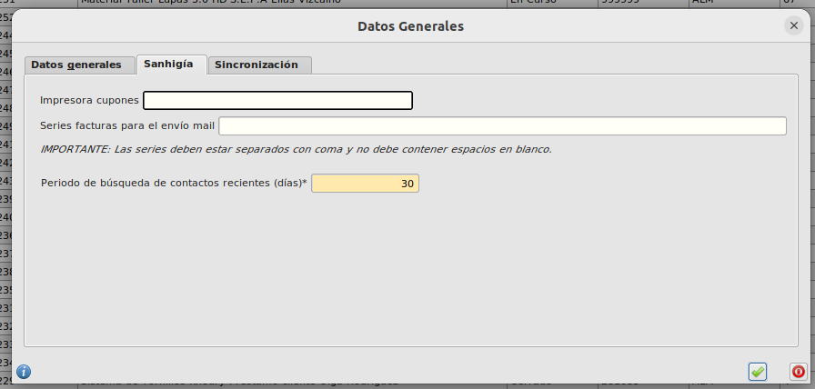

# Configurar periodo de búsqueda

Por defecto, el periodo establecido de búsqueda de contactos para generar la notificación de **contactos recientes** en SmartSales está establecido en 30 días, es decir, solo se buscará aquellos contactos que hayan asistido a un evento cuya fecha de inicio este establecida en los últimos 30 días.

## ¿Cómo modifico el periodo de búsqueda?

* Abrimos el formulario **Area de Facturación/Facturación/Configuración** y seleccionamos la pestaña **Sanhigía**. Introducimos el número de días que queremos establecer y pulsamos el botón de confirmación.

[Volver al Índice](./index.md)