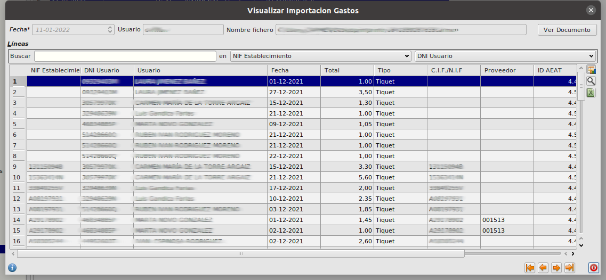

# Importacion de gastos

## ¿Cómo selecciono los datos a importar?

* Pulsamos sobre el botón **Importar** del formulario principal de **Area de Facturación/Facturación/Importación Gastos/Importación Gastos**. Esto abrirá un formulario de importación.

Para realizar la importación seguimos los pasos indicados en [Importación CSV](../../../../modulos/area_facturacion/facturacion/importacioncsv.md)

## ¿Cómo veo los datos importados?

* Al finalizar la importación quedará un registro en la tabla **Ímportación Gastos** del formulario principal de **Area de Facturación/Facturación/Importación Gastos/Importación Gastos**. Si editamos ese registro veremos que aparece una tabla con todos los datos que se han importado

* Los registros importados pueden ser de dos tipos: Factura o Tiquet. Para los registros de tipo factura se genera una factura de proveedor. Si no existe el proveedor en la base de datos creará uno nuevo con el nif del fichero csv. Para los registros de tipo tiquet se genera un asiento contable.

* Podemos ver los documentos generados seleccionando el registro correspondiente y pulsando el botón **Ver Documento** en la parte superior derecha del formulario. Al hacer esto se abrirá el formulario de facturas de proveedor o el de asientos contables según el tipo.