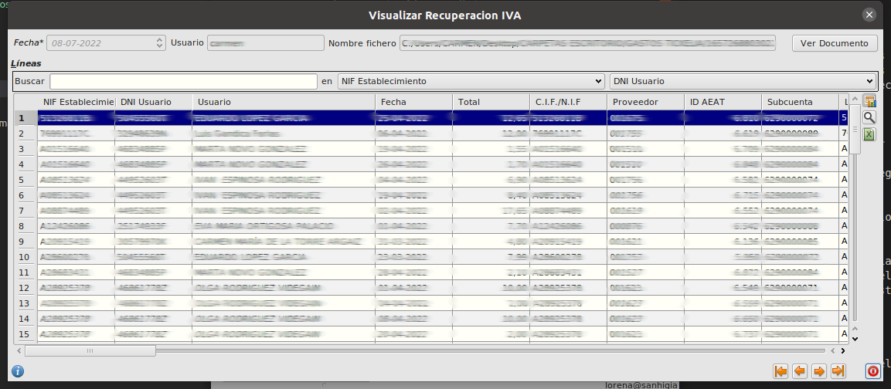

# Recuperación de iva

Antes de realizar la importación de la recuperación de iva, debe existir previamente una importación de gastos para los mismos registros. Es decir para los registros con el mismo ID AEAT. Si no es así, y algún registro de recuperación no existe en una importación de gastos aparecerá con un error

## ¿Cómo selecciono los datos a importar?

* Pulsamos sobre el botón **Importar** del formulario principal de **Area de Facturación/Facturación/Importación Gastos/Recuperación IVA**. Esto abrirá un formulario de importación.

Para realizar la importación seguimos los pasos indicados en [Importación CSV](../../../../modulos/area_facturacion/facturacion/importacioncsv.md)

## ¿Cómo veo los datos importados?

* Al finalizar la importación quedará un registro en la tabla **Recuperación Iva** del formulario principal de **Area de Facturación/Facturación/Importación Gastos/Recuperación IVA**. Si editamos ese registro veremos que aparece una tabla con todos los datos que se han importado

* Para cada uno de los registros importados se genera una factura de proveedor.

* Podemos ver los documentos generados seleccionando el registro correspondiente y pulsando el botón **Ver Documento** en la parte superior derecha del formulario. Esto abrirá el formulario de facturas de proveedor