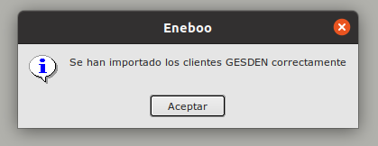

# Importacion de clientes GESDEN

* Antes de hacemos una importación de Facturas GESDEN, lo primero es importar los clientes.

## ¿Cómo selecciono los datos a importar?

* Pulsamos sobre el botón **Imp. Clientes** del formulario principal de **Area de Facturación/Facturación/Importación Facturas GESDEN**. Esto abrirá un formulario de importación.

Para realizar la importación seguimos los pasos indicados en [Importación CSV](../../../../modulos/area_facturacion/facturacion/importacioncsv.md)

El proceso de importación puede tardar más o menos tiempo en función de la cantidad de datos a importar 

Si no ha habido ningún error, se terminará el proceso y se crearán los clientes.

