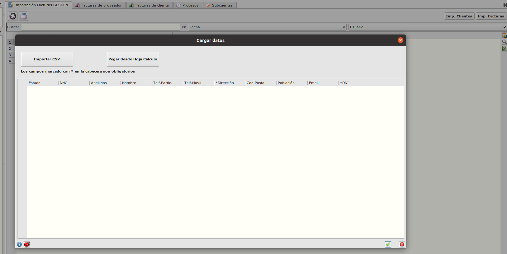
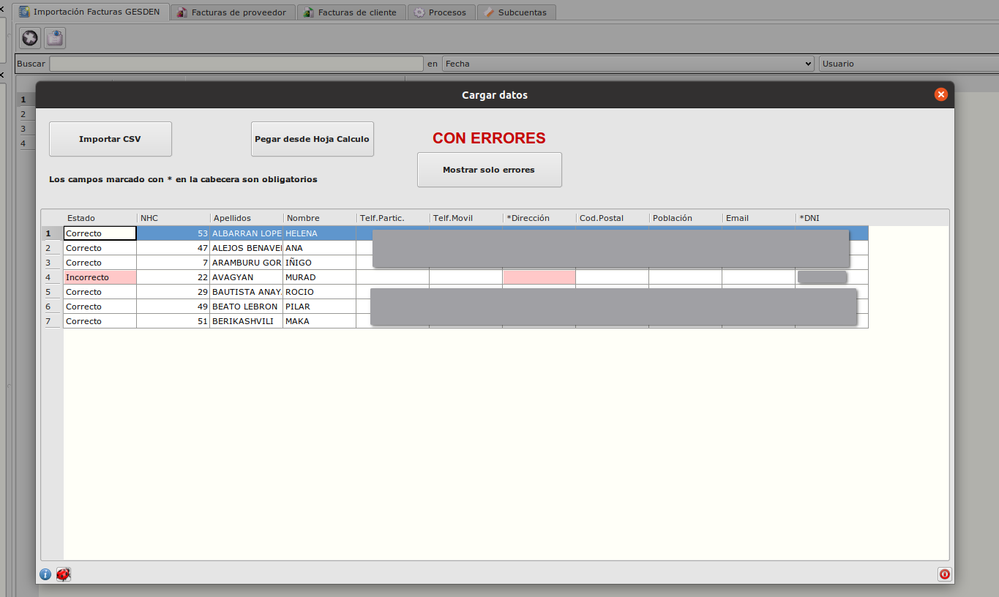
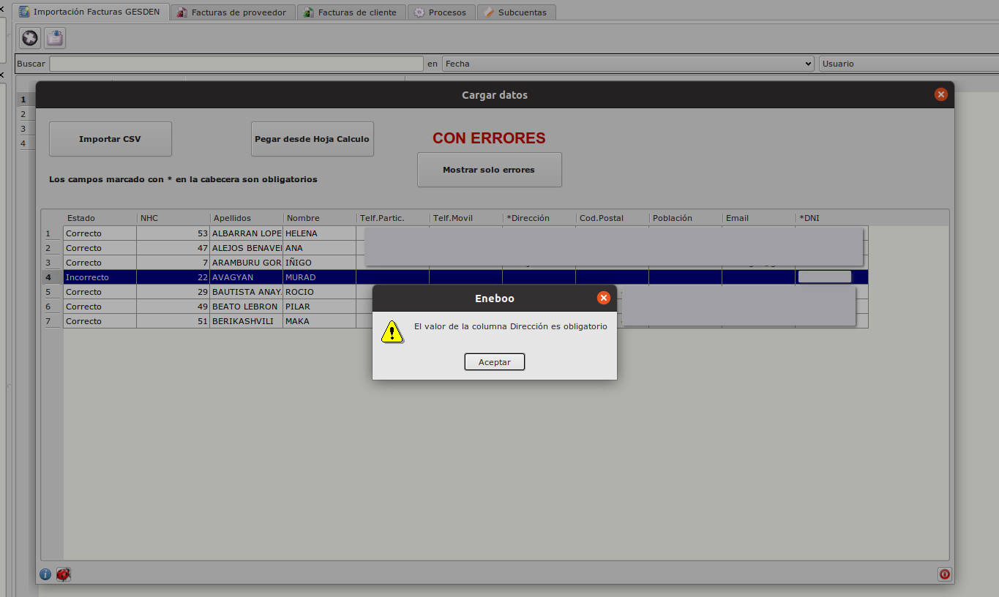

# Importacion de clientes GESDEN

* Antes de hacemos una importación de Facturas GESDEN, lo primero es importar los clientes.

## ¿Cómo selecciono los datos a importar?

* Pulsamos sobre el botón **Imp. Clientes** del formulario principal de **Area de Facturación/Facturación/Importación Facturas GESDEN**. Esto abrirá un formulario de importación.

* En este formulario tenemos dos formas de raalizar la importación:
    - Pulsamos el botón **Importar CSV**. Que importará los datos desde un fichero csv. Se abrirá una ventana en la que debemos especificar algunos datos como el caracter separador del fichero, si debe ignorar o no la primera línea (debe ignorarse en el caso de que la primera línea corresponda a la cabececera con los nombres de las columnas) y número de líneas adicionales a ignorar (en el caso de que quisíeramos ignorar alguna otra línea). Al aceptar el formulario debemos seleccionar en nuestro disco el fichero csv a importar.
    - O también podemos hacerlo pulsando el botón **Pegar desde Hoja Cálculo**. En esta opción se abrirá una ventana con un cuadro de texto en blanco en el que debemos pegar el contenido de la hoja de cálculo que queramos importar

* De ambas formas se leerán los datos a importar, se ejecutarán una serie de validaciones y se mostrará en el formulario de importación una lista con los datos a importar dónde nos indicará si son correctos o hay algún error.

## ¿Como veo los errores antes de hacer la importacion?

* Una vez hemos seleccionado los datos a importar. En la previsualización, si hay algún error en los datos nos lo indicará en la primera columna. Si la línea es correcta en la primera columna pondrá Correcto, pero si hay algún error pondrá incorrecto y aparecerá en rojo. 

* Podemos mostrar únicamente los registros con errores pulsando el botón **Mostrar solo errores**

* Para saber qué error hay, hacemos doble click sobre la palabra incorrecto del registro que queramos comprobar y aparecerá un mensaje indicando el error.

* Debemos solucionar los posibles errores en el fichero csv o en la hoja de cálculo y volver a seleccionar los datos a importar.

* Una vez que la previsualización salga sin errores pulsamos el botón de aceptar el formulario en la parte inferior derecha.
Empezará el proceso de creación de clientes.

* Si no han salido ningún error, se terminará el proceso y se crearán los clientes.

