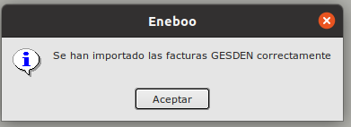

# Importacion de facturas GESDEN

## ¿Cómo selecciono los datos a importar?

* Pulsamos sobre el botón **Imp. Facturas** del formulario principal de **Area de Facturación/Facturación/Importación Facturas GESDEN**. Esto abrirá un formulario de importación.

* Para realizar la importación seguimos los pasos indicados en [Importación CSV](../../../../modulos/area_facturacion/facturacion/importacioncsv.md)

* Al inicar el proceso de importación de Facturas GESDEN el programa comprobará si existe cliente con CIF/NIF creado en la base de datos. Si no existe el proceso se cancelerá y hay que volver en el apartado [Importación Clientes](./importacionclientes.md) para crear el cliente.

* Si no han salido ningún error, se terminará el proceso y se crearán las facturas de clientes.

## ¿Cómo veo los datos importados?

* Al finalizar la importación quedará un registro en la tabla **Ímportación Gastos** del formulario principal de **Area de Facturación/Facturación/Importación Facturas GESDEN**. Si editamos ese registro veremos que aparece una tabla con todas las facturas que se han importado.

* Podemos ver las facturas generados seleccionando el registro correspondiente y pulsando el botón **Ver Documento** en la parte superior derecha del formulario. Al hacer esto se abrirá el formulario de facturas de cliente.