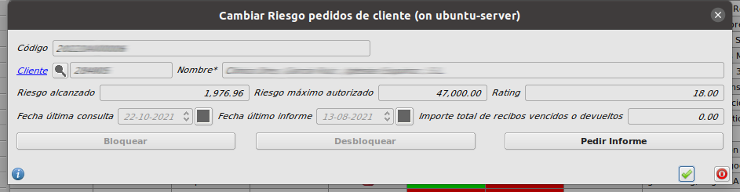

# Manual Gestión de riesgo

## ¿Cómo obtener el informe de riesgo de un cliente?

* Abrimos el formulario de **Pedidos de cliente** en **Area de Facturación/Facturación/Pedidos de Cliente**.

* Seleccionamos cualquier pedido del cliente para el que queramos obtener el informe de riesgo y pulsamos el botón **Cambiar riesgo** de la parte superior derecha del formulario

* Al pulsar el botón **Pedir informe**, se abrirá una conexión con la API de gestión de riesgo, se obtendrán los datos de riesgo para ese cliente y se informarán en su formulario.

## Cálculo de riesgo automático al crear o modificar pedidos

* Al crear o modificar un pedido de cliente, se hace una llamada a la API de gestión de riesgo, calculando sus datos de riesgo y guardándolos en la ficha del cliente

* Si un cliente supera el riesgo autorizado con un pedido, ese pedido quedará con **Estado** **Bloqueado**
