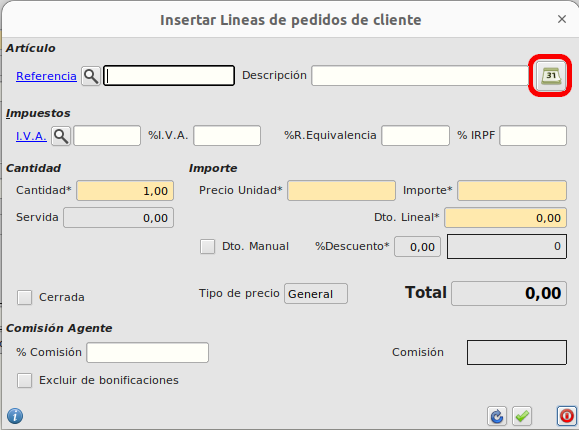
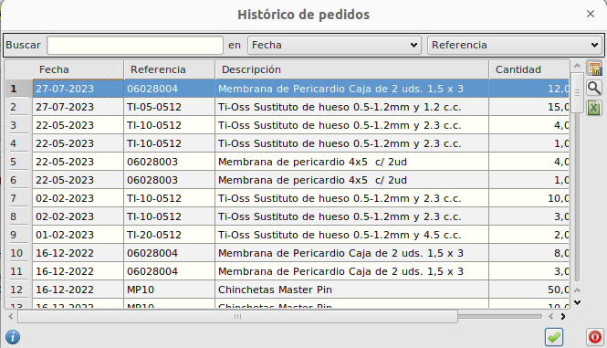
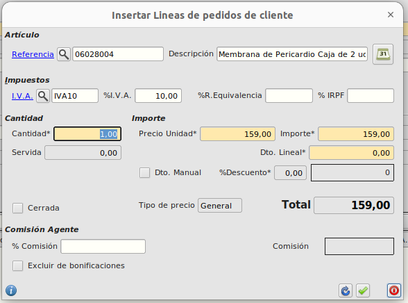

# Añadir productos comprados anteriormente en un pedido a partir del histórico

## Objetivo

Queremos añadir líneas de un pedido seleccionando un artículo que ya hemos pedido en alguna otra ocasión.

## Guía paso a paso

- Nos dirigimos al formulario de pedidos de cliente.
  Ruta: **Área de facturación -> facturación -> pedidos de cliente**

- Creamos un pedido nuevo o editamos un pedido que no esté servido.

- Seleccionamos un cliente que ya haya realizado algún pedido.

- Añadimos una línea nueva al pedido o editamos una ya existente.

- Pulsamos en el botón resaltado en la siguiente imagen para abrir el histórico de pedidos del cliente.

- Seleccionamos una línea del histórico y pulsamos aceptar, o bien hacemos doble click sobre la línea que queramos seleccionar.

- El histórico se cerrará y se rellenará el formulario de la línea con la información del artículo seleccionado en el histórico.

- Por último, seleccionamos la cantidad y guardamos la línea en el pedido como haríamos normalmente.

[Volver al Índice](../../../index.md)
