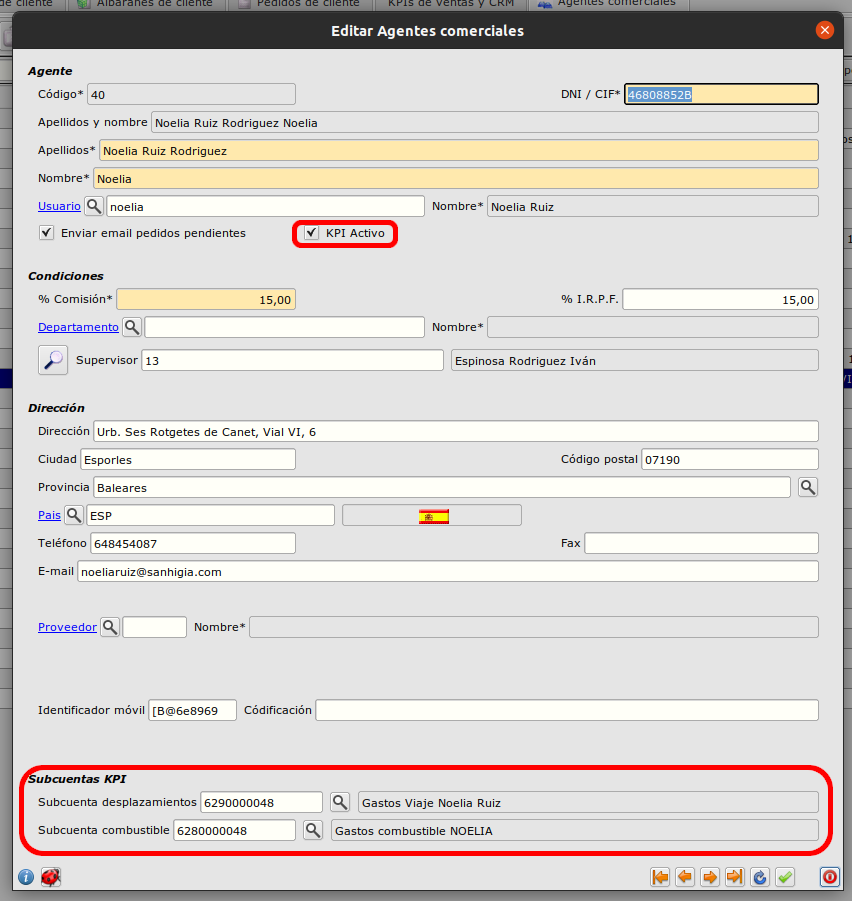
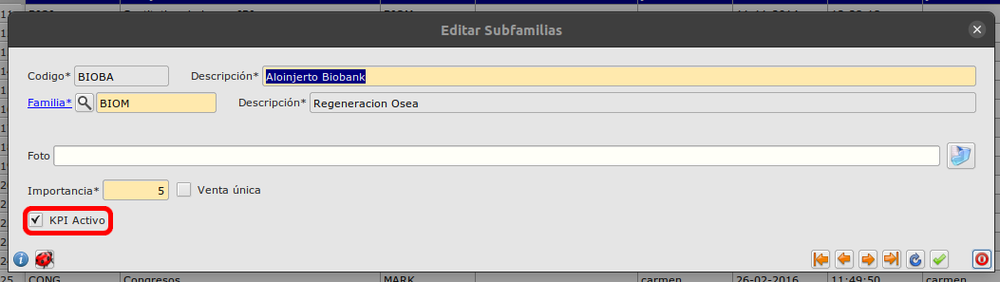
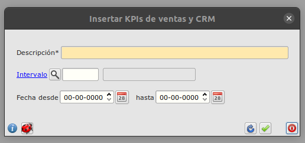

# Informe de KPIs de ventas y CRM

## Pasos para generar el informe

- Los agentes que queramos que se incluyan en el informe deberán tener el campo "KPI Activo" marcado.
- También deberán rellenarse los campos para las subcuentas de gastos de desplazamiento y combustible asociados a estos agentes.

Ruta: **Área de facturación -> Principal -> Agentes**

-También tendremos que asegurarnos de que las subfamilias de los artículos que queremos ver en el informe tengan el campo "KPI Activo" marcado

Ruta: **Área de facturación -> Almacén -> Subfamilias**

-Nos dirigimos al formulario para los informes KPI y creamos un nuevo registro. Podemos introducir las fechas o seleccionar un intervalo.

Ruta: **Área de facturación -> Informes -> KPIs de ventas y CRM**

- Por último, pulsamos en el botón para generar el informe en Excel y seleccionamos una carpeta donde guardar el archivo.

[Volver al Índice](./index.md)