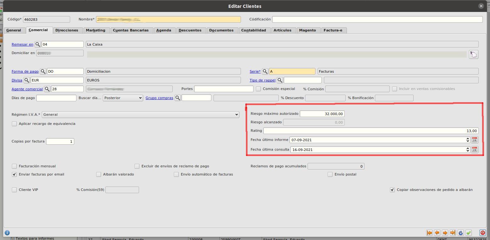

# Gestión de riesgo

## ¿Cómo consulto los datos de riesgo de un cliente?

* Abrimos el formulario de **Clientes** en **Area de Facturación/Principal/Clientes**. Seleccionamos un registro y abrimos su formulario de edición. En este fomulario nos vamos a la pestaña **Comercial**

* En la parte inferior derecha podemos ver los datos de riesgo calculados desde la api, así como las fechas de última consulta y último informe.