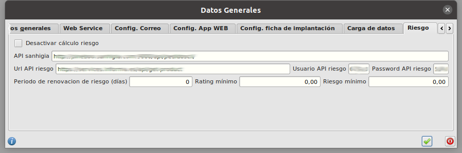

# Gestión de riesgo

## Configuraciones previas

* Abrimos el formulario de **Configuración** en **Area de Facturación/Principal/Configuración**. Y nos vamos a la pestaña **Riesgo**. 

* Desde este formulario podemos ver la configuración de las urls de acceso a la API de riesgo así como los datos de conexión Usuario y contraseña. 

* Desde este formulario podremos activar o desactivar la funcionalidad marcando o desmarcando el check **Desactivar calculo riesgo**. Si lo marcamos la funcionalidad de cálculo de riesgo quedará desactivada y no se hará el cálculo automático en la generación de pedidos