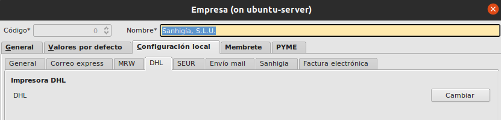

# Permisos para configurar las impresoras

Solo los usuarios del grupo Administracion pueden acceder a la zona de configuración de impresoras, cada equipo es independiente y tiene su configuración propia de impresoras.

Todas las configuraciones se encuentran en Aréa de Facturación -> Principal -> Empresa -> Pestaña Configuración local

## Configuración Correos Express

* Accedemos a la pestaña Correo express donde tenemos que configurar el nombre de la impresora previamente instalada en el equipo que estamos configurando.

* Debemos configurar la ruta donde tenemos instalado en nuestro equipo el programa acrobat reader de Adobe. Suele ser una ruta parecida a la siguiente: **C:\Program Files (x86)\Adobe\Reader 11.0\Reader\AcroRd32.exe**

* Los etiquetas de correos express vienen con un formato determinado que hay que descodificar, por lo tanto debemos informar la ruta a la aplicación de codificación en la tercera opción del formulario.

## Configuración MRW

* Accedemos a la pestaña MRW donde unicamente debemos configurar el nombre de la impresora por la que se vaya a imprimir sus etiquetas, la ruta de lector de PDFs es la misma que la de correos express por lo que usaremos la misma configuración anterior para no duplicar parámetros.

## Configuración DHL

* Accedemos a la pestaña DHL donde unicamente debemos configurar el nombre de la impresora. Esta impresora funciona mediante el puerto LPT1 por lo que debe contener la direccion local del equipo (127.0.0.1)

Si la impresora dejara de funciona lo primero es comprobar el siguiente comando

***net use LPT1: //127.0.0.1/DHL /persistent:yes***

## Configuración SEUR

* Accedemos a la pestaña MRW donde unicamente debemos configurar el nombre de la impresora. Por otra parte en la pestaña **Sanhigia** debemos configurar también la ruta a la aplicación que lanzara la etiqueta a imprimir. **Su nombre es print.exe**