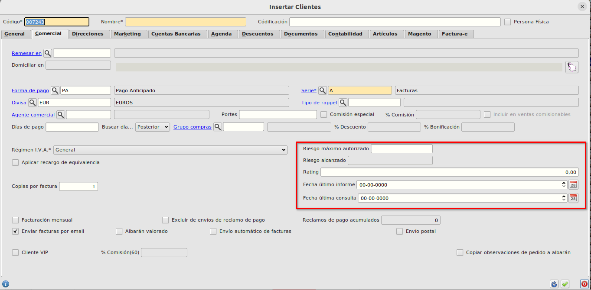
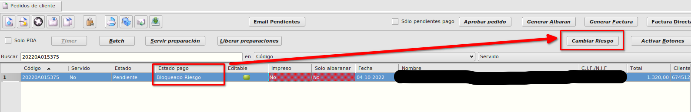
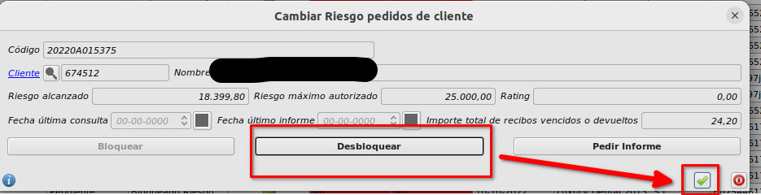
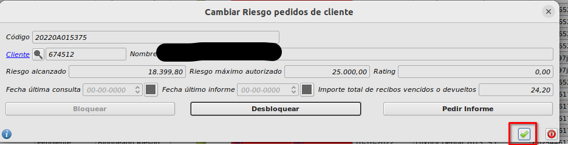
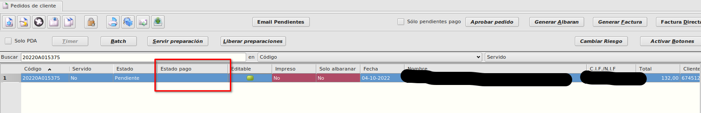

# Gestión de riesgo

## Configuraciones previas

* Abrimos el formulario de **Configuración** en **Area de Facturación -> Principal -> Configuración**. Y nos vamos a la pestaña **Riesgo**. 

* Desde este formulario podemos ver la configuración de las urls de acceso a la API de riesgo así como los datos de conexión Usuario y contraseña. 

* También podremos activar o desactivar la funcionalidad marcando o desmarcando el check **Desactivar calculo riesgo**. Si lo marcamos la funcionalidad de cálculo de riesgo quedará desactivada y no se hará el cálculo automático en la generación de pedidos

* Informaremos el campo *Periodo de renovación de riesgo (días)* con el número de días que deben de pasar desde la última vez que se pidieron datos a la API de riesgo para volver a pedirse automáticamente.

* Informaremos el campo *Rating mínimo* con el valor mínimo que debe cumplir el rating que nos devuelve la API para poder actualizar el cliente con los valores de riesgo recomendados devueltos por la API.

* Informaremos el campo *Riesgo mínimo* con el valor que se asignará al cliente en el caso de que consultemos con la API el riesgo y no nos devuelva nada porque el cliente no está dado de alta en la base de datos que consulta la API.

## Campos en formulario de clientes
* En la pestaña **Comercial** del formulario de **Clientes** que podemos encontrar en **Área de facturación -> Facturación -> Clientes** tenemos 5 nuevos campos los cuales se calculan automáticamente pudiéndose modificar manuelamente:

*Riesgo máximo autorizado*: En este campo se informará automáticamente el valor devuelto por la API como crédito recomendado.    

*Riesgo alcanzado*: Este campo se informará automáticamente con la suma de los pedidos pendientes + albaranes no facturados + recibos pendientes o devueltos.

*Rating*: Este campo se informa automáticamente con el valor Rating que nos devuleve la API.  

*Fecha último informe*: Este cmapo se informa automáticamente con la fecha devulta por la API como fecha de último informe.

*Fecha última consulta*: Este campo se informa con la última fecha en la que se ha llamado a la API. 

a. Riesgo máximo autorizado con valor 0 y campo de fecha de última consulta vacía implica que no se le ha asignado riesgo.

b. Riesgo máximo autorizado con valor 0 y fecha de última consulta informada implica que el cliente solo puede pagar por anticipado.

c. Riesgo máximo autorizado con valor en cualquier otro valor y fecha de última consulta rellenada, implica que el cliente tiene este riesgo. El riesgo se calculará cada x tiempo desde la fecha de última consulta del riesgo a través de la API. Si han pasado más días de los configurados en el campo *Periodo de renovación de riesgo (días)* del formulario de **Configuración** entre la fecha informada en el campo *Fecha última consulta* del formulario de **Clientes** y la fecha de hoy, se realizará llamada a la API cuando se guarde el cliente en su ficha o se le realice un pedido.

d. Cuando realizamos un pedido, se avisará al usuario y se bloqueará el pedido (campo *Estado pago* de pedidos tendrá el valor **Bloqueado Riesgo**) en los siguientes supuestos:

1. El cliente supera el riesgo máximo autorizado sumando pedidos pendientes, albaranes sin facturar y recibos pendientes o devueltos.
2. El hecho de tener pagos pendientes vencidos tiene preeminencia sobre el riesgo.
3. El cliente no tiene riesgo asignado.

e. Los desbloqueos de los pedidos los hará administración al igual que las promociones. Desbloquearemos un pedido con **Bloqueado Riesgo** de la siguiente forma:

1. Seleccionamos el pedido
2. Pulsamos el botón **Cambiar Riesgo** en la parte superior derecha del formulario principal de pedidos

3. En el formulario que se abre, pulsamos el botón **Desbloquear**

4. Pulsamos el botón Aceptar

5. Se cerrará el formulario y el pedido quedará desbloqueado por riesgo

## Funcionamiento

El cálculo del riesgo se realizará de la siguiente forma:

a. Introducimos un pedido, se comprueba si el cliente tiene ya un riesgo asignado, si el cliente tiene riesgo asignado en un periodo inferior al periodo de renovación de riesgos (dias transcurridos desde la fecha de última consulta hasta la fecha actual es menor al número de días informados en el campo *Periodo de renovación de riesgo (días)* que hemos configuardo en la configuración) se procede con normalidad y no se realiza ninguna llamada a la API.

b. Si el cliente no tiene riesgo asignado, se realiza una llamada a la API automáticamente cuando introducimos un pedido previo paso a comprobar si tiene pagos pendientes.

1. Si la API responde, se comprueba si el rating es superior al valor configurado en el campo *Rating mínimo* del formulario **Configuración** y si lo es se asigna el riesgo que devuelva la API como crédito recomendado. Para asignar este riesgo, el cliente debe tener al menos un recálculo de riesgo de menos de un año de antigüedad en la BBDD informa.
2. Si la API no da ningún valor (el cliente no está en la bbdd) entonces se configura el cliente con un riesgo mínimo por defecto, que se establece en el campo *Riesgo mínimo* en el formulario de **Configuración**. Si el cliente ya tiene como forma de pago PA (pago anticipado) no se le informa ningún riesgo.
3. Los clientes con Pago Anticipado no tienen riesgo, por lo que estos clientes se informará su riesgo cero y la fecha de la última llamada a la API como fecha de recálculo de riesgo. Si cambiamos la forma de pago a una forma de pago distinta a *PA* se llamará a la API para recalcular el riesgo.

## ¿Cómo obtener el informe de riesgo de un cliente manualmente?

* Abrimos el formulario de **Pedidos de cliente** en **Area de Facturación/Facturación/Pedidos de Cliente**.

* Seleccionamos cualquier pedido del cliente para el que queramos obtener el informe de riesgo y pulsamos el botón **Cambiar riesgo** de la parte superior derecha del formulario

* Pulsaremos el botón **Pedir informe**, se abrirá una conexión con la API de gestión de riesgo, se obtendrán los datos de riesgo para ese cliente y se informarán en su ficha.

## ¿Cómo consulto los datos de riesgo de un cliente?

* Abrimos el formulario de **Clientes** en **Area de Facturación -> Principal -> Clientes**. Seleccionamos un registro y abrimos su formulario de edición. En este fomulario nos vamos a la pestaña **Comercial**

* En la parte inferior derecha podemos ver los datos de riesgo calculados desde la api, así como las fechas de última consulta y último informe.