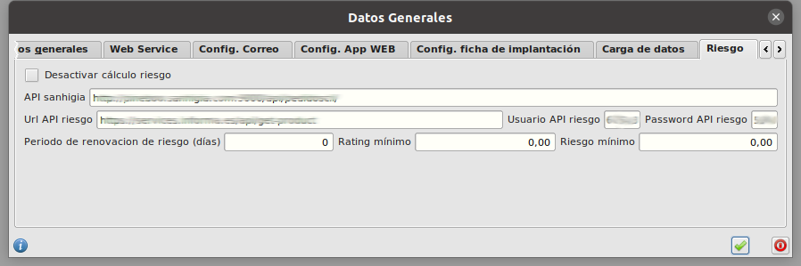
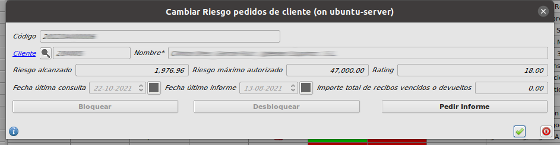
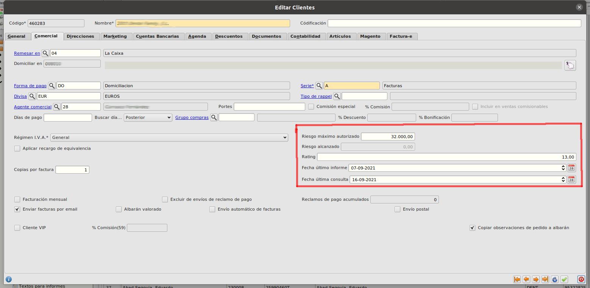

# Gestión de riesgo

## Configuraciones previas

* Abrimos el formulario de **Configuración** en **Area de Facturación/Principal/Configuración**. Y nos vamos a la pestaña **Riesgo**. 

* Desde este formulario podemos ver la configuración de las urls de acceso a la API de riesgo así como los datos de conexión Usuario y contraseña. 

* También podremos activar o desactivar la funcionalidad marcando o desmarcando el check **Desactivar calculo riesgo**. Si lo marcamos la funcionalidad de cálculo de riesgo quedará desactivada y no se hará el cálculo automático en la generación de pedidos

## ¿Cómo obtener el informe de riesgo de un cliente?

* Abrimos el formulario de **Pedidos de cliente** en **Area de Facturación/Facturación/Pedidos de Cliente**.

* Seleccionamos cualquier pedido del cliente para el que queramos obtener el informe de riesgo y pulsamos el botón **Cambiar riesgo** de la parte superior derecha del formulario

* Al pulsar el botón **Pedir informe**, se abrirá una conexión con la API de gestión de riesgo, se obtendrán los datos de riesgo para ese cliente y se informarán en su formulario.

## Cálculo de riesgo automático al crear o modificar pedidos

* Al crear o modificar un pedido de cliente, se hace una llamada a la API de gestión de riesgo, calculando sus datos de riesgo y guardándolos en la ficha del cliente

* Si un cliente supera el riesgo autorizado con un pedido, ese pedido quedará con **Estado** **Bloqueado**

## ¿Cómo consulto los datos de riesgo de un cliente?

* Abrimos el formulario de **Clientes** en **Area de Facturación/Principal/Clientes**. Seleccionamos un registro y abrimos su formulario de edición. En este fomulario nos vamos a la pestaña **Comercial**

* En la parte inferior derecha podemos ver los datos de riesgo calculados desde la api, así como las fechas de última consulta y último informe.

## Desbloquear un pedido con Estado pago Bloqueado Riesgo

Para desbloquear manualmente un pedido con **Bloqueado Riesgo** debemos seguir los siguientes pasos:

* Seleccionamos el pedido
* Pulsamos el botón **Cambiar Riesgo** en la parte superior derecha del formulario principal de pedidos
* En el formulario que se abre, pulsamos el botón **Desbloquear**
* Pulsamos el botón Aceptar