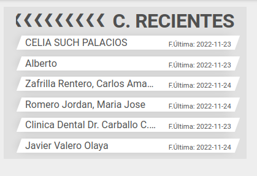

# Dashboard

---

## Contactos recientes

### ¿Qué es un contacto reciente?

 Son aquellos contactos que están asociados a nuestro usuario por código postal o contactos que no tienen asignado ningún código postal y que han tenido una interacción o asistencia a un evento en los últimos _N_ días, siendo _N_ un valor parametrizable en el ERP.  [Parametrizar días](../facturacion/importacioneventos/periodobusqueda.md).

La caja de contactos recientes será visible siempre que tengamos al menos un contacto reciente. 

### Listado de contactos recientes

Si clicamos en la caja veremos la pantalla de *Contactos recientes* que contiene el listado de contactos recientes indicando el nombre del evento y la fecha de la última interacción. Al clicar sobre un contacto accederemos los datos del mismo.

### Datos del contacto

Si el contacto está asociado a nuestra lista como agente o a nuestros códigos postales, veremos los datos del contacto, incluyendo el apartado *Eventos(número de interacciones)* si existe actividad reciente o el texto *Sin participación en eventos* si no la hubiera.

Si desplegamos el apartado veremos un listado de los eventos en los que el contacto participó, indicando el nombre del evento y la fecha de inicio del mismo. Al clicar sobre un evento accederemos los datos del evento.

### Datos del evento

Veremos el nombre del evento en la parte superior y un listado de los productos que se promocionaron en el evento, indicando nombre y refencia del producto.

[Volver al Índice](./index.md)