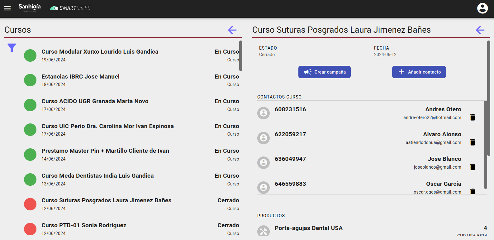

# Cursos

## Creación de la campaña

Se puede acceder a los eventos de tipo curso desde el menu principal en la seccion de smartsales.

Dentro los usuarios de Marketing podran ver toda informacion y realizar las acciones, el resto de usuarios solo vera los contactos asociados a su agente.

## Crear campaña

 Crea una campaña de tipo captacion de leads con los datos del curso(Nombre, productos) y un score minimo de 0. Tambien se crea un trato por cada contacto asociado al curso.

Una vez creada la campaña, no importara si se añaden o elimian contactos del evento, los tratos no se veran afectados.

## Añadir contacto

Posibilidad de asociar un contacto al evento y actualiza los datos del contacto, tambien se puede crear un contacto nuevo desde la pantalla de añadir.
