# Artículos
El formulario de artículos lo podemos encontrar en **Área de facturación -> Almacén -> Artículos**. Desde este formulario gestionaremos todos los tipos de referencias, ya sean prendas, tejidos o cualquier tipo de artículo susceptible de ser vendido, comprado o componente de una prenda.

Crearemos cualquier tipo de artículo pulsando en el botón de *Insertar registro* y dependiendo de como lo cataloguemos en el campo *Tipo*, el cual podemos encontrar en la pestaña **General**, la referencia será una *Prenda* si el tipo es *Producto*, será un *Tejido* si el tipo es *Material* o será cualquier otro tipo si el tipo es *Otro*.

En el formulario de artículos podemos ver distintas pestañas:

**Pestaña General** --> En esta pestaña tenemos los campos generales del artículo, aquí informaremos el *Tipo*, el *Modelo*, la *Serie*, el *Color*, la *Temporada* y el *Año*. 
Podemos ver dentro de esta pestaña los siguiente checks:

*Sin Stock* --> Si marcamos este check indicamos que no queremos controlar el stock del artículo y la pestaña de **Stocks**, por defecto está desmarcado al crear una nueva referencia.

*Se compra* --> Si marcamos este check indicamos que la referencia se puede comprar y estará habilitada la pestaña de **Compra**, por defecto está marcado al crear una nueva referencia.

*Se vende* --> Si marcamos este check indicamos que la referencia se vende y estará habilitada la pestaña ded **Venta**, por defecto está marcado al crear una nueva referencia.

**Pestaña Composición** --> Esta pestaña se utilizará para informar el escandaño y para indicar si el artículo se fabrica y cual es su proceso de fabricación.

Esta pestaña la informaremos para aquellas referencias que sean *Prendas*.

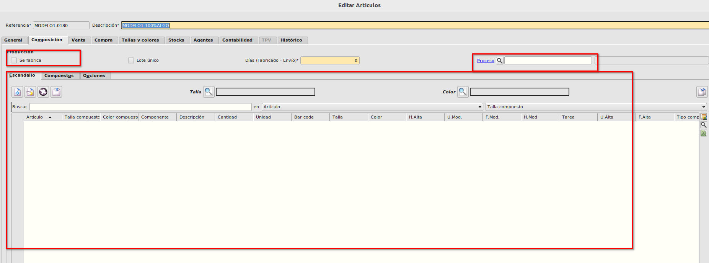

Check de *Se Fabrica* --> Si marcamos este check indicamos que la referencia hay que fabricarla y hay que asignarle un proceso de fabricación en el campo [Proceso](/lillotex/areacolaboracion/Procesos/index.md). 

En la pestaña de **Escandallo** asignaremos los componentes por los que está compuesto la prenda, para ello pulsaremos el botón de nuevo registro. 

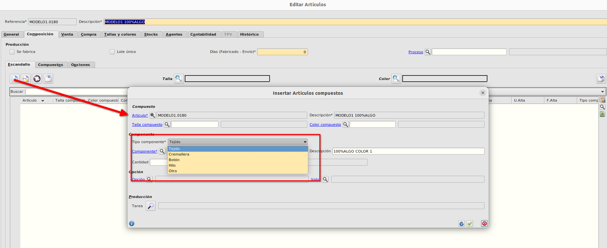

Indicaremos el *Tipo de componente* que vamos a añadir. Si seleccionamos *Tejido*, la serie del componente debe de coincidir con la serie de la prenda.

Indicaremos el *Componente* a asociar e informamos en el campo *Cantidad* las unidades que hacen falta para fabricar una unidad de la prenda. 

En nuestro ejemplo estamos indicando que para fabricar 1 unidad de la prenda *MODELO1.0180* nos hacen falta 1.25 unidades del tejido *0180.COLOR1*.

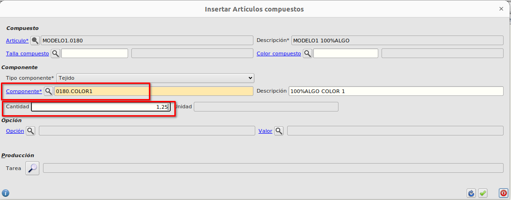

Existe la posibilidad de indicar en el escandallo que el componente indicado sólamente se va a utilizar en la fabricación de la prenda en determinadas tallas o determinados colores, para ello informariamos los campos *Talla compuesto* y/o *Color compuesto*

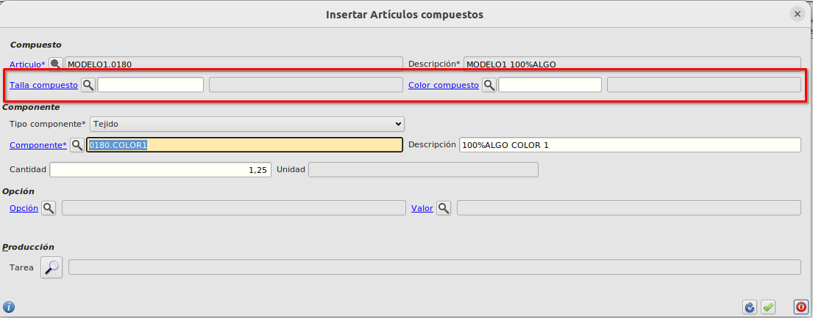

En el campo [Tarea](/lillotex/areacolaboracion/Procesos/index.md) indicaremos en que tare del proceso de producción se van a consumir los componentes.

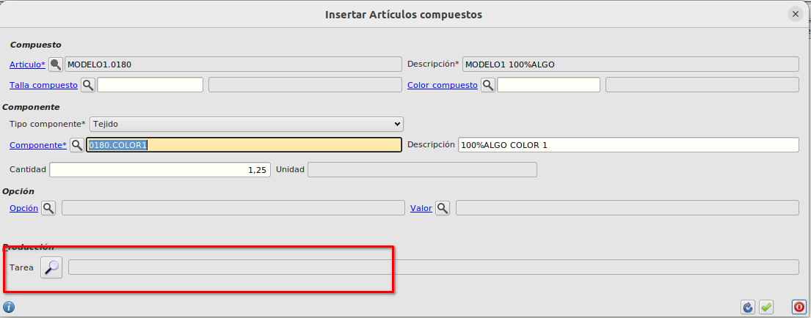

**Pestaña Venta** --> En esta pestaña informaremos el *Precio de Venta* y el *Tipo de I.V.A.* que se aplicará en la venta.

Vemos que hay una tabla para informar las tarifas en las cuales está incluido una referencia de tal forma que una misma referencia puede tener varios precios según la tarifa que tenga.

**Pestaña Compra** --> En esta pestaña informaremos los distintos proveedores a los que le podemos comprar el artículo así como el precio al que le compramos a cada proveedor, referencia del proveedor etc.

Marcaremos el proveedor por defecto con el botón de la estrella.

**Pestaña Tallas y Colores** --> En esta pestaña indicaremos las tallas y colores que tiene nuestra referencia asignándole un *barcode*. 

Esta pestaña la informaremos para las referencias que sean *Prendas*.

Cada barcode será una combinación de referencia-talla-color distinta. 

Los barcodes los podemos crear manualmente desde la pestaña **Barcodes** creando registros para cada una de las combinaciones e informando para cada uno de ellos el barcode, la talla y el color.

Este método puede ser tedioso y lo utilizaremos de forma puntual cuando tengamos que crea un barcode extra en una prenda en la cual ya están definidas todas sus tallas y colores.

Utilizaremos los [Set de tallas](./tallas.md) para indicar que posibles tallas puede tener nuestra prenda y los colores vendrán definidos por la serie de la prenda que hayamos informado en la **Pestaña General** de tal forma que al pulsar sobre el botón de *Alta rápida de combinaciones de  tallas y color* se nos muestren las tallas de nuestro set y los colores de nuestra serie.

En la parte izquierda de la pantalla que se abre seleccionaremos las tallas y en la parte derecha seleccionaremos lo colores.
Al aceptar se crearan todas las combinaciones de tallas y colores posibles de lo que hemos seleccionado.

El formato del barcode será el que hayamos configurado en **Área de facturación -> Almacén -> Configuración**

En el ejemplo utilizamos la configuración de **Referencia+Talla+Color** con  **-**  como separador.

**Pestaña Stocks** --> En esta pestaña podemos ver la cantidad de stock que tenemos de la referencia (y de sus tallas) en cada almacén de un vistazo.

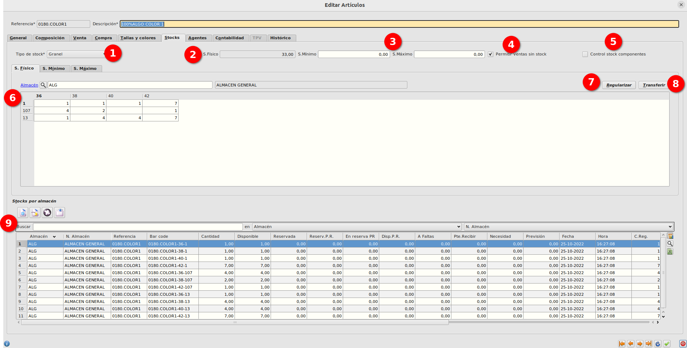

Si nos fijamos en la imagen:
1. Tipo de stock, por defecto es *Granel* ya que contabilizaremos unidades pudiéndose cambiar a *Lotes*, *Sin stock* o *Grupo base*. Para la funcionalidad de Lillotex aplica *Granel*.
2. Stock Físico. En este campo se muestra la suma de todas las unidades de todas las tallas de todos los almacenes de la referencia.
3. Stock mínimo y Stock máximo permitidos para el artículo.
4. Check *Permitir ventas sin stocks* --> Si este check está marcado podremos realizar ventas sin tener stock, si lo desmarcamos, para poder vender el artículo deberemos de tener cantidad suficiente para realizar la venta.
5. Control stock componente. --> Si este check está marcado y no está marcado como que *Se fabrica* en la pestaña de **Composición** se crearan tantos movimientos de stock como componentes tenga la prenda.
6. Podemos ver 3 sub-pestañas que muestran las cantidades físicas (1ª pestaña), los stocks mínimos (2ª pestaña) y los stocks máximos (3ª pestaña) para cada talla/color de la referencia facilitando así la lectura de estas cantidades. 

La pestaña de **Stock Físico** es de solo lectura y su modificación se hará desde el botón de *Reguralizar*.

Las pestañas de **Stock Mínimo** y **Stock Máximo** permiten cambiar las cantidades de forma ágil desde la propia matriz pulsando el botón guardar después de que hayamos realizado la modificación.

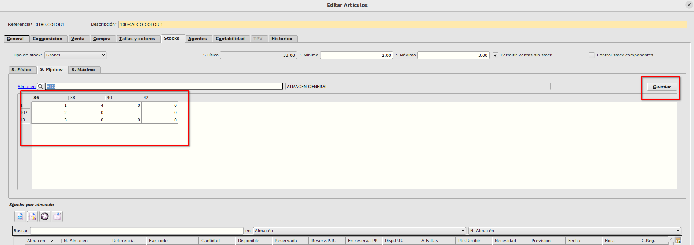

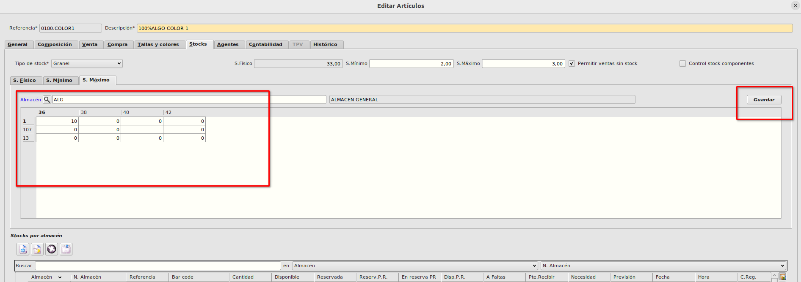

7. Con el botón *Regularizar*, podemos insertar regularizaciones de stock de forma rápida para las tallas y colores modificando la cantidad en la matriz y pulsando en el botón de *Insertar regularizaciones*

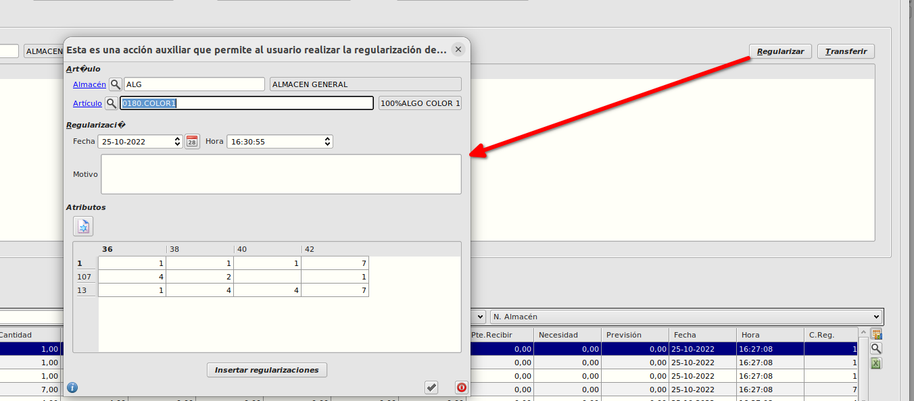

8. Con el botón *Transferir* podemos realizar una [transferencia de stock](./transstock.md) de la referencia de un almacén a otro.

9. Se muestra en modo tabla cada barcode (referencia-talla-color) con su registro de [Stock](./stocks.md).

**Pestaña Agentes** --> En esta pestaña podemos añadir las comisiones que tiene cada agente por la venta de esta referencia, pudiendo ser la comisión porcentual o lineal.

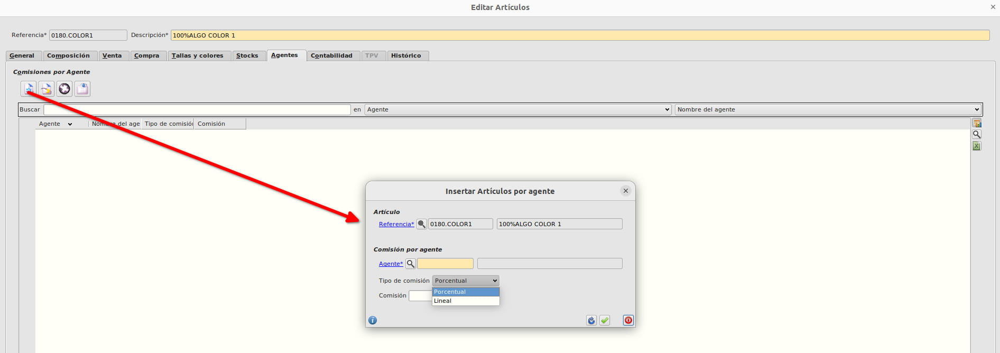

**Contabilidad** --> En esta pestaña informaremos las subcuentas de compras y de IRPF del artículo.

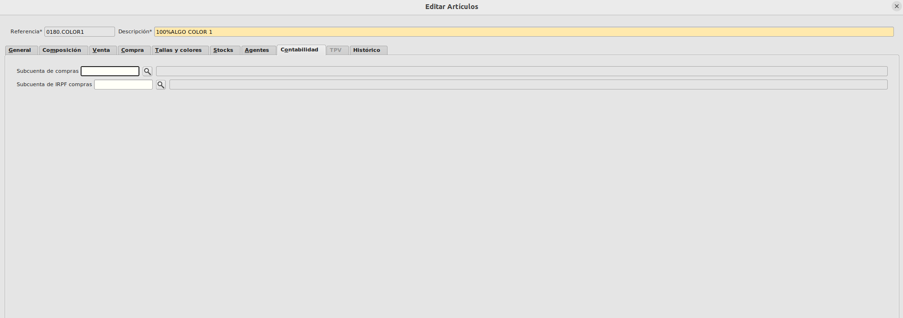

**Histórico** --> En esta pestaña podemos ver el histórico de ventas y compras que ha tenido la referencia mostrándose sus albaranes y facturas.

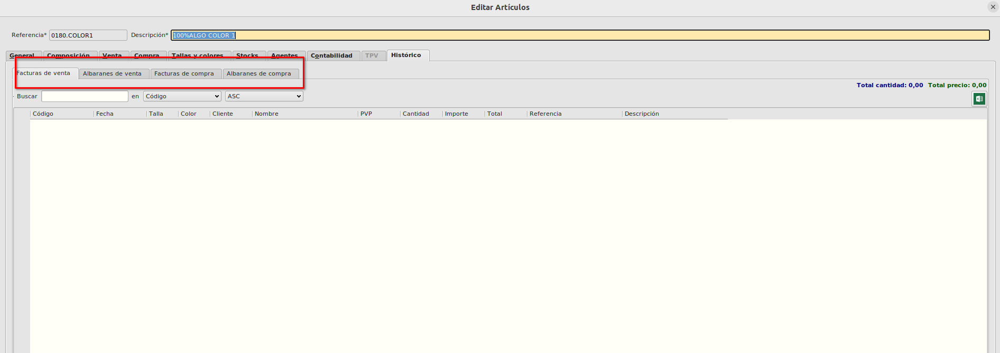

## Artículos tejido
Los artículos tejido los crearemos desde el formulario de artículos seleccionando en el campo *Tipo* el valor *Material*.
Para este tipo de artículos, los campos *Serie* y *Color* serán obligatorios
El campo *Rerencia* se informará automáticamente con el código de la *Serie* seguido de un punto y seguido de código del *Color*.
El campo *Descripción* se informará automáticamente con la descripción de la *Serie* seguido de un espacio y seguido de la descripción del *Color *
Para 
El campo *Referencia* debe de ser único por lo que no habrá dos artículos con la misma serie y el mismo color

