# Artículos
El formulario de artículos lo podemos encontrar en **Área de facturación -> Almacén -> Artículos**. Desde este formulario gestionaremos todos los tipos de referencias, ya sean prendas, tejidos o cualquier tipo de artículo susceptible de ser vendido, comprado o componente de una prenda.

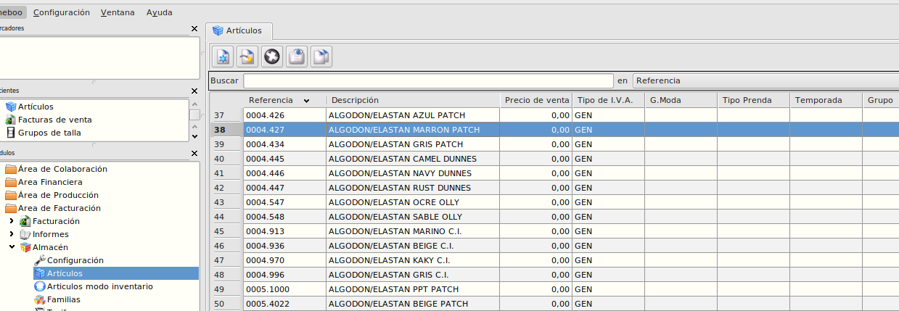

Crearemos cualquier tipo de artículo pulsando en el botón de *Insertar registro* y dependiendo de como lo cataloguemos en el campo *Tipo*, el cual podemos encontrar en la pestaña **General**, la referencia será una *Prenda* si el tipo es *Producto*, será un *Tejido* si el tipo es *Material* o será cualquier otro tipo si el tipo es *Otro*.

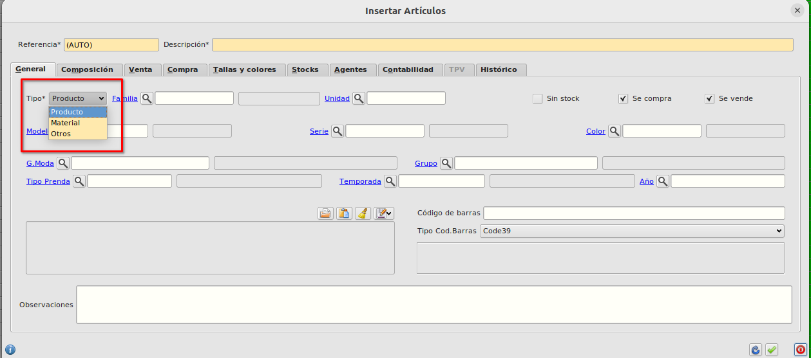

En el formulario de artículos podemos ver distintas pestañas:

**Pestaña General** --> En esta pestaña tenemos los campos generales del artículo, aquí informaremos el *Tipo*, el *Modelo*, la *Serie*, el *Color*, la *Temporada* y el *Año*. 
Podemos ver dentro de esta pestaña los siguiente checks:

*Sin Stock* --> Si marcamos este check, la pestaña de **Stocks** se deshabilita ya que no se llevará un control del stock de la referencia, por defecto está desmarcado al crear una nueva referencia.

*Se compra* --> Si marcamos este check indicamos que la referencia se puede comprar y estará habilitada la pestaña de **Compra**, por defecto está marcado al crear una nueva referencia.

*Se vende* --> Si marcamos este check indicamos que la referencia se vende y estará habilitada la pestaña ded **Venta**, por defecto está marcado al crear una nueva referencia.

**Pestaña Composición** --> Esta pestaña se utilizará para informar el escandaño, lo informaremos con las referencias que sean *Prendas*.

**Pestaña Venta** --> En esta pestaña informaremos el *Precio de Venta* y el *Tipo de I.V.A.* que se aplicará en la venta.

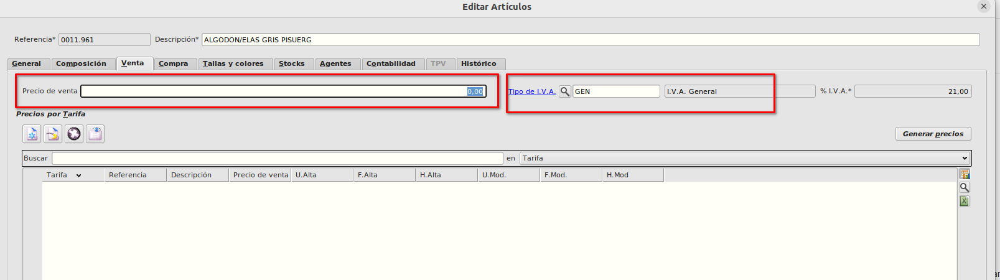

Vemos que hay una tabla para informar las tarifas en las cuales está incluido una referencia de tal forma que una misma referencia puede tener varios precios según la tarifa que tenga.

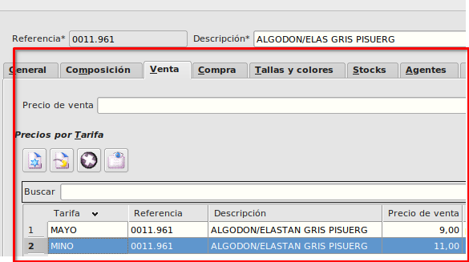

**Pestaña Compra** --> En esta pestaña informaremos los distintos proveedores a los que le podemos comprar el artículo así como el precio al que le compramos a cada proveedor, referencia del proveedor etc.

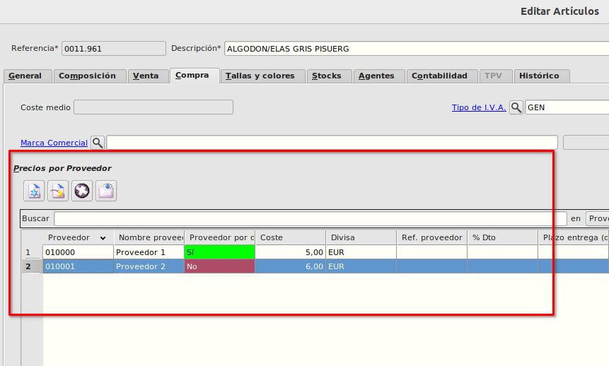

Marcaremos el proveedor por defecto con el botón de la estrella.

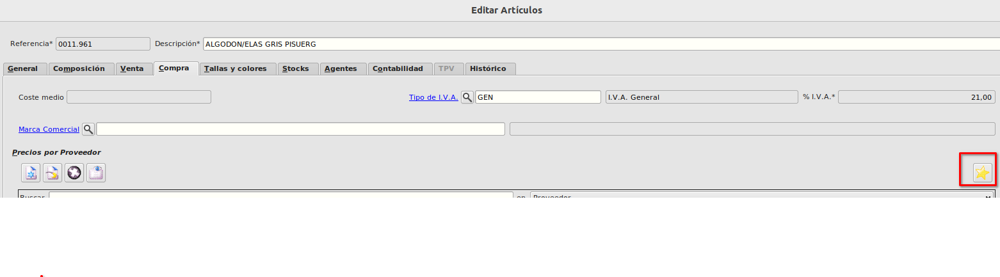

**Pestaña Tallas y Colores** --> En esta pestaña indicaremos las tallas y colores que tiene nuestra referencia asignándole un *barcode*. 

Esta pestaña la informaremos para las referencias que sean *Prendas*.

Cada barcode será una combinación de referencia-talla-color distinta. 

Los barcodes los podemos crear manualmente desde la pestaña **Barcodes** creando registros para cada una de las combinaciones e informando para cada uno de ellos el barcode, la talla y el color.

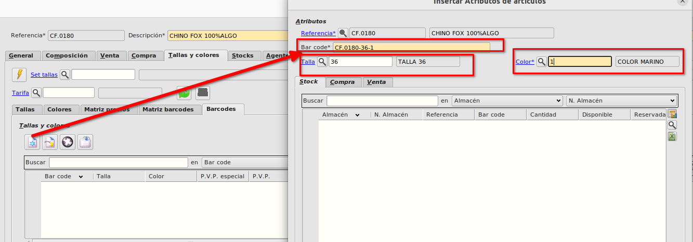

Este método puede ser tedioso y lo utilizaremos de forma puntual cuando tengamos que crea un barcode extra en una prenda en la cual ya están definidas todas sus tallas y colores.

Utilizaremos los [Set de tallas](./tallas.md) para indicar que posibles tallas puede tener nuestra prenda y los colores vendrán definidos por la serie de la prenda que hayamos informado en la **Pestaña General** de tal forma que al pulsar sobre el botón de *Alta rápida de combinaciones de  tallas y color* se nos muestren las tallas de nuestro set y los colores de nuestra serie.

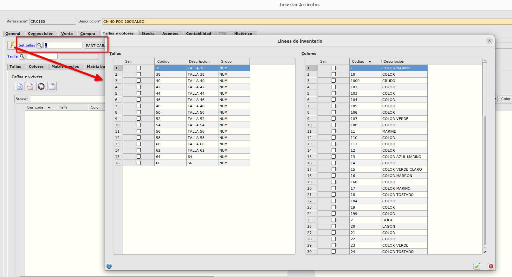

En la parte izquierda de la pantalla que se abre seleccionaremos las tallas y en la parte derecha seleccionaremos lo colores.
Al aceptar se crearan todas las combinaciones de tallas y colores posibles de lo que hemos seleccionado.

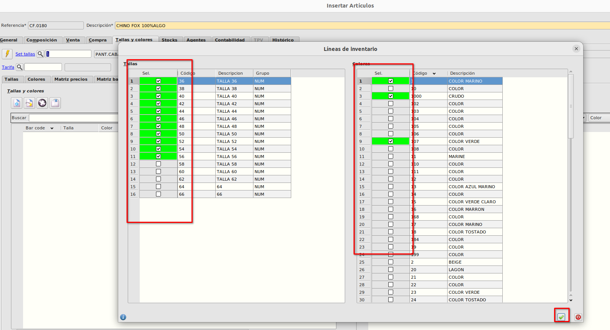

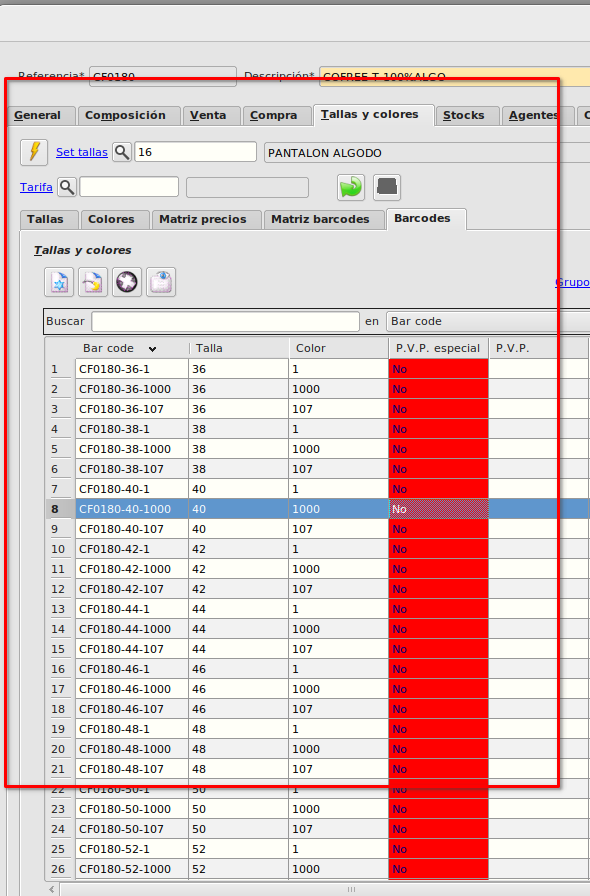

El formato del barcode será el que hayamos configurado en **Área de facturación -> Almacén -> Configuración**

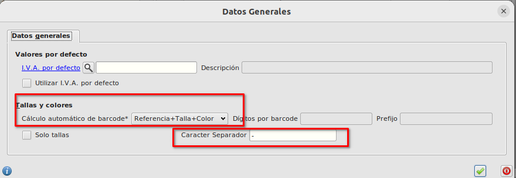

En el ejemplo utilizamos la configuración de Referencia+Talla+Color con *-* como separador.

## Artículos tejido
Los artículos tejido los crearemos desde el formulario de artículos seleccionando en el campo *Tipo* el valor *Material*.
Para este tipo de artículos, los campos *Serie* y *Color* serán obligatorios
El campo *Rerencia* se informará automáticamente con el código de la *Serie* seguido de un punto y seguido de código del *Color*.
El campo *Descripción* se informará automáticamente con la descripción de la *Serie* seguido de un espacio y seguido de la descripción del *Color *
Para 
El campo *Referencia* debe de ser único por lo que no habrá dos artículos con la misma serie y el mismo color

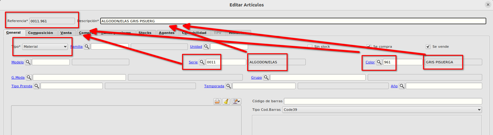

