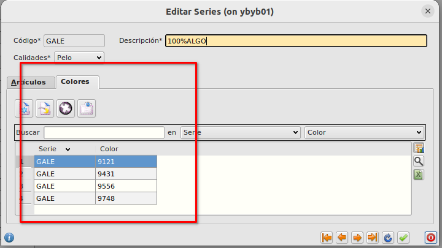

# Colores
## Creación de colores
Los colores las crearemos desde **Área de facturación -> Almacén -> Colores**

Pulsaremos en nuevo registro e informaremos el código del color y la descripción.

## Colores por serie
En el formulario de [Series](./series.md) podremos asignar que colores contiene esa serie. Un color podrá estar en uno o varias series.

