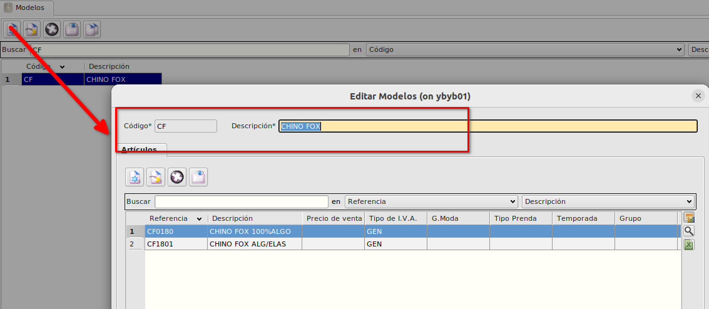
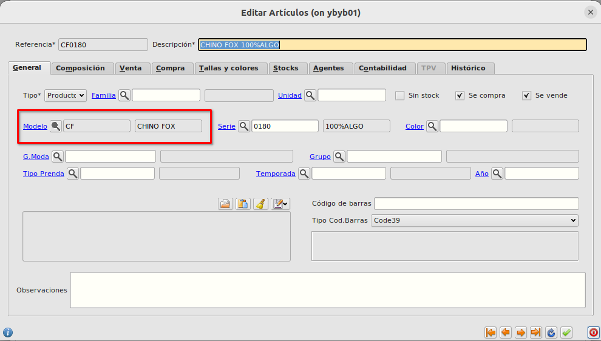
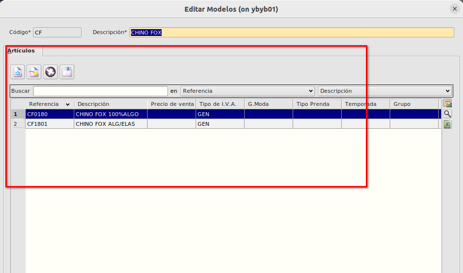

# Modelos
## Creación de modelos
Los modelos los crearemos desde **Área de facturación -> Almacén -> Modelos**

Pulsaremos en nuevo registro e informaremos el código del modelo y la descripción.

## Asignación de modelos a artículos
En la pestaña **General** del formulario de [Artículos](./articulos.md), podemos asignar el modelo al que pertenece el artículo. 

En la pestaña de **Artículos** del formulario de **Modelos** podemos ver que artículos tienen asignada el modelo

