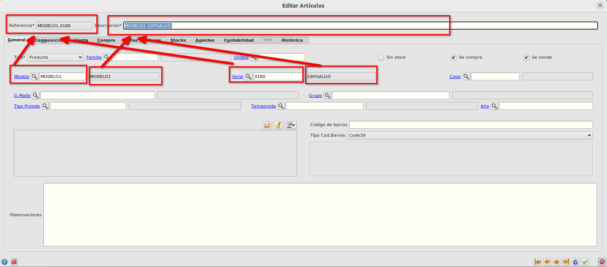
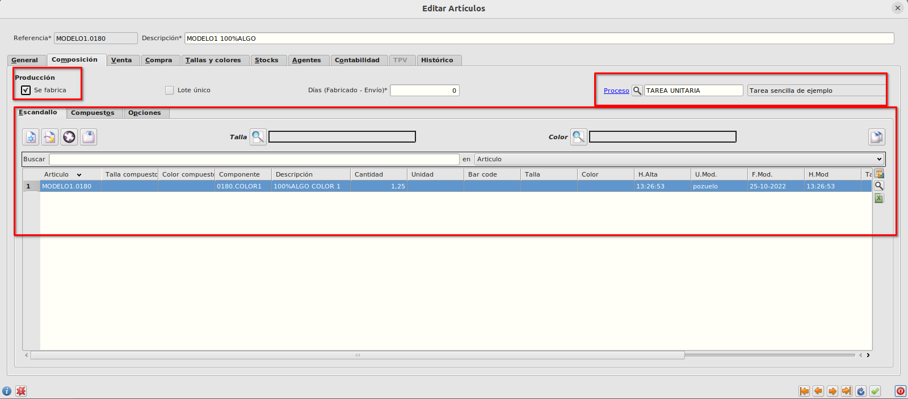

## Prendas
Las prendas las crearemos desde el formulario de [Artículos](./articulos.md) seleccionando en el campo *Tipo* el valor *Producto*.

Para este tipo de artículos, los campos *Modelo* y *Serie* serán obligatorios

El campo *Rerencia* se calculará automáticamente al aceptar el formulario con el código del *Modelo* seguido de un punto y seguido de código de la *Serie*.

El campo *Descripción* se informará automáticamente con la descripción del *Modelo* seguido de un espacio y seguido de la descripción de la *Serie*
 
El campo *Referencia* debe de ser único por lo que no habrá dos prendas con el mismo modelo y la misma serie

Este tipo de artículos lo normal es que se fabrique por lo que informaremos los datos de la pestaña de Composición:
- Marcaremos el check de *Se fabrica*.
- Informaremos el [Proceso de producción](/lillotex/areacolaboracion/Procesos/index.md)
- Informaremos el escandallo con los componentes necesarios para la fabricación de la prenda

