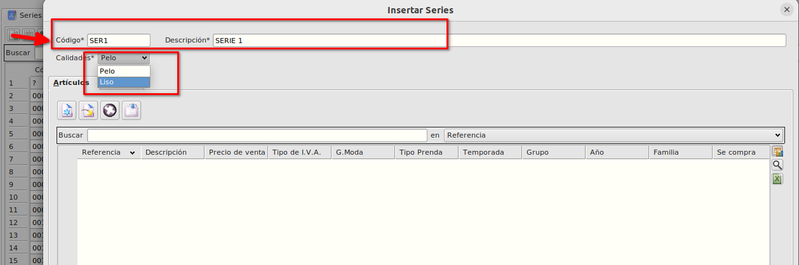
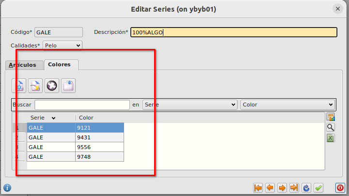
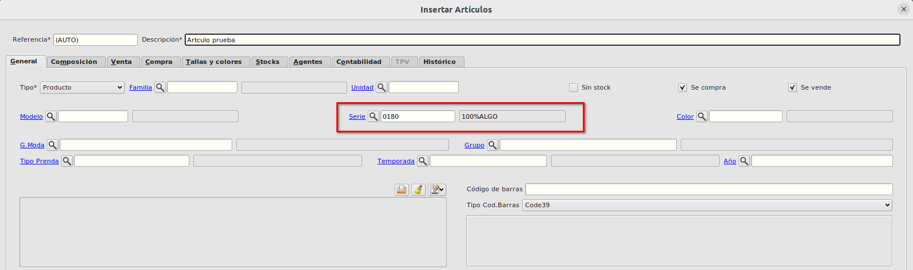
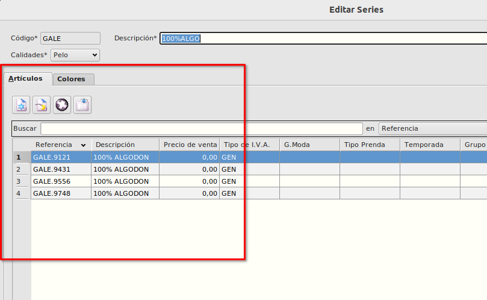

# Series
## Creación de series
Las series las crearemos desde **Área de facturación -> Almacén -> Series**

Pulsaremos en nuevo registro e informaremos el código de la serie y la descripción.

En el campo Calidad informaremos si es Pelo o Liso.

## Colores por serie
En la pestaña de **Colores** podemos ver que colores están asignados a la serie y añadir nuevos colores a la serie o quitar los ya incluidos.

## Asignación de series a artículos
En la pestaña **General** del formulario de [Artículos](./articulos.md), podemos asignar la serie a la que pertenece el artículo. 

En la pestaña de **Artículos** del formulario de **Series** podemos ver que artículos tienen asignada la serie

