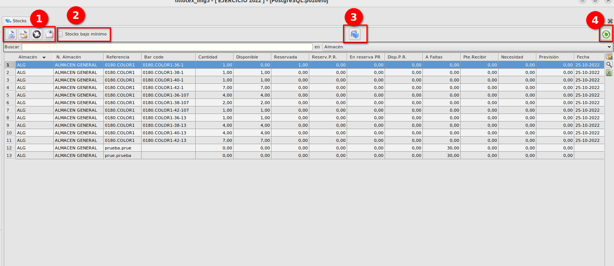
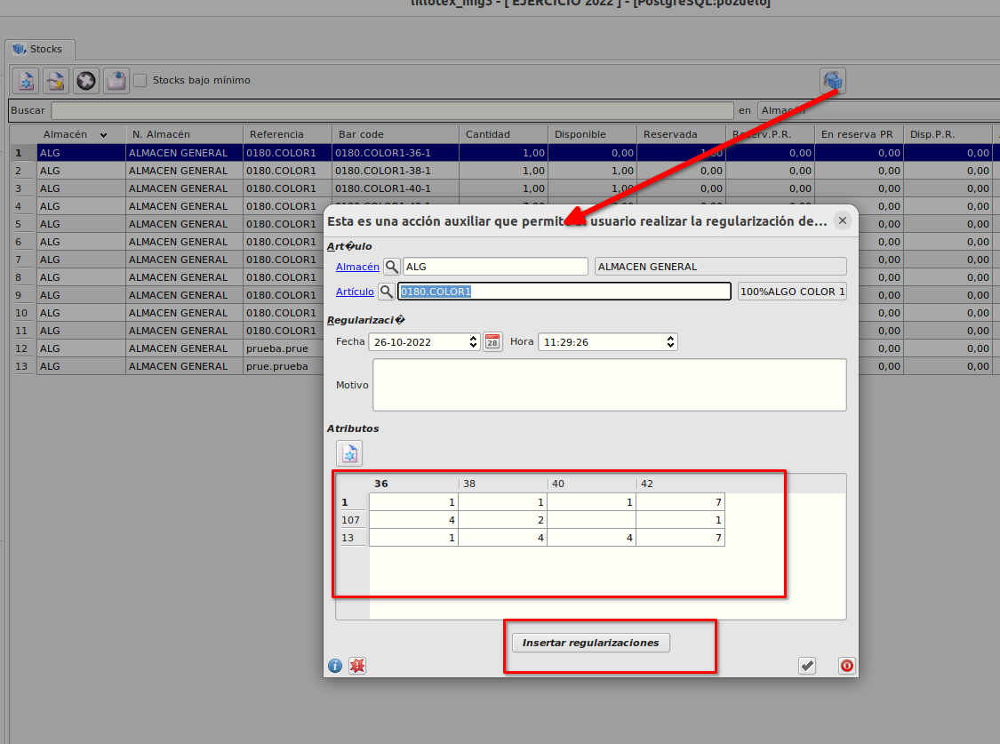
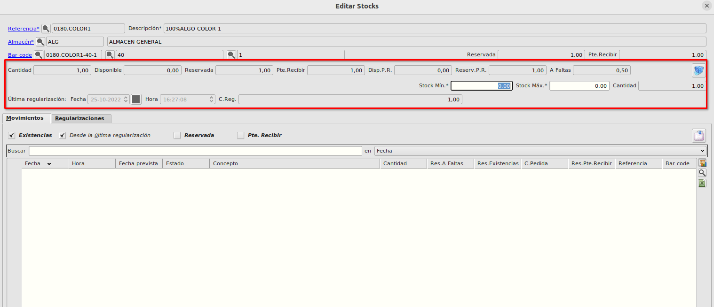
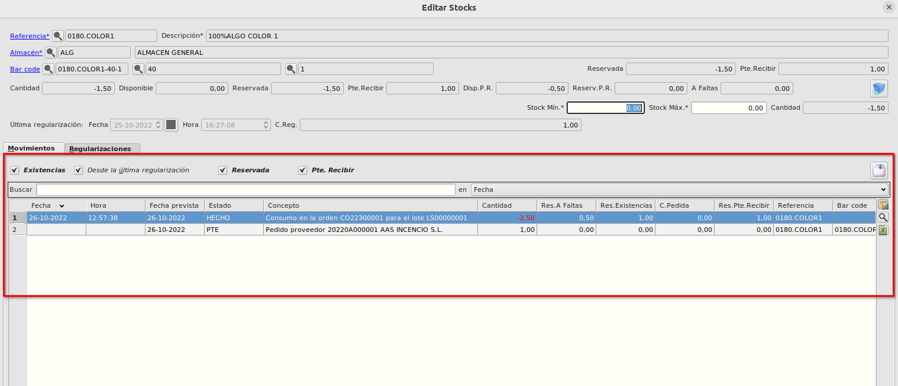
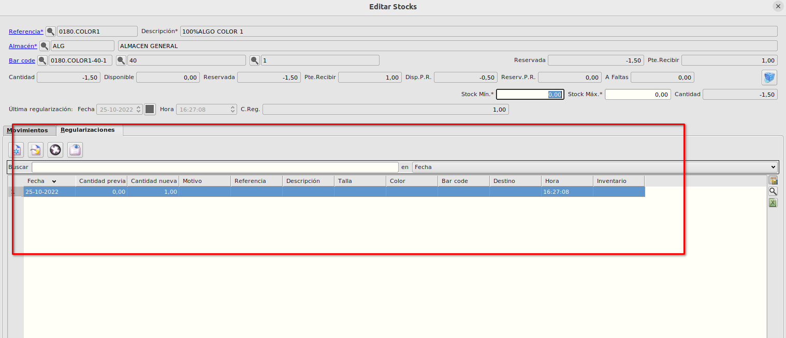

# Stocks
El formulario de stocks lo podemos encontrar en **Área de facturación -> Almacén -> Stocks**.

En el listado que aparece podemos ver para cada referencia o referencia/talla/color y almacén las distintas cantidades de stock. Cada uno de los registros es lo que llamamos "Stock".

1. Podemos insertar, modificar, borrar y ver los registos de stocks.
2. Con el check seleccionado de *Stocks bajo mínimo* se filtrará la tabla y se mostrarán solamente aquellos registros de stocks que su cantidad esté por debajo del stock mínimo que hayamos informado.
3. Con el botón *Regularizar artículos por talla y color*, podemos insertar regularizaciones de stock de forma rápida para las tallas y colores de la referencia del registro seleccionado modificando la cantidad en la matriz y pulsando en el botón de *Insertar regularizaciones*

4. Con el botón de *Revisar Stocks* podemos ejecutar procesos para realizar revisión de stocks por si hay algún stock que no nos cuadra.

## Edición de registo de Stock
### Campos de stock
- *Cantidad* --> En este campo se muestra la cantidad física que hay en el almacén para el stock seleccionado.
- *Disponible* --> En este campo se muestra la cantidad disponible que hay en el almacén para para el stock seleccionado. Este campo se calcula como *Cantidad - Reservada*.
- *Reservada* --> En este campo se muestra la cantidad reservada de la cantidad física para el stock seleccionado. Este campo se calcula como la suma de las cantidades de los pedidos de clientes que están sin servir + la suma de las cantidades que se reservan al generar las órdenes de producción.
- *Pte. Recibir* --> En este campo se muestra la cantidad que está por llegar al stock seleccionado pero todavía no ha llegado, es la cantidad que está en pedidos de proveedor que están sin servir + la suma de las cantidades de producto terminado que están en órdenes de producir sin terminar.
- *Disponible P.R.* --> En este campo se muestra de la cantidad pendiente de recibir del stock seleccionado aquella que no está reservada. Este campo se calcula como *Pendiente de Recibir - Reservada Pendiente de Recibir*.
- *Reservada P.R.* --> En el campo Reservada pendiente de recibir se muestra para el stock seleccionado la cantidad que se ha reservado al hacer un pedido de venta de la cantidad que está por llegar al stock y que todavía no ha llegado (cantidad que está en pedidos de compra sin albaranar o cantidades de componentes en órdenes de producción sin terminar).
- *A Faltas* --> En este campo se  muestra la cantidad que hay que fabricar o comprar en el almacén para el stock seleccionado para poder servir la cantidad demandada.
- *Última regularización* --> En los campos *Fecha* y *Hora* de última regularización se muestran los datos de cuando fue la última regularización, desde la cual el stock inicial será el que se muestra en el campo *C.Reg*.
- *Stock Mínimo* y *Stock Máximo* --> Son los stocks mínimos y máximos permitidos para el artículo en el almacén seleccionado.

## Orden de reservas
Cuando se realiza un pedido de venta de una referencia se sigue un orden para informar los campos de stocks.
1. Se mira si hay cantidad física disponible, si hay stock físico disponible se reserva de la cantidad física incrementándose el campo *Reservada* y disminuyendo el campo *Disponible*
2. Si no hay cantidad física disponible, se mira si hay cantidad pendiente de recibir disponible, si hay hay cantidad pendiente de recibir se reserva del pendiente de recibir incrementándose el campo *Reservada P.R* y decrementado el campo *Disponible P.R.*.
3. Si no hay cantidad pendiente de recibir disponible se reserva de lo que llamamos A faltas, incrementándose el campo *A faltas*.

En el momento se que se albaran el pedido:
- Si estamos en el caso 1, el campo *Reservada* aumenta por la cantidad albaranada y el *Disponible* se queda como está y el campo *Cantidad* disminuye por la cantidad albaranada.
- Si estamos en el caso 2 y ya hemos recibido el stock que teníamos pendiente de recibir, las reservas se cambian automáticamente y estaríamos en la situación 1.
- Si estamos en el caso 3, se harán lo necesario para dejar de tener stock *A faltas* bien creando pedidos de compras o bien generando órdenes de producción de tal forma que pasaríamos a la situación 2 y luego a la situación 1.

### Movimientos
En la parte de abajo del formulario de edición podemos ver la pestaña de movimientos, en esta pestaña se muestran los movimientos que se van generando en el stock seleccionado.
Según los checks que marquemos veremos unos movimientos u otros.
- *Existencias* --> Con este check marcado, los movimientos que se muestran son los movimientos que están en estado "HECHO", es decir,movimientos de albaranes o facturas tanto de ventas como de compras y movimientos de producto fabricado generados por Órdenes de producción terminadas.
- *Desde Última Regularización* --> Con este check marcado se muestran los movimientos generados después de la última regularización, si se desmarca se mostrarán todos los movimientos sin filtrar por fecha de última regularización.
- *Reservada* --> Con este check marcado se muestran los movimientos en estado "PTE* que restan al stock pero que aún no están en firme, es decir, movimientos de pedidos de venta no albaranados y movimientos de consumo generados por órdenes de producción no terminadas.
- *Pte. Recibir* --> Con este check marcado se muestran los movimientos en estado "PTE* que suman al stock pero que aún no están en firme, es decir, movimientos de pedidos de compra no albaranados y movimientos de producto terminado generados por órdenes de producción no terminadas.

### Regularizaciones
En la pestaña de regularizaciones podemos ver todas las regularizaciones que se han hecho para el stock seleccionado.

