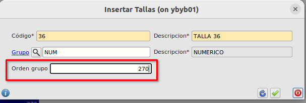

# Tallas

## Creación de tallas
Las tallas las crearemos desde **Área de facturación -> Almacén -> Tallas**

Pulsaremos en nuevo registro e informaremos el código de la talla y la descripción.

En el fomulario de **Tallas** podemos ver el campo *Grupo* y el campo *Orden grupo*, estos campos los utilizaremos para asignar un grupo de tallas de forma que tallas del mismo grupo podamos ordenarlas de menor a mayor para que en los formularios e informes dónde aparecen las tallas queden visualmente ordenadas.

El orden del grupo de talla se ofrece automáticamente al insertar el registro como el último orden asignado + 1 aunque se puede cambiar manualmente pudiéndose luego reordenar desde el formulario de [Grupos de tallas](#grupostallas) con los botones *Subir* y *Bajar*

## Grupos de tallas
Los grupos de tallas los usaremos para agrupar las tallas según su naturaleza y poder ordenar las tallas unas respecto a otras.
Para crear una grupo de tallas iremos a **Área de facturación -> Almacén -> Grupos de tallas**.
Crearemos un nuevo registro informando el código y la descripción.

En el formulario de [Tallas](#tallas) es donde asignaremos a la tall el *grupo de tallas* que queramos y el orden de la talla respecto a las demás tallas contenidas en el mismo grupo. Una talla sólamente puede estar en un grupo de tallas.

Por ejemplo podremos crear un grupo de tallas que sea *Numérico* y otro grupo de tallas que sea *Alfanumérico* de forma que el grupo *Numérico* se lo asociaremos a todas las tallas que sean numéricas (2, 4, 38...) pudiendo indicar que talla es mayor que la otra.

 En el alfanúmerico asociaremos las tallas que sean letras (S, M, L...), de igual forma indicaremos que talla es mayor que otra.

Utilizaremos los botones de *Subir* y *Bajar* para cambiar el orden dentro del grupo

## Set de tallas
Los sets de tallas son agrupaciones de tallas los cuales los asignaremos a las prendas en su ficha para saber que posibles tallas puede tener dicha prenda. Una talla podrá estar en uno o varios set de tallas, por ejemplo la tallas 40 estará en el set de Pantalón caballero y también estará en el set Pantalón señora.

El formulario de **Set de tallas** lo podemos encontrar en **Área de factuación -> Almacén -> Set  de tallas**

Pulsaremos en nuevo registro e informaremos *Código* y *Descripción*

Pulsaremos en el botón de *Insertar registro* en la parte de tallas tantas veces como tallas queramos asignar al set.

En el formulario de [Artículos](./articulos.md), en la pestaña de **Tallas y Colores** asignaremos el set de tallas correspondiente.

