# 3.- Seccion stocks.

Esta sección muestra las funcionalidades relativas a la gestión de almacén. Está adaptada para visualizarse en dispositivos móviles.

## 3.1.- Inventarios.

En esta página se podrán crear y administrar los inventarios de la tienda.

Se muestra los años seleccionados, el botón de añadir nuevo inventario, un buscador de inventarios por nombre y el botón de obtener inventarios. 

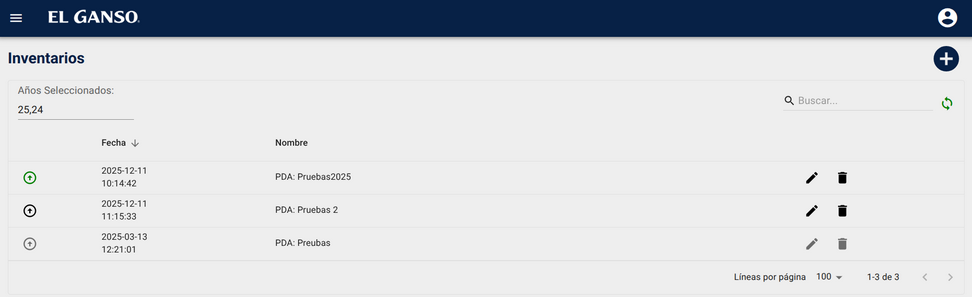

Accede a la sección para crear un inventario.

Indica los años seleccionados, en el listado se mostrarán solo inventarios de esos años, si se pulsa se accede a la sección cambio de año.

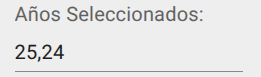

Buscador de inventarios

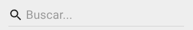

Obtener inventarios. Obtiene los inventarios de la tienda, reemplaza los datos almacenados en el dispositivo por los datos de la base de datos de la tienda.

**Importante. Datos del dispositivo / datos de la base de datos de la tienda**

Esta aplicación está pensada para trabajar sin conexión a la base de datos de la tienda, los datos se almacenan en el dispositivo local y hasta que no se sincronizan, no están en la base de datos de la tienda. Por ejemplo, si obtenemos los inventarios, abrimos uno y escaneamos las líneas correspondientes, si volvemos a pulsar el botón de obtener inventarios sin haber sincronizado antes el inventario editado se perderá el trabajo realizado.

Listado de inventarios

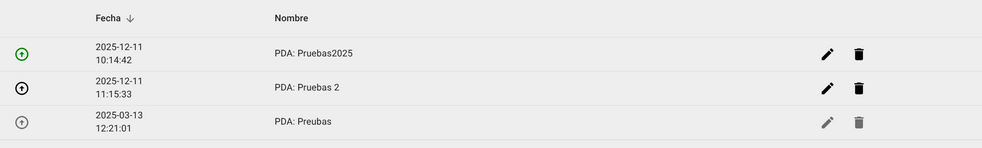

**Columna estado**

El inventario ya se ha sincronizado y no puede modificarse.

El inventario se ha obtenido de la base de datos de la tienda y no tiene modificaciones en el dispositivo, si se pulsa se sincronizará con la base de datos de la tienda y ya no podrá modificarse.

El inventario tiene modificaciones en el dispositivo local, si se pulsa se sincronizará con la bbdd de la tienda y no podrá ser modificado, si se pulsa el botón de obtener inventarios antes de sincronizarse se perderán los datos almacenados en el dispositivo y cambiará al estado anterior.

**Columna Fecha**

Muestra la fecha en la que se creó el inventario.

**Columna Nombre**

Muestra el nombre del inventario.

**Borrar/editar**

Si el inventario no está en estado sincronizado se podrá editar y borrar.

<ins>Crear un inventario </ins>

Al pulsar el botón de crear un inventario accederemos a la pantalla de crear inventario.

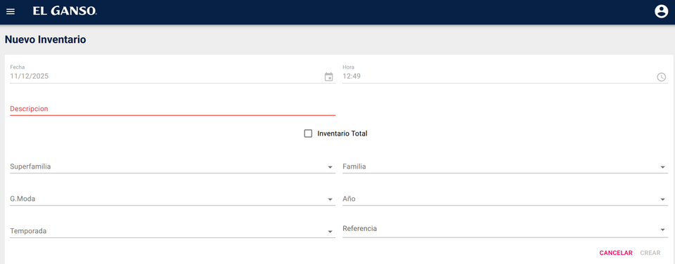

Se muestra la fecha y la hora de la creación del inventario. No son modificables.

Se tendrá que introducir una descripción para el inventario.

Si se marca la opción Inventario Total y se usan los filtros al aprobar el inventario regularizará el stocks de todos los artículos filtrados a cero.

Al pulsar el botón de crear inventario se accederá al modo de edición de inventario. También aparecerá en el listado de inventarios y se podrá editar y borrar.

<ins>Edición de inventarios</ins>

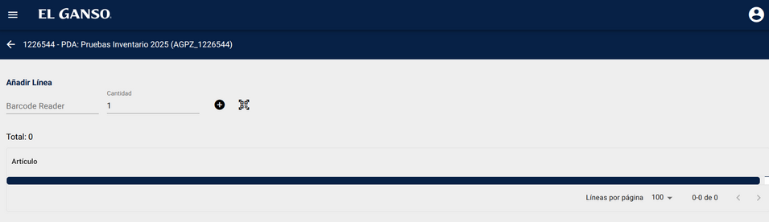

Si nos situamos en barcode reader podemos introducir manualmente un código de barras y al pulsar + se añadirá la linea con la cantidad.

Escanearlo con una pistola laser.

O activar la cámara del dispositivo y capturarlo.

El escaneo y la captura de imagen introducen la linea sin necesidad de pulsar +

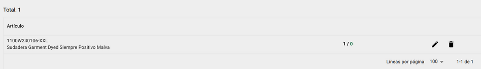

Se pueden editar y eliminar las líneas y se muestra un total de la cantidad de artículos escaneados.

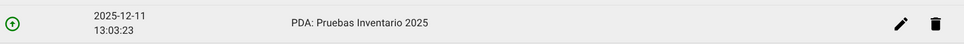

El inventario aparecerá en el listado como con modificaciones y pendiente de sincronizar.

## 3.2.- Recepciones de mercancía.

En esta página se muestran los viajes de recepción de mercancía de la tienda, se muestra un listado de todas las recepciones de mercancía de la tienda, en la cabecera consta de un selector de años (filtra los años de las recepciones) un buscador de recepciones y el botón de actualizar.

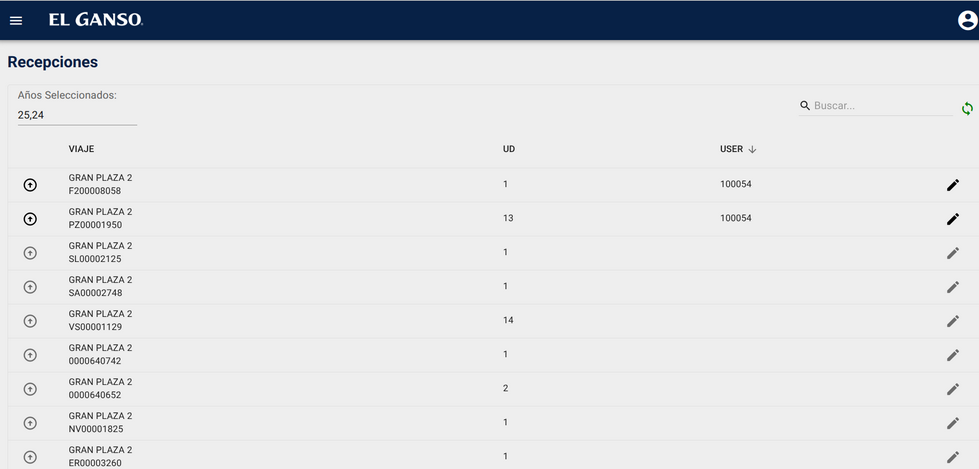

El botón de actualizar descarga al dispositivo todas las recepciones de la base de datos de la tienda.

Al pulsar sobre el botón de editar una recepción se asigna automáticamente la recepción al usuario de la aplicación y se abre el modo edición. Se muestran todas las líneas de la recepción con la cantidad pendiente de recibir y la cantidad escaneada.

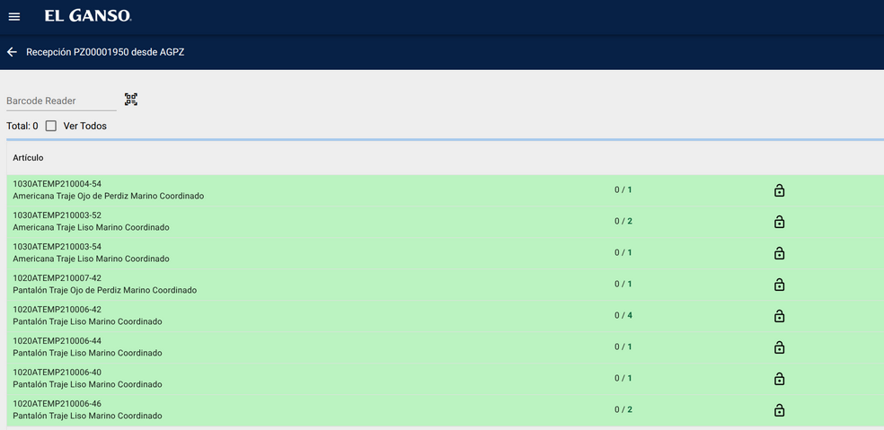

Aquí el usuario deberá de ir introduciendo todos los artículos de la recepción, bien sea introduciendo el código de barras, escaneándolo o mediante la cámara del dispositivo.

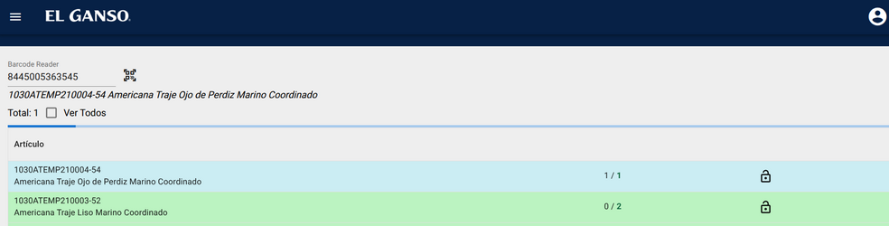

Cuando el código de barras introducido corresponde a un artículo de la recepción aparecerá el nombre del artículo y su referencia debajo del lector de códigos, se actualizará la barra de progreso y si se han alcanzado el total de la cantidad pendiente de recibir la línea cambiará de color.

Se pude marcar una linea como bloqueada si, aunque esté, en la recepción no se va a procesar. Al marcarla como bloqueada desaparecerá del listado y solo se verá si se activa el check ver todos.

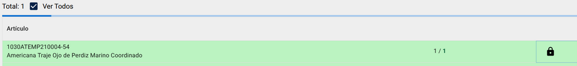

Tras completar la recepción, estará completada en el dispositivo pero faltará sincronizarla con la base de datos de la tienda.

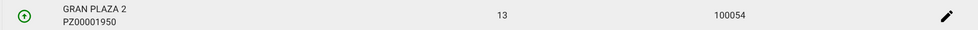

Para ello pulsar el botón de sincronizar recepción en el listado de recepciones.

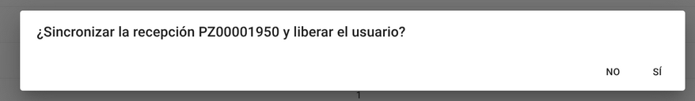

## 3.3.- Envíos de mercancía.

En esta página se muestran los viajes de envío de mercancía de la tienda, el funcionamiento es análogo al de las recepciones de mercancía del apartado anterior, se muestra un listado de todos los envíos de mercancía de la tienda, en la cabecera consta de un selector de años (filtra los años de los envíos) un buscador de envíos y el botón de actualizar.

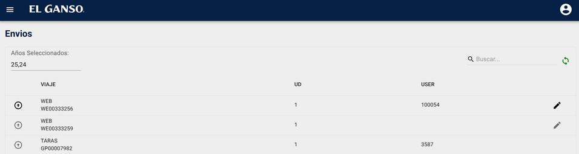

El botón de actualizar descarga al dispositivo todos los envíos de la base de datos de la tienda.

Al pulsar sobre el botón de editar un envío se asigna automáticamente al usuario de la aplicación y se abre el modo edición. Se muestran todas las líneas del envío con la cantidad pendiente de enviar y la cantidad escaneada.

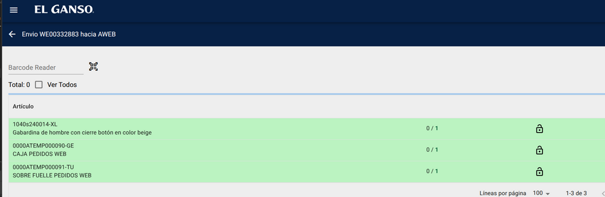

Aquí el usuario deberá de ir introduciendo todos los artículos del envío, bien sea introduciendo el código de barras, escaneándolo o mediante la cámara del dispositivo.

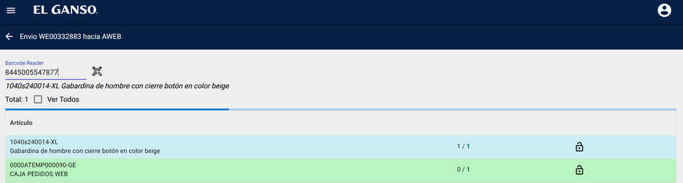

Cuando el código de barras introducido corresponde a un artículo del envío aparecerá el nombre del artículo y su referencia debajo del lector de códigos, se actualizará la barra de progreso y si se han alcanzado el total de la cantidad pendiente de enviar la línea cambiará de color.

Se pude marcar una linea como bloqueada si, aunque esté, en el envío no se va a procesar. Al marcarla como bloqueada desaparecerá del listado y solo se verá si se activa el check ver todos

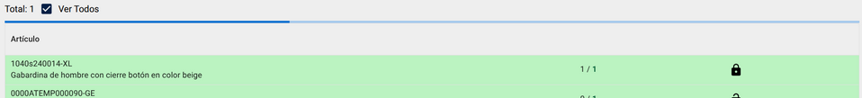

Tras completar el envío, estará completada en el dispositivo pero faltará sincronizarla con la base de datos de la tienda.

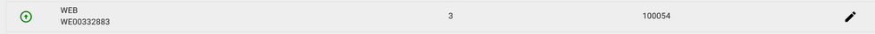

Para ello pulsar el botón de sincronizar envío en el listado de envíos.

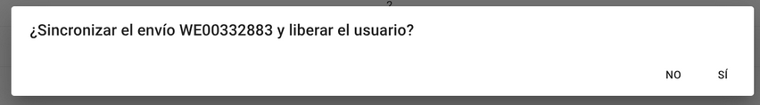

## 3.4.- Consulta de stock.

Esta pantalla sirve para consultar el stock de un artículo en el resto de tiendas.

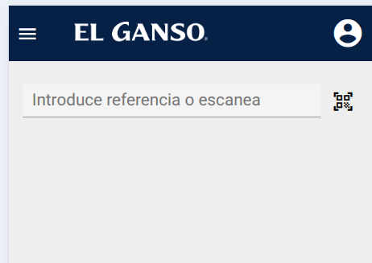

Al acceder solamente se muestra un input donde el ususario podrá introducir una referencia o código de barras.

Se puede introducir manualmente, mediante escáner laser o activando la cámara del dispositivo (si la tuviera)

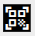

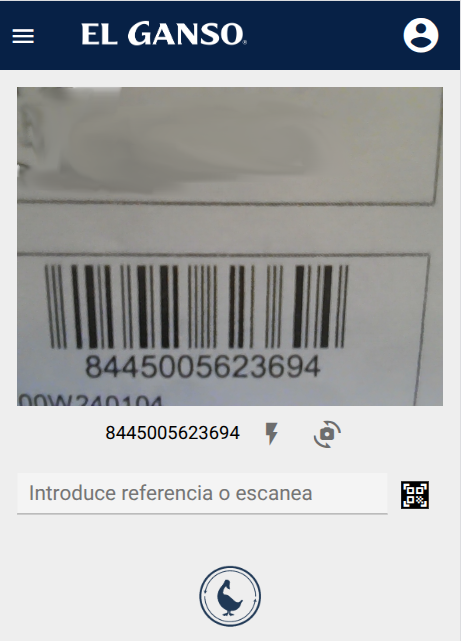

Tras comprobar la referencia se muestra un selector con las tallas de esa referencia (da igual que se haya escaneado un código de barras de una referencia hijo siempre se mostrará el padre y si fuera talla única la referencia). Imaginemos el siguiente supuesto un cliente pregunta si tienen este artículo en la talla M el dependiente puede escanear el código de barras de otra talla, aparecerá el selector y tras seleccionar la talla (también puede elegir mostrar todas las tallas) aparecerán la tiendas ordenadas por proximidad y el stock que disponen. Se puede desplegar la tienda para mostrar la dirección y el teléfono.

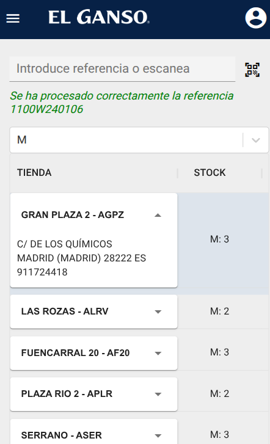

Mostrando el stock para todas las tallas:

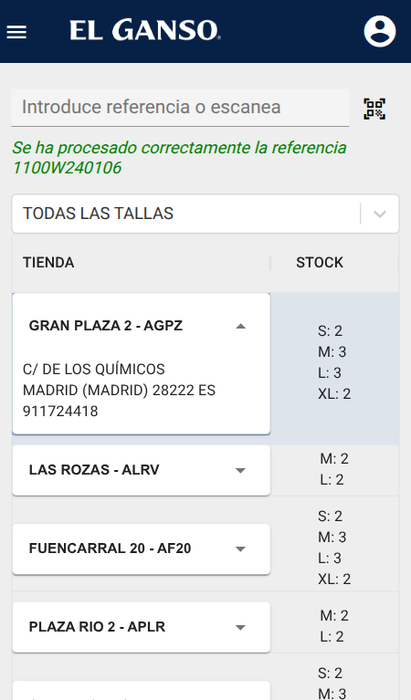

## 3.5.- Cambiar año.

En esta sección se podrá cambiar el año utilizado para inventarios y envíos/recepciones de mercancía.

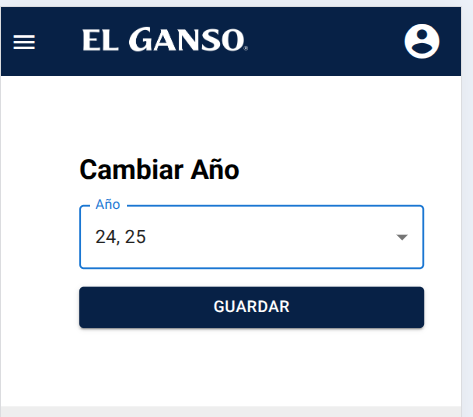

Se puede acceder tanto desde el menú lateral como desde el selector de años de inventarios, envíos/recepciones de mercancía.

