# 5.- Pedidos.

## 5.1.- Preparación pedidos web.

En esta página las tiendas podrán gestionar la preparación de pedidos hechos desde web que tengan que enviar.

En la parte superior se muestra un buscador de pedidos.

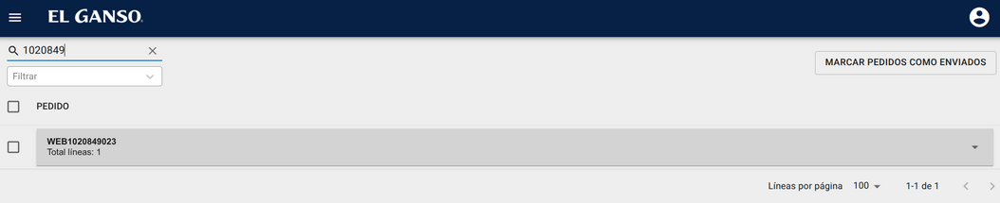

Un filtro de estado de los pedidos. En la parte inferior de la pantalla se muestra el filtro aplicado y la posibilidad de eliminar los filtros aplicados.

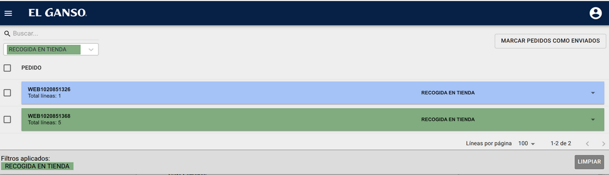

En el filtro se muestran los diferentes estados de un pedido.

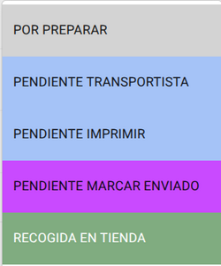

**Por Preparar:**  Estado inicial. Un pedido que haya caído a esa tienda pero todavía no se han marcado todas sus lineas como escaneadas.

**Pendiente Transportista:** Todas las líneas del pedido han sido escaneadas o marcadas como faltantes.

**Pendiente Imprimir:** Se ha avisado al transportista, pero todavía no se ha imprimido la etiqueta de recogida proporcionada por el transportista.

**Pendiente Marcar Enviado:**  Las lineas del pedido se han escaneado o marcado como faltante, se ha avisado al transportista e imprimido la etiqueta, está a la espera de que el transportista venga a recoger el pedido y se marque como enviado. Una vez marcado como enviado el pedido desaparecerá de la lista (ya ha sido resuelto).

**Recogida en tienda:** No es un estado de pedido como tal, pero sirve como filtro para poder ver todos los pedidos que sean de recogida en tienda. Además del código de colores en la cabecera del pedido se muestra el mensaje recogida en tienda en la línea del pedido.

Botón marcar pedidos como enviado: este botón permite marcar varios pedidos como enviados de golpe, es especialmente útil cuando el transportista se lleva varios pedidos a la vez para que no se tengan que marcar como enviado individualmente. Si un pedido de los seleccionados no está en el estado pendiente marcar como enviado se mostrará un mensaje de error con los pedidos pendientes de resolver:

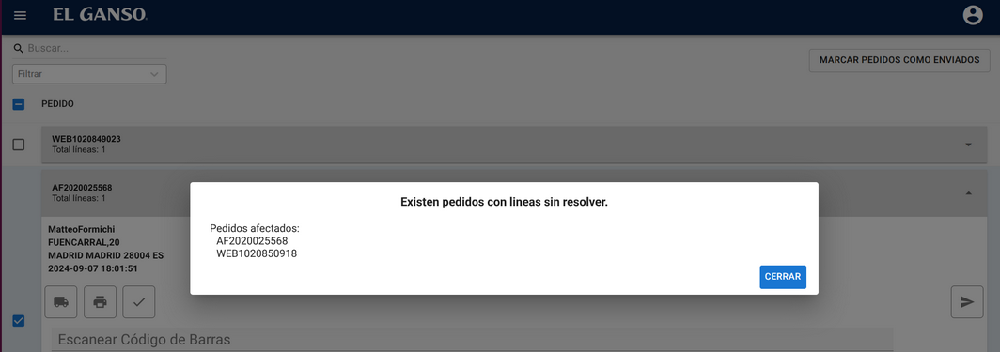

**Procesar lineas:**

Al seleccionar uno de los pedidos de la lista, se desplegará mostrando los datos del pedido y las líneas que lo componen.

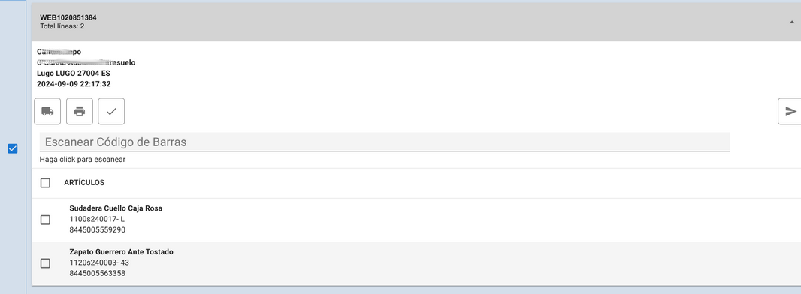

Al situarnos en *Escanear código de barras* podemos introducir manualmente el código de barras del producto o escanearlo con la pistola láser. Si se escanea correctamente la línea que se corresponda al código de barras se marca como escaneada.

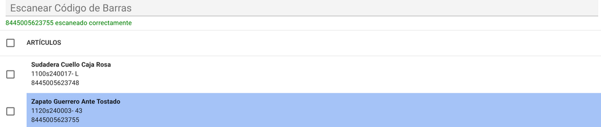

Si el código de barras introducido no se corresponde con una línea del pedido o ya ha sido escaneado se mostrará un mensaje de error (y sonará un pitido diferente).

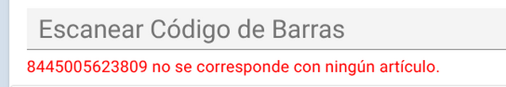

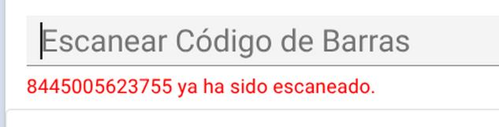

Una vez resueltas todas las líneas del pedido (escaneadas o marcadas como faltante) el pedido cambia de estado y se activa el botón de avisar al transportista.

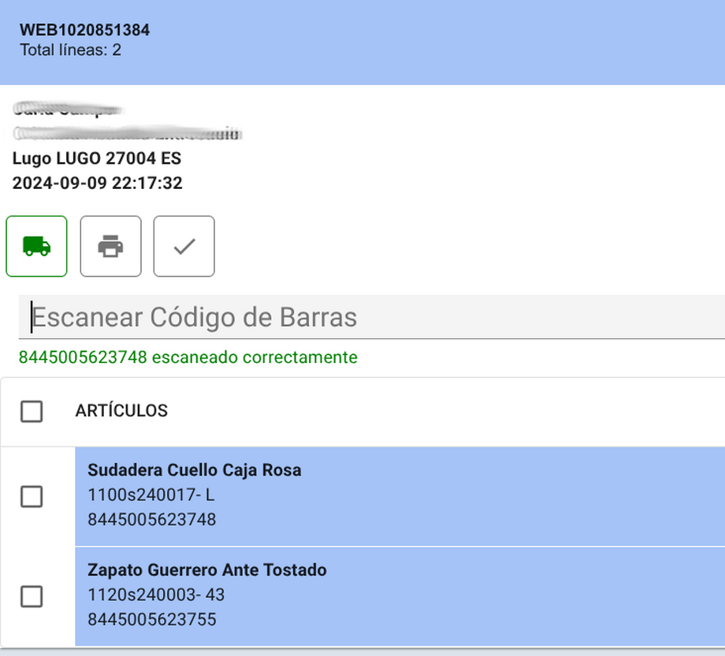

**Marcar linea como faltante:**

Si la tienda no dispone de un artículo puede marcarlo como faltante. Para ello selecciona la linea, o las líneas, y pulsa sobre el botón marcar como faltante.

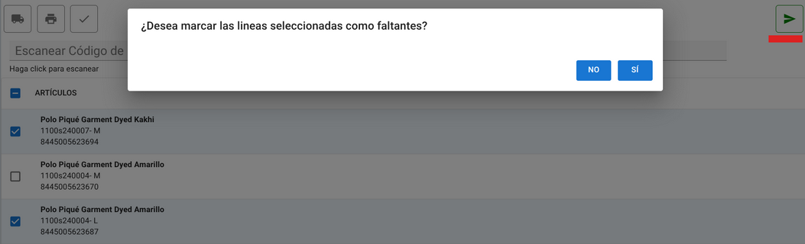

Al marcar como faltantes se pueden regularizar los stocks de las líneas seleccionadas u omitir (solo marcar como faltante la línea).

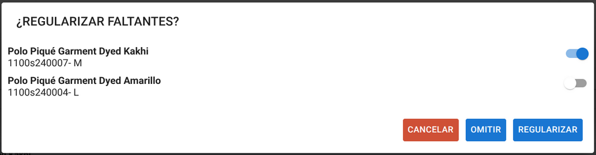

Las líneas marcadas como faltantes ya no aparecerán en el listado de líneas del pedido.

**Avisar al transportista:**

Al resolver todas las líneas de pedido se activa el botón de avisar al trasportista. Al pulsarlo aparecerá el diálogo de selección de bultos (El número de bultos no pude exceder al número de líneas del pedido)

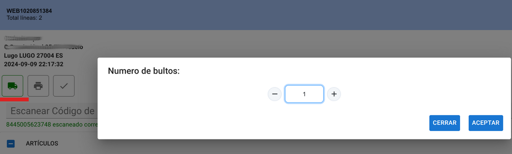

Y el packaging.

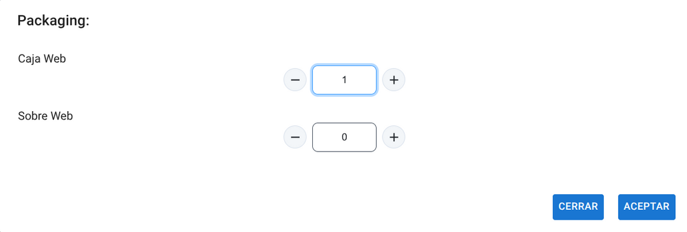

Una vez comunicado el pedido al transportista cambiará el estado a Pendiente de imprimir.

**Pendiente de imprimir:**

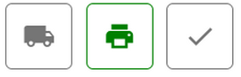

Al pulsar el botón de imprimir se abrirá una nueva ventana en el navegador con la etiqueta proporcionada por el transportista y el pedido cambiará al estado de Pendiente Marcar Enviado.

**Pendiente Marcar Enviado:**

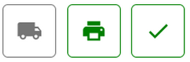

Una vez impresa la etiqueta se podrá marcar como enviado (está pensado para marcarse cuando vaya a recogerlo el transportista o si es un pedido recogida en tienda cuando vaya el cliente).

Al marcar el pedido desaparecerá del listado de pedidos web pendientes.

También se pueden seleccionar varios pedidos y marcar como enviado a la vez como hemos visto, esto está pensado para el caso en el que el transportista vaya a recoger varios pedidos en el mismo viaje.