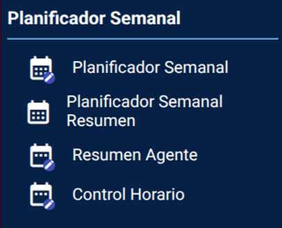
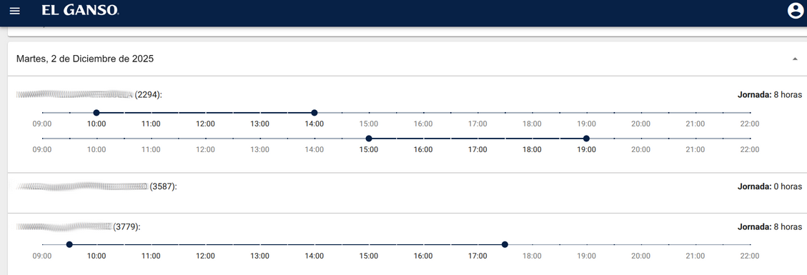
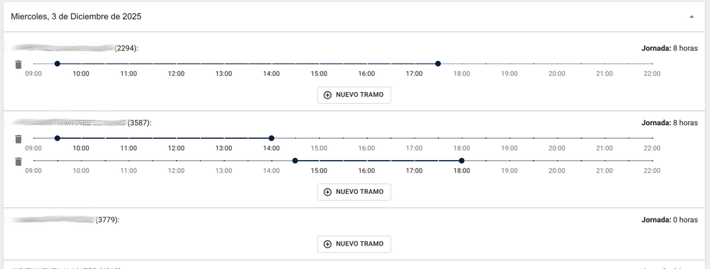
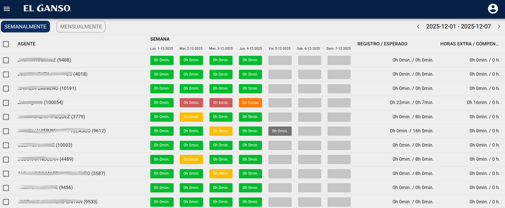
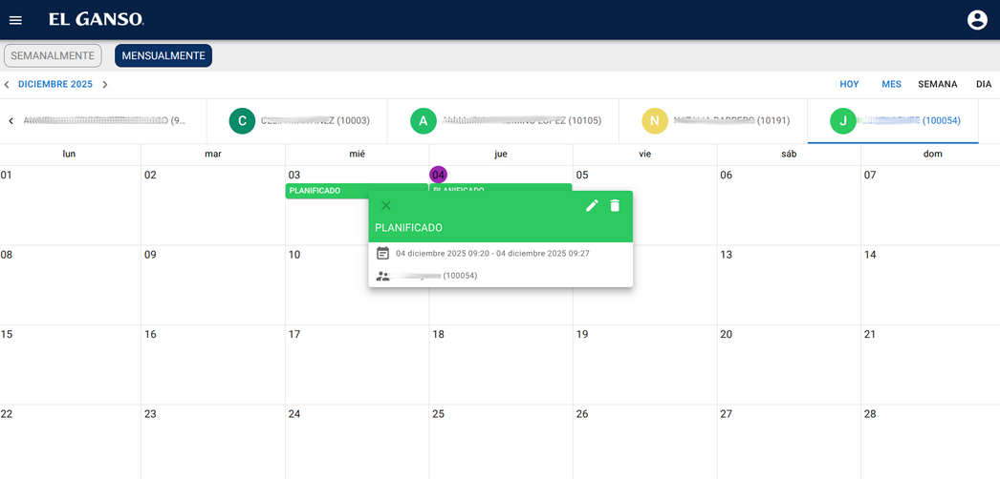
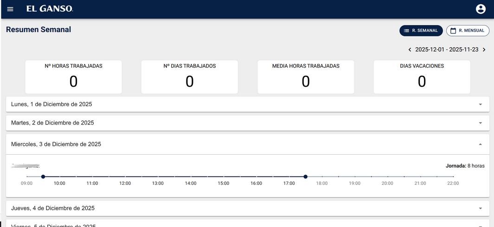
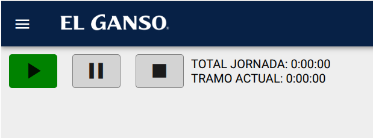
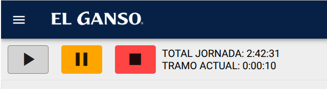
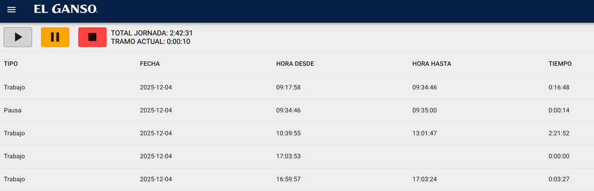

# 4.- Recursos Humanos

En esta sección se muestran las funcionalidades relacionadas con recursos humanos. Está específicamente diseñada para visualizarse en escritorio.

## 4.1.- Planificador semanal.

En esta página un administrador podrá planificar la jornada laboral de los empleados de la tienda. Se muestra un selector de agentes (por defecto todos) y de semana (por defecto semana actual). A continuación aparecerán como desplegables los días de esa semana. Si se trata de un día pasado el administrador no podrá modificar los tramos horarios (añadir, borrar y editar).

Si es una fecha futura se podrán crear, modificar y borrar tramos horarios.

Al crear un nuevo tramo se crea con el horario por defecto (9:30-17:30).

Si se añaden más tramos horarios el nuevo tramo añadido empieza media hora después del fin del último tramo.

## 4.2.- Planificador semanal.

Está pagina muestra el control de la planificación semanal para una tienda, solo estará disponible para los administradores de recursos humanos. Y está específicamente diseñada para visualizarse en escritorio.

Consta de dos secciones semanal y mensualmente.

<ins>Vista Semanal:</ins>

En la columna Agentes se listan todos los agentes de la tienda.

En la columna semana se muestra un resumen semanal de los tiempos trabajados por día, cada día muestra el tiempo trabajado.

Código de colores:

    Jornada futura en la que el trabajador no tiene tiempo planificado.

   Jornada futura en la que el trabajador tiene tiempo planificado

 Jornada actual, el trabajador ha activado el registro temporal y el contador está en marcha

 El trabajador no tenía tiempo planificado pero ha activado el registro laboral ese día durante el tiempo indicado

 El trabajador tenía tiempo planificado y lo ha superado

 El trabajador tenía tiempo planificado y no lo ha superado

Registro / Esperado:

Esta columna muestra el tiempo trabajado frente al tiempo planificado

Horas Extra / Compensadas:

Esta columna muestra el tiempo extra trabajado y las horas extra compensadas.

<ins>Vista Mensual:</ins>

Resume en forma de calendario donde se pueden ver los tiempos planificados para cada agente, se pueden seleccionar fechas y cambiar la vista por mes / semana / día.

## 4.3.- Resumen Agente.

En esta pagina un agente podrá ver el resumen de sus jornadas de trabajo, se puede seleccionar la vista  (mensual/semanal). Muestra el número de horas trabajadas, numero de días trabajados, la media de hora y los días de vacaciones.

## 4.4.- Control horario.

Esta pagina muestra el control horario diario de cada trabajador.

Al inicio de la jornada cada trabajador deberá pulsar el botón play.

Durante los descansos se deberá pulsar el botón pausa y para reanudar la actividad de nuevo el botón play.

Solo al final de la jornada se deberá pulsar el botón stop.

se muestran los diferentes tramos que ha ejecutado el trabajador a lo largo del día.

