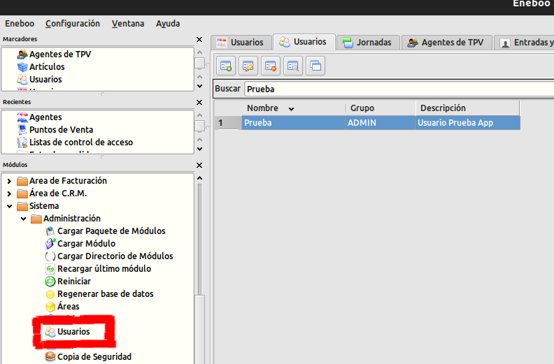
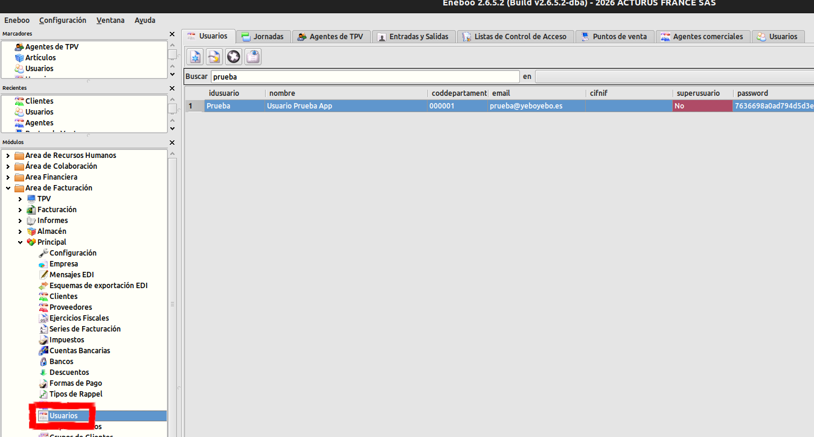
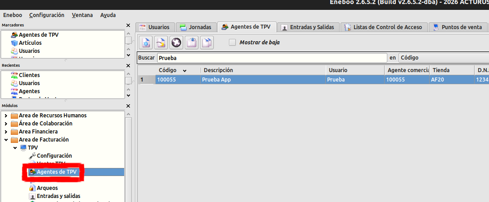
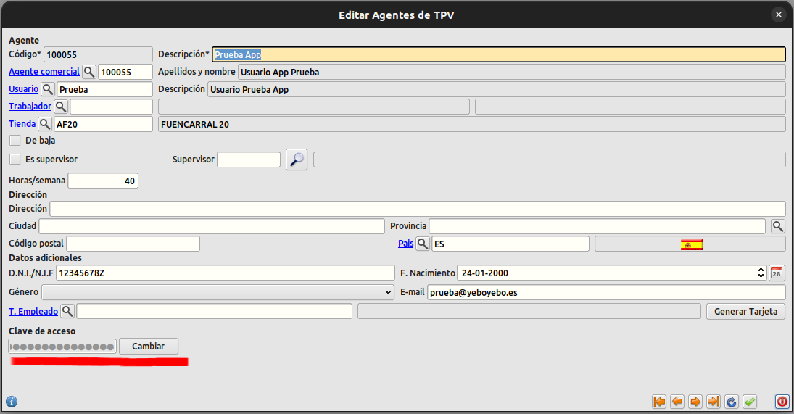
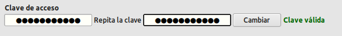

# 1.- USUARIO

En esta página podremos consultar el alta de usaurios, como iniciar sesión a nuestra aplicación o la forma de restaurar nuestra contraseña de inicio de sesión.

# 1.1.- ALTA NUEVO USUARIO

Para dar de alta un nuevo usuario en la app debemos tener lo siguiente.
 1. Crear Usuario (Sistema > Administración > Usuarios)
    
    
 2. Crear Usuario (Area de Facturación > Principal > Usuarios)
    

 3. Agente TPV (Area de Facturación > TPV > Agentes de TPV)
     

Con estos pasos deberíamos de poder acceder con normalidad en la aplicación.

# 1.2.- INICIO DE SESION

Accede con tu correo y tu contraseña de Eneboo configurados en el paso anterior.

# 1.3.- CAMBIO CLAVE DE ACCESO

Tenemos la opción de recuperar nuestra contraseña o cambiarla por una nueva desde Eneboo en la sección **Agente TPV** (Area de Facturación > TPV > Agentes de TPV)

Al hacer clic en **Cambiar**, nos apareceran 2 campos donde debemos poner nuestra nueva contraseña. Finalmente cuando veamos el mensaje *Clave válida*, hacemos clic de nuevo en el botón **Cambiar** para aplicar los cambios.

