# Transferencias de stocks

- Existe 3 formas de realizar una transferencia de stock, manualmente, copiando los datos de una excel o importando un fichero csv.

## Transferencia manual

- Desde **Área de facturación - Almacén - Transferencias de Stock** pulsaremos sobre nuevo registro.

- Informaremos los datos de **Almacenes** (origen y destino) y pulsaremos sobre nueva línea

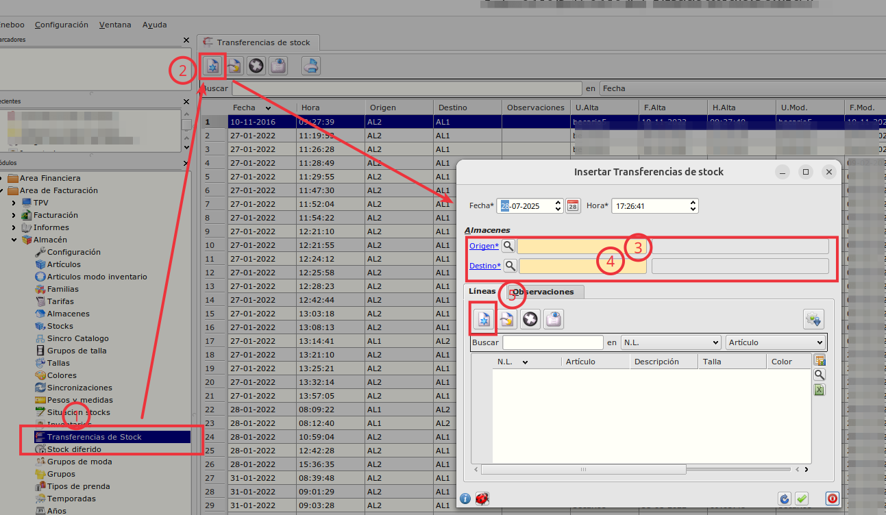

- Informaremos la referencia y cantidad 

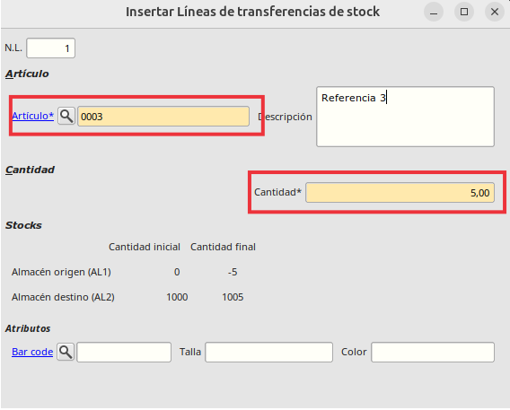

- Si es un artículo que tiene tallas y/o colores informaremos también el barcode

- Aceptaremos y se creará una línea de transferencia


## Transferencia copiando datos dese hoja de cálculo

- Desde **Área de facturación - Almacén - Transferencias de Stock** pulsaremos sobre nuevo registro.

- Informaremos almacén de origen y destino como en la transferencia manual pero pulsaremos en el botón de **Importar datos**


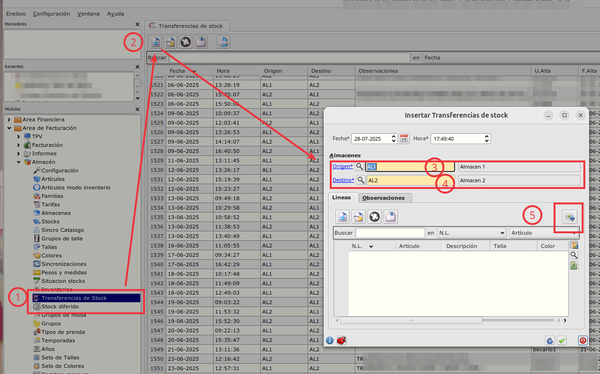

- Se abrirá una pantalla para poder seleccionar **Importar CSV** o **Pegar desde Hoja Cálculo**, pulsaremos en *Pegar desde Hoja de cálculo* y se abrirá un diálogo para pegar datos que tengamos en una hoja de cálculo.


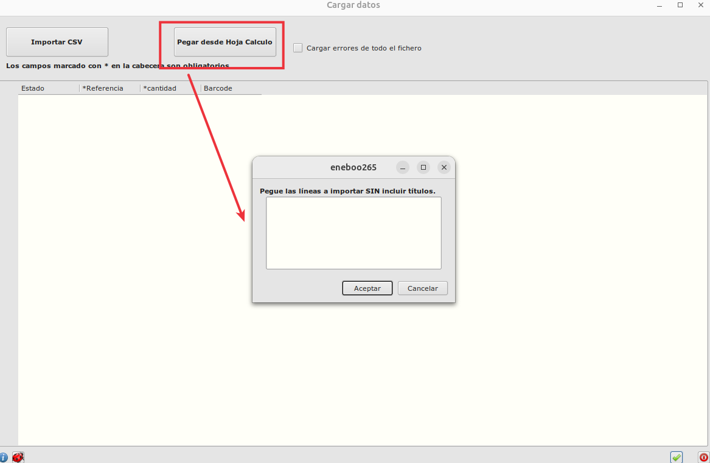


- Los datos que tengamos en la hoja de cálculo serán Referencia - Cantidad o Referencia - Cantidad - Barcode si la referencia va por tallas y/o colores.

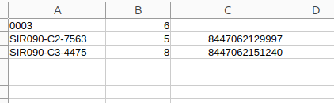

```
En el ejemplo podemos ver que hay 3 líneas, la primera solo tiene informada 2 columnas, la de referencia y la de cantidad ya que esta referencia no va por tallas y/o colores, pero la segunda y tercera línea si que tiene la 3 columna informada con el barcode ya que son referencias que van por tallas y es necesario saber a que talla/color pertenecen.

```

- Copiaremos de la hoja de cálculo las líneas que queramos seleccionando las 3 columnas y las pegaremos en el diálogo y aceptaremos.

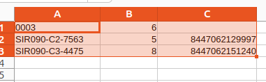

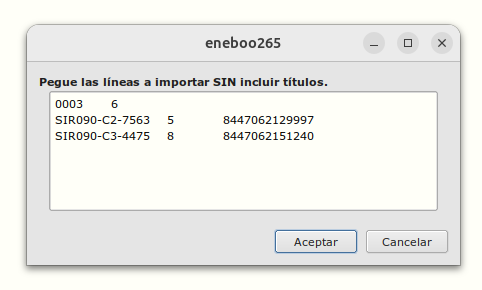

- Si todo ha ido correctamente pondrá en la parte de arriba a la derecha **SIN ERRORES** y al aceptar el formulario se crearán las líneas de transferencia


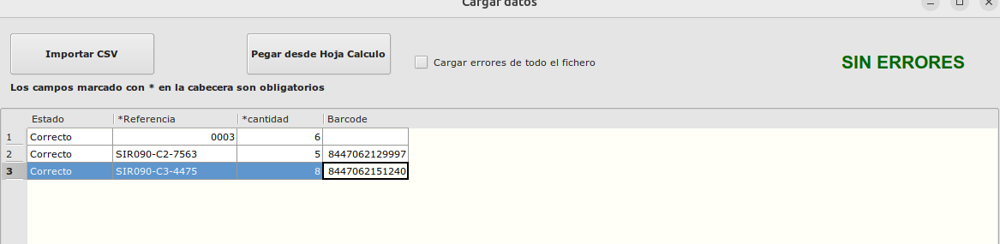

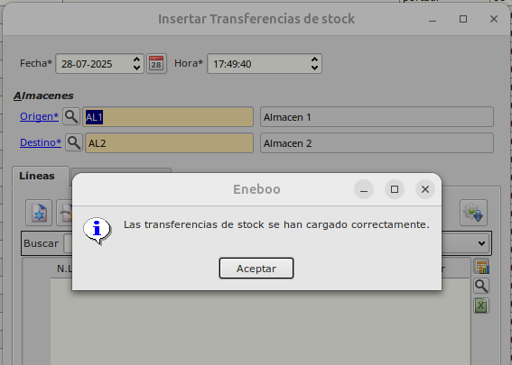

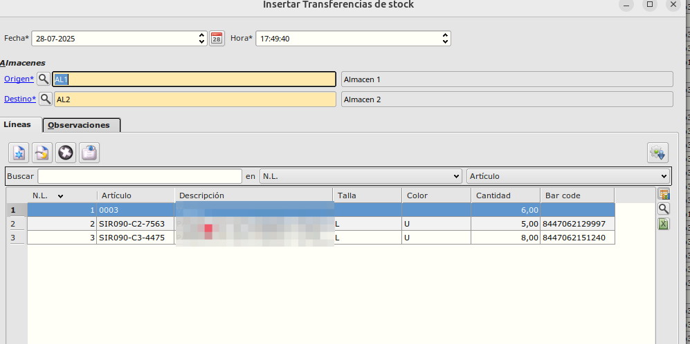


- Si hay algún error, en la parte de arriba a la derecha pondrá **CON ERRORES** y en las líneas que hay errores pondrá **Incorrecto**

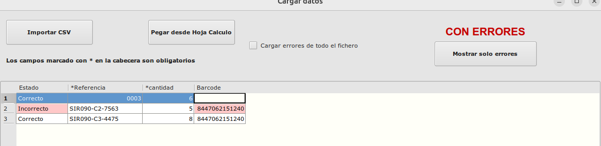

- Haciendo doble click sobre la línea que está incorrecta sobre la celda que pone *Incorrecto* se mostrará un mensaje con el detalle del error:

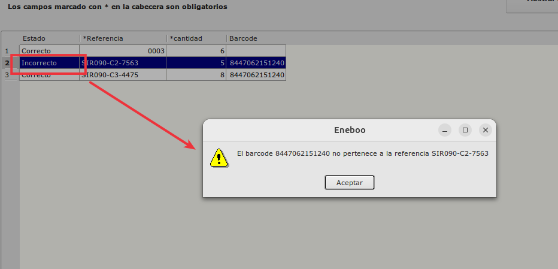


## Transferencia importando fichero csv

- Desde **Área de facturación - Almacén - Transferencias de Stock** pulsaremos sobre nuevo registro.

- Informaremos almacén de origen y destino y al igual que en la *Transferencia copiando datos de hoja de cálculo*, pulsaremos en el botón de **Importar datos**


- Se abrirá una pantalla para poder seleccionar **Importar CSV** o **Pegar desde Hoja Cálculo**, en este caso pulsaremos en *Importar csv* y se abrirá un diálogo seleccionar los parámetros del fichero csv:

    - **Separador**: Es el separador que utiliza el fichero csv para separar las columnas, por defecto la barra **|**

    - **Ignorar primera línea**: Marcaremos este check si el csv contiene una líneas con los títulos

    - **Número de líneas adicionales a ignorar**: Por defecto es 0, aquí informaremos el número de líneas adicionales a ignorar por si tiene subtítulos el fichero csv.

    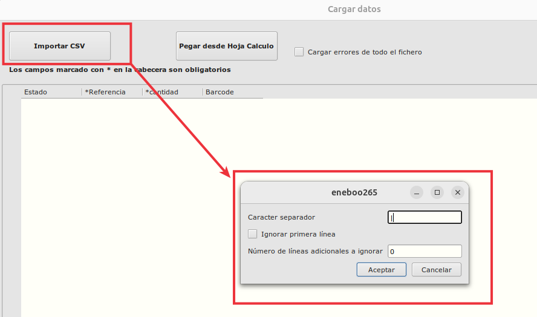

- El **formato del fichero csv** es el siguiente, 3 columnas:

    - 1ª columna: Referencia, es **obligatoria**

    - 2ª columna: Cantidad, es **obligatoria**

    - 3ª columna: Barcode, esta es opcional, se informará para aquellas referencias que vayan por talla y/o color.

- En nuestro ejemplo vamos a importar un fichero el cual:

    - Tiene título

    - El carácter separador es la barra |

    - Tiene 3 líneas, la primera solo referencia y cantidad y las otras dos como van por talla informaremos el barcode

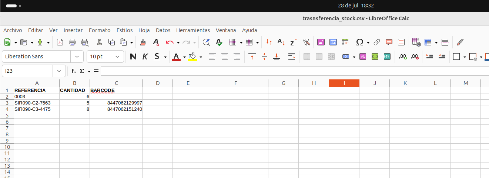


- Por tanto en el díalogo de marcaremos **Ignorar primera línea**

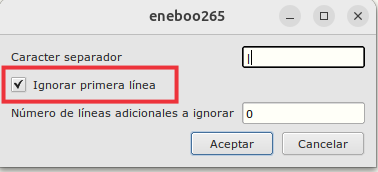

- Pulsaremos aceptar y nos saldrá diálogo para elegir el fichero csv

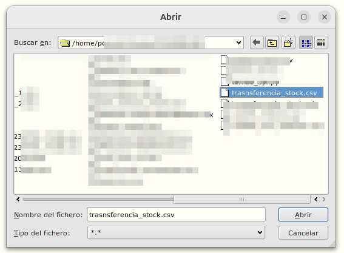

- Se cargarán las líneas que hay en el fichero 

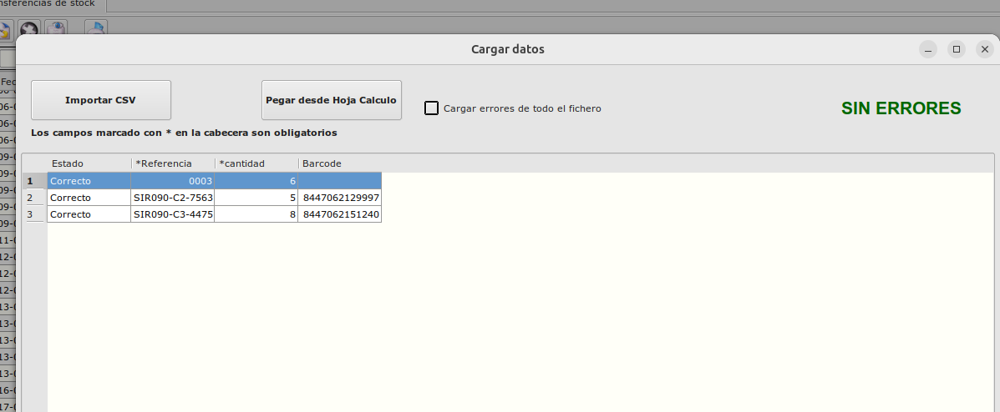


- Si todo ha ido correctamente pondrá en la parte de arriba a la derecha **SIN ERRORES** y al aceptar el formulario se crearán las líneas de transferencia


- Si hubiera algún error, como en el caso de **Copiar desde Hoja Cálculo** en la parte de arriba a la derecha pondrá **CON ERRORES** y en las líneas que hay errores pondrá **Incorrecto**


- Haciendo doble click sobre la línea que está incorrecta sobre la celda que pone *Incorrecto* se mostrará un mensaje con el detalle del error.
