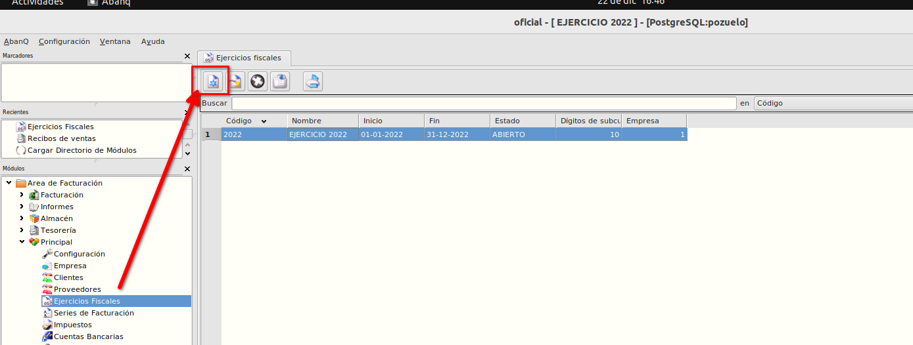
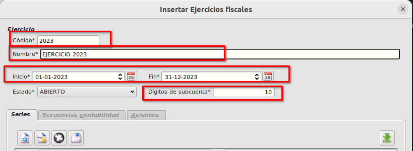
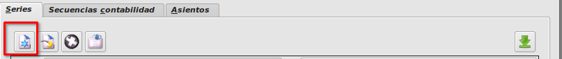
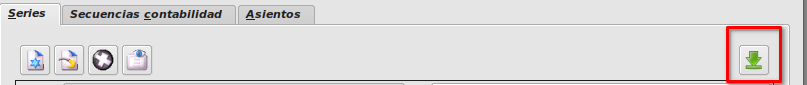
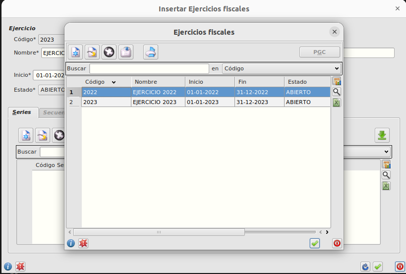
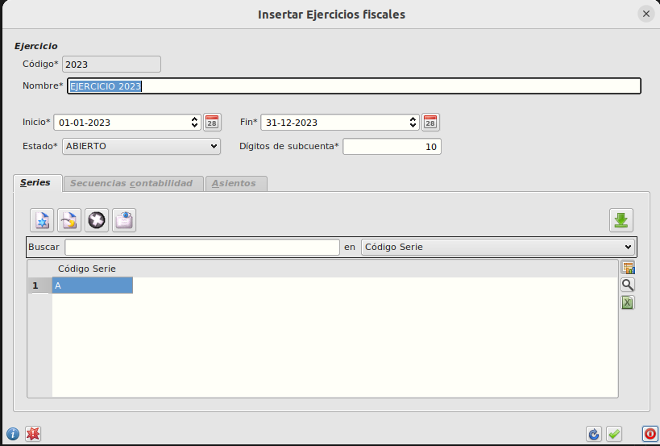
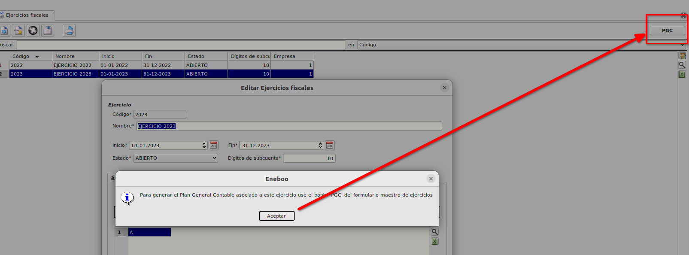
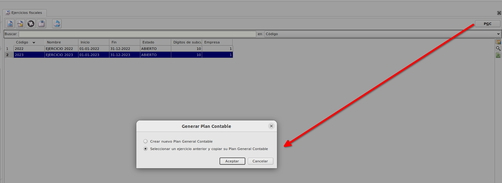

# Ejercicios

## ¿Cómo crear un ejercicio nuevo?

* En **Área de facturación -> Principal -> Ejercicios Fiscales** vemos que tenemos todos los ejercicios fiscales, pulsaremos sobre nuevo registro para crear el nuevo ejercicio.

* Por defecto nos ofrecerá un *Código* de ejercicio y unas fechas de *Inicio* y *Fín* de ejercicio, comprobaremos que son correctos y si no los modificaremos.
Informaremos la *descripción* e informaremos los *Dígitos de subcuenta* tal y como lo teníamos el año anterior (en el ejemplo son 10).

* Una vez informados estos campos crearemos las *Series*, bien de forma manual utilizando el botón de nuevo registro 

o bien pulsaremos el botón para copiar series de un ejercicio anterior

Al pulsar se mostrarán todos los ejercicios fiscales.

Seleccionaremos el ejercicio inmediatamente anterior al que estamos creando (en nuestro ejemplo el 2022).

* Cuando tengamos los datos informados y las series creadas, aceptamos el formulario y nos aparece un mensaje indicando que para generar el cuadro de cuentas debemos de utilizar el botón *PGC*.

* Cuando pulsemos sobre el botón *PGC* teniendo seleccionado el registro del ejercicio que acabamos de crear, podremos elegir entre *Crear un nuevo Plan General Contable* o *Seleccionar un ejercicio anterior y copiar su Plan General Contable*.

* Seleccionaremos la segunda opción ya que así tendremos las mismas cuentas y subcuentas que hemos creado en el ejercicio anterior.Al pulsar aceptar se muestran los ejercicios anteriores, seleccionamos el ejercicio inmediatamente anterior al que acabamos de crear (en nuestro ejemplo el 2022) y aceptamos. Se creará así el plan general contable para el nuevo ejercicio.

