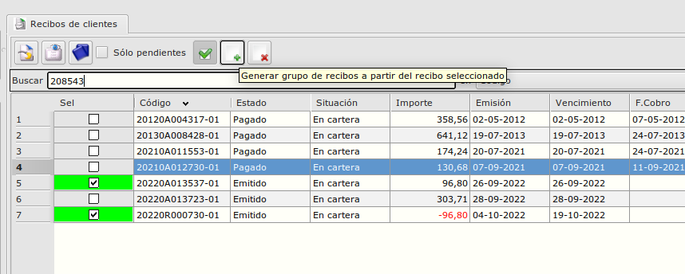
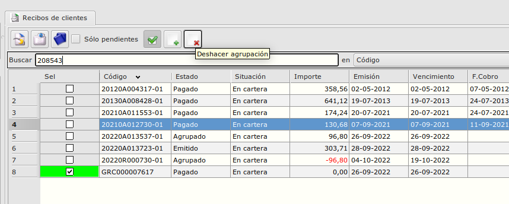

# Agrupar / Desagrupar recibos

## ¿Cómo agrupamos recibos de un cliente?

## Pasos para agrupación de recibos
* Seleccionamos el cliente 
* Activamos la multi selección
* Selecionamos los recibos los que queremos agrupar. Deben ser recibos con estado 'Emitido' o 'Devuelto'.
* Con el botón 'Generar grupo de recibos ...' creamos el recibo agrupado.

## ¿Cómo deshacemos una agrupación de recibos de un cliente?

## Pasos para desagrupar un recibo agrupado
* Seleccionamos el cliente 
* Activamos la multi selección
* Selecionamos el recibo agrupado
* Con el botón 'Deshacer la agrupación' eliminamos el recibo agrupado. Al terminar el proceso los recibos que pertenecian en el recibo agrupado se quedan como Emitidos. 