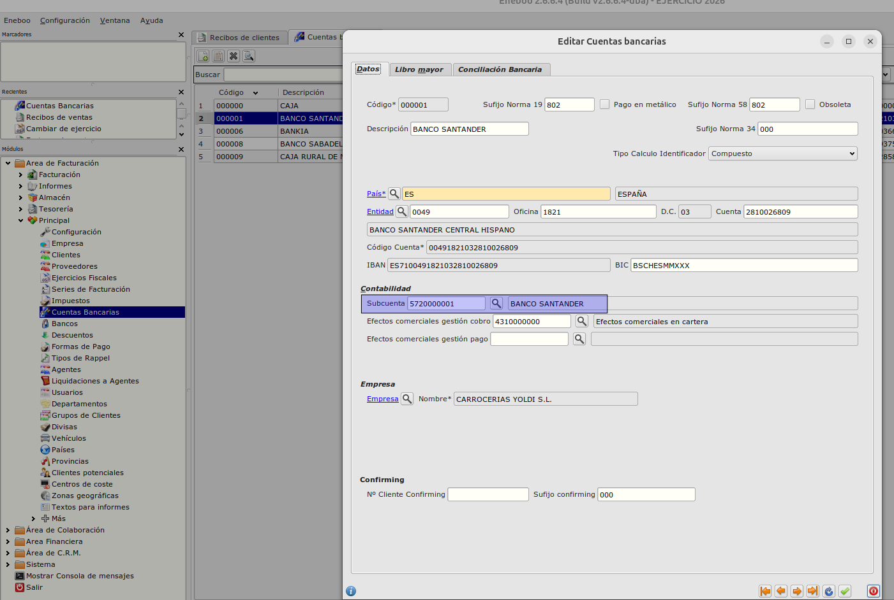
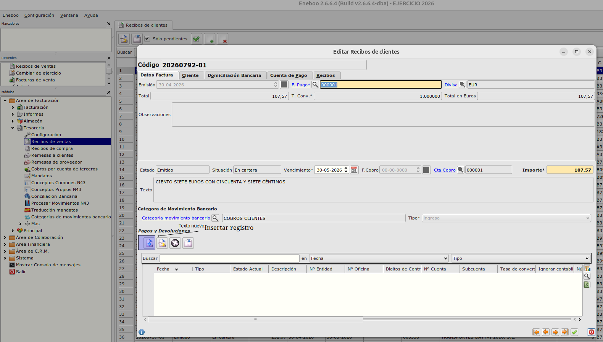
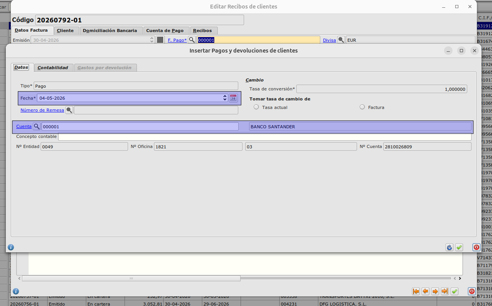
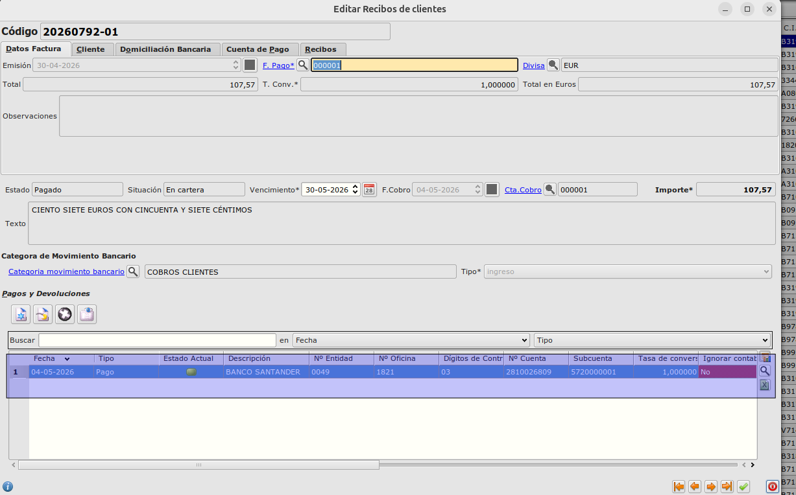
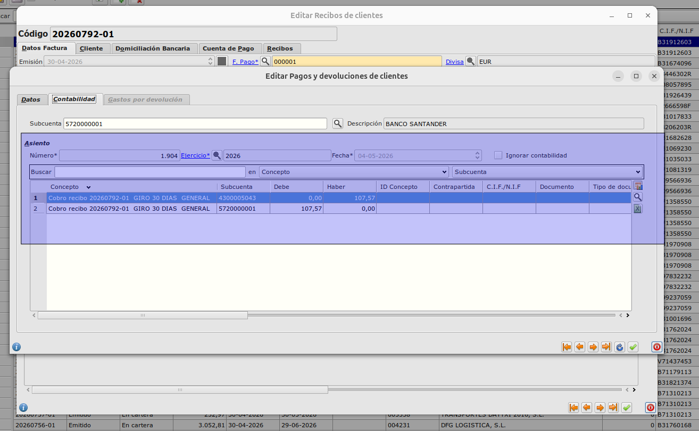

# Pagar / Devolver recibo

## Configuración Cuenta Bancaría
Para que se crea correctamente el asiento de pago/devolución de recibos tenemos que configurar la subcuenta del banco en su ficha.

## Pasos para hacer el pago/devolució de recibo
* Entramos en el formulario de recibo

* Desde la tabla 'Pagos y Devoluciones' creamos el pago/devolución con el botón 'Insertar'
* Se abre el formulario de pago/devolución.
* Informamos los datos obligatorios (fecha, cuenta)

* Guardamos el formulario de pago/devolución

* Guardamos el formulario de recibo
* Se ha creado el asiento del pago.

* Para crear una devolución los pasos son los mismos con la condición que antes el recibo debe de tener un pago creado. El programa detecta que existe un pago y el siguiente registro que crea es una devolución.
