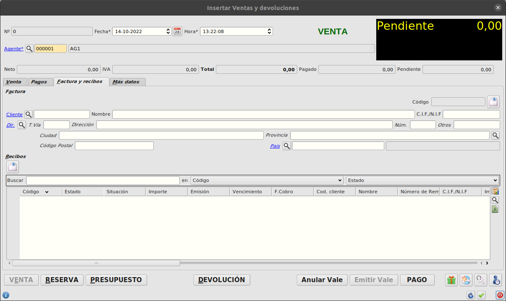
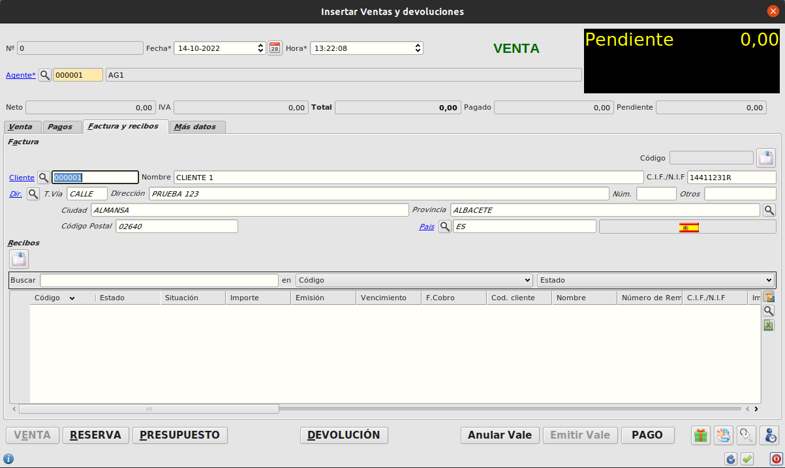

# ¿Cómo generar una factura?

* En este formulario encontramos la pestaña **facturas y recibos**:
    - Podemos buscar con la lupa un registro de cliente ya informado en el sistema, el cual tras ser seleccionado, informará todos los campos relacionados (nombre, direccion, ciudad, provincia, etc...).
    - O también podemos hacerlo escribiendo manualmente los datos en los campos correspondientes por si el cliente no esta registrado en la base de datos.

* De ambas formas se guardarán los datos y se mostrarán en el ticket al finalizar la venta e imprimirse justo entre las líneas y el código del ticket.
