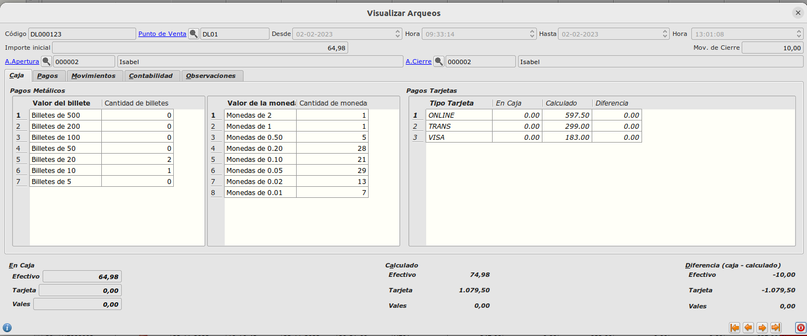
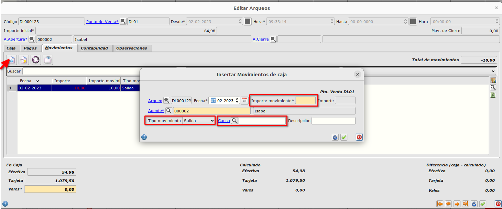

# ¿Cómo generar movimiento salida / entrada de un arque?

En este formulario encontramos la pestaña **Movimientos**:

    - El movimiento se crea con el botón **Insertar registro**. Se abre el formulario de movimientos donde se informan los campos **Tipo movimiento**, **Importe movimiento** y tambien si tenemos creada la **Causa de movimiento**. El campo **Importe movimiento** siempre se informa con valor positivo. Según el tipo de movimiento (Salida o Entrada) el campo **Importe** se calcula con el valor del **Importe movimiento** multiplicado por 1 en caso de Entrada y -1 en caso de Salida.
    