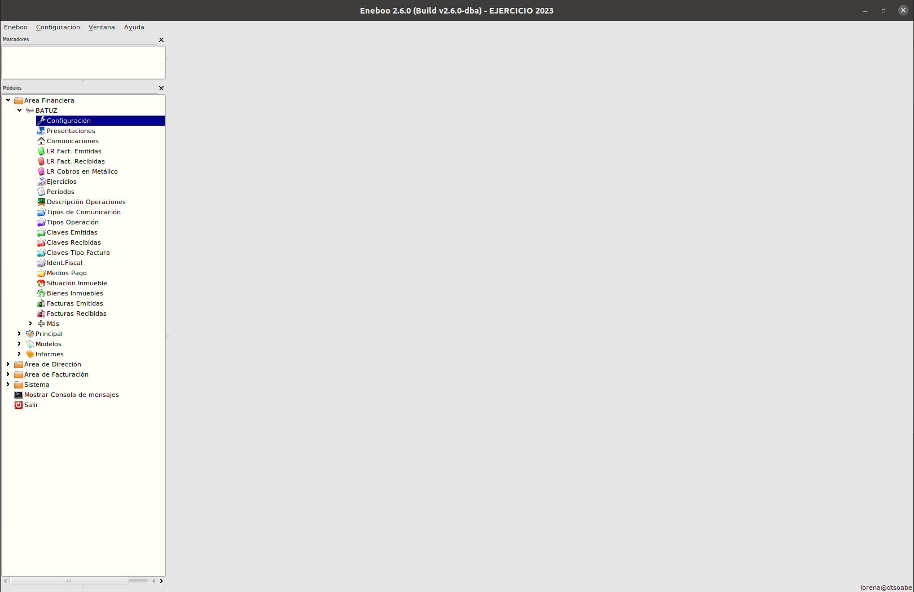
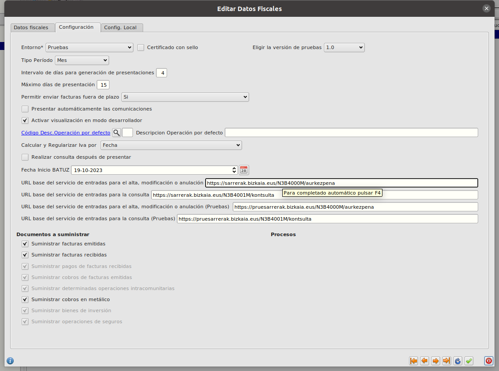
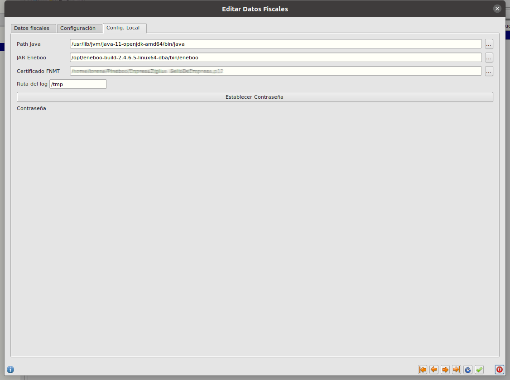

# Batuz
----------------------

## ¿Qué es Batuz?
BATUZ es una estrategia de control de la tributación de todas las empresas y autónomos sujetos a la normativa de Bizkaia con independencia de su tamaño.

BATUZ lo forman tres componentes:
* SOFTWARE GARANTE DE FACTURACIÓN TICKETBAI
Sistema informático de facturación para asegurar la declaración de todas las operaciones de venta realizadas. 

* LIBRO REGISTRO DE OPERACIONES ECONÓMICAS (LROE): MODELOS 140 Y 240
En los que se declararán los ingresos, gastos y facturas de las personas que realizan actividades económicas. Modelo 140 para personas físicas y Modelo 240 para personas jurídicas.

* ELABORACIÓN DE BORRADORES DE IVA, SOCIEDADES Y RENTA
Con la información remitida en los modelos 140 y 240, la Hacienda Foral de Bizkaia elaborará a las personas jurídicas y a las personas físicas con actividad económica borradores de declaración de IVA y de Sociedades o Renta.

# Acceso y configuración

Podemos acceder al módulo Batuz en el Área Financiera.

## Configuraciones en Eneboo

Antes de empezar a trabajar con Batuz en Eneboo hay que realizar algunas cofiguraciones.

- [Configuraciones de TicketBAI y firma de facturas](../../../../extensiones/ticketbai/index.md)

- Configuración del módulo de Batuz. Podemos acceder desde Area Financiera-->Batuz->Configuración
En el formulario aparecerán 3 pestañas:

* **Datos Fiscales**. En esta pestaña estableceremos los datos de la empresa, así como la razón social proporcionada por Batuz al darnos de alta. Si tenemos varias empresas habrá que crear un registro por cada una

* **Configuración** En esta pestaña estableceremos configuraciones sobre el comportamiento del módulo: Tipo de entorno, tipo de periodo, intervalo de presentaciones, fecha de inicio en Batuz, urls de consulta y envio de datos a batuz...

* **Configuración Local** En esta pestaña configuraremos urls a aplicaciones de nuestro equipo y al certificado de empresa

[Volver](../index.md)

