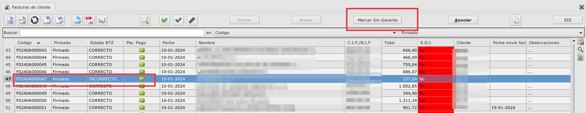
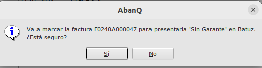
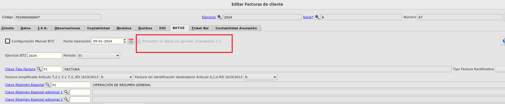
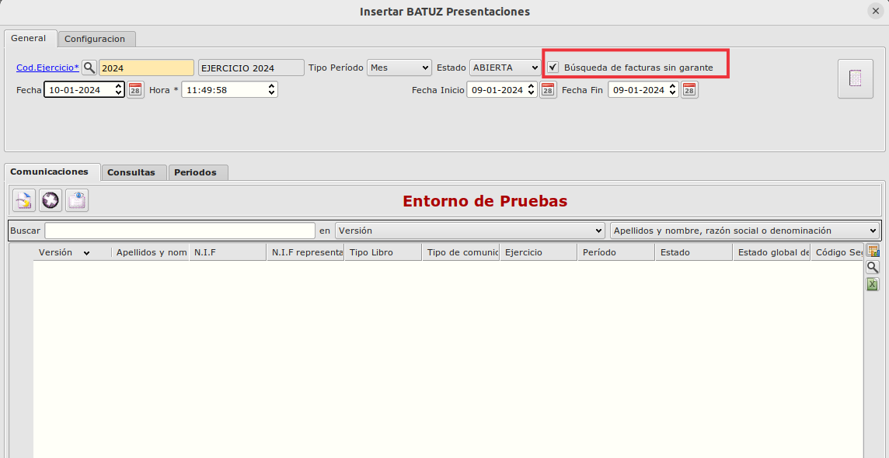
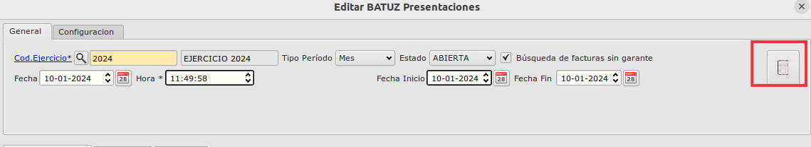
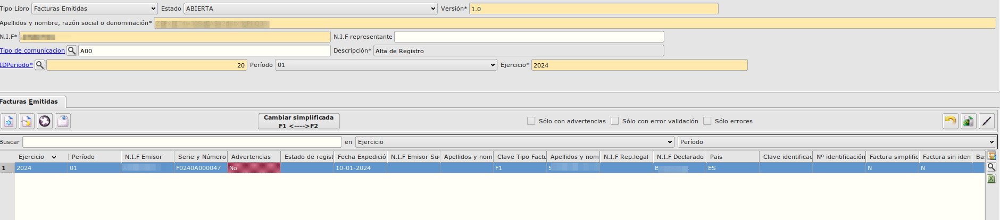

# Batuz. Guía rápida
----------------------

En esta sección se describe brevemente y con un sentido práctico cómo usar el módulo Batuz de Eneboo para el suministro de facturas emitidas y recibidas. Vamos a suponer que el módulo está correctamente configurado.

## Alta de facturas
La información para Batuz de las facturas de cliente o de proveedor es generada de forma automática por Eneboo en el momento en que se crea la factura.
De forma periódica se procederá a generar y enviar las nuevas facturas generadas como se indica a continuación:
- Abrimos la opción de menú Area Financiera → BATUZ → Presentaciones.
- Pulsamos el botón Insertar registro.
- Indicar Fecha Inicio y Fecha Fin del intervalo de facturas que vamos a suministrar.
- Pulsamos el botón Calcular Datos .
- Si pide la clave para el certificado digital la introducimos y pulsamos Aceptar.
- Eneboo rellenará las pestañas Comunicaciones, Consultas y Periodos. La pestaña Comunicaciones es la que contiene los datos que va a suministrar a Batuz.
- Cerramos el formulario aceptando los cambios.
- Pulsamos el botón Generar Fichero .
- Abrimos la presentación y consultamos el Estado global de cada una de las comunicaciones. Si hay algún error podemos consultar el Estado de registro de cada factura abriendo la comunicación.

## Modificación de facturas
Batuz permite enviar modificaciones solamente de facturas recibidas que no se han registrado correctamente en el libro correspondiente. Estas modificaciones no pueden afectar a los datos de identificación del emisor, número de factura y fecha de expedición (en cuyo caso se deberá realizar una baja de las facturas como se explica en el apartado siguiente).
Es importante no confundir este tipo de comunicación con la de facturas rectificativas, que se suministrarán como altas según lo explicado en el apartado anterior.
Para hacerlo seguiremos estos pasos:
- Abrimos la opción de menú Área Financiera → BATUZ → Presentaciones.
- Pulsamos el botón Insertar registro.
- Indicar Fecha Inicio y Fecha Fin del intervalo en el que se encuentran las facturas a modificar.
- Pulsamos el botón Calcular Datos .
- Si pide la clave para el certificado digital la introducimos y pulsamos Aceptar.
- Eneboo rellenará las pestañas Comunicaciones, Consultas y Periodos. La pestaña Comunicaciones es la que contiene los datos que va a suministrar a Batuz.
- Las facaturas recibidas modificaras aparecerán con el tipo M00
- Cerramos el formulario aceptando los cambios.
- Pulsamos el botón Generar Fichero .
- Abrimos la presentación y consultamos el Estado global de cada una de las comunicaciones. Si hay algún error podemos consultar el Estado de registro de cada factura abriendo la comunicación.

## Baja de facturas
Se pueden dar de baja facturas recibidas enviadas por error. Es importante no confundir esto con las facturas rectificativas que, como ya se ha dicho, se deben enviar como facturas nuevas y por tanto enviarlas como altas.
Para hacerlo seguiremos estos pasos:
- Eliminamos las facturas que queramos dar de baja en la lista de facturas de proveedores y que ya han sido enviadas previamente.
- Abrimos la opción de menú Área Financiera → BATUZ → Presentaciones.
- Pulsamos el botón Insertar registro.
- Indicar Fecha Inicio y Fecha Fin del intervalo en el que se encuentran las facturas a modificar.
- Pulsamos el botón Calcular Datos .
- Si pide la clave para el certificado digital la introducimos y pulsamos Aceptar.
- Eneboo rellenará las pestañas Comunicaciones, Consultas y Periodos. La pestaña Comunicaciones es la que contiene los datos que va a suministrar a Batuz.
- Revisamos que las comunicaciones tienen el tipo de comunicación vacío (con el fondo rojo).
- Editamos las comunicaciones que queden y revisamos que las facturas que contienen sean aquellas para las que queremos enviar la baja. Eliminaremos aquellas para las que no queremos enviar la baja.
- Cerramos el formulario aceptando los cambios.
- Pulsamos el botón Generar Fichero .
- Abrimos la presentación y consultamos el Estado global de cada una de las comunicaciones. Si hay algún error podemos consultar el Estado de registro de cada factura abriendo la comunicación.

## Presentación de facturas SIN Garante
En los casos en las que una determinada factura está firmada pero da error al presentar (el campo **Firmado** de la factura tiene el valor de *Firmado* o *Anulado* porque la hemos anulado y el campo **Estado Batuz**  es *INCORRECTO*), tenemos que solventar los errores que hacen que falle al presentar y volver a presentar.

Como la factura está firmada no es posible modificarla por lo que habría que modificar el registro en la propia presentación y poder presentarla *SIN Garante* ya que lo firmado no corresponde con lo que se va a presentar.
Para ello seguirmos estos pasos:
- Marcaremos la factura a presentar como *Sin Garante*, para ello teniendo la factura seleccionada, pulsaremos el botón de **Marcar Sin Garante**

- Nos avisará de que la factura se va a presentar *Sin Garante* y si queremos continuar.

    - Si pulsamos en No no hará nada
    - Si pulsamos en Si la factura se marca como *Sin Garante*

- Crearemos una nueva presentación informando todos los filtros deseados como si una **Alta** normal se tratara
- Marcaremos el check de **Búsqueda de facturas sin garante**

- Pulsaremos en el botón de calcular datos 

- Nos aparecerá únicamente las facturas que estén marcadas como *Sin Garante*, en nuestro ejemplo la factura *F0240A000047*

- El resto de pasos es el mismo que en una presentación normal

[Volver](../index.md)