# Batuz
----------------------

## ¿Qué es Batuz?
BATUZ es una estrategia de control de la tributación de todas las empresas y autónomos sujetos a la normativa de Bizkaia con independencia de su tamaño.

BATUZ lo forman tres componentes:
* SOFTWARE GARANTE DE FACTURACIÓN TICKETBAI
Sistema informático de facturación para asegurar la declaración de todas las operaciones de venta realizadas. 

* LIBRO REGISTRO DE OPERACIONES ECONÓMICAS (LROE): MODELOS 140 Y 240
En los que se declararán los ingresos, gastos y facturas de las personas que realizan actividades económicas. Modelo 140 para personas físicas y Modelo 240 para personas jurídicas.

* ELABORACIÓN DE BORRADORES DE IVA, SOCIEDADES Y RENTA
Con la información remitida en los modelos 140 y 240, la Hacienda Foral de Bizkaia elaborará a las personas jurídicas y a las personas físicas con actividad económica borradores de declaración de IVA y de Sociedades o Renta.

# Acceso y configuración

Podemos acceder al módulo Batuz en el Área Financiera.

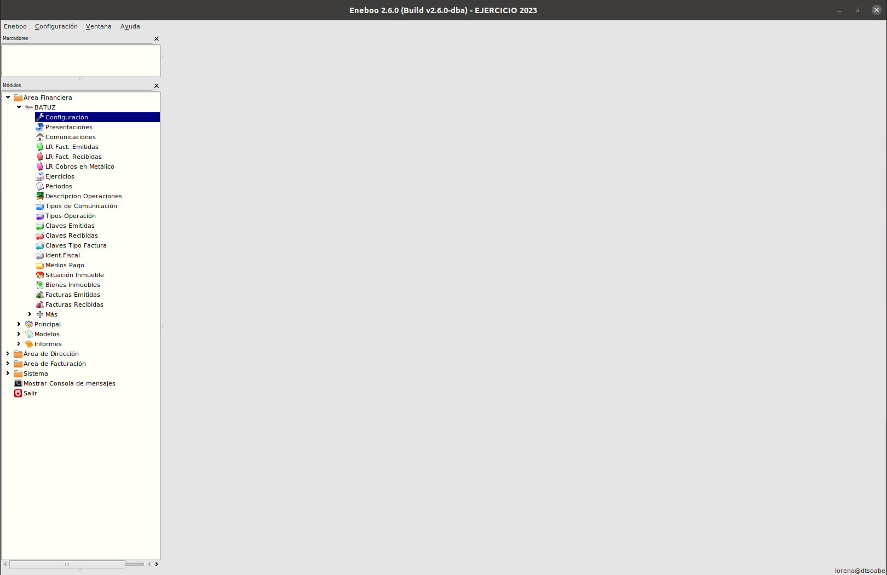

## Configuraciones en Eneboo

Antes de empezar a trabajar con Batuz en Eneboo hay que realizar algunas cofiguraciones.

- [Configuraciones de TicketBAI y firma de facturas](../../../extensiones/ticketbai/index.md)

- Configuración del módulo de Batuz. Podemos acceder desde Area Financiera-->Batuz->Configuración
En el formulario aparecerán 3 pestañas:

* **Datos Fiscales**. En esta pestaña estableceremos los datos de la empresa, así como la razón social proporcionada por Batuz al darnos de alta. Si tenemos varias empresas habrá que crear un registro por cada una
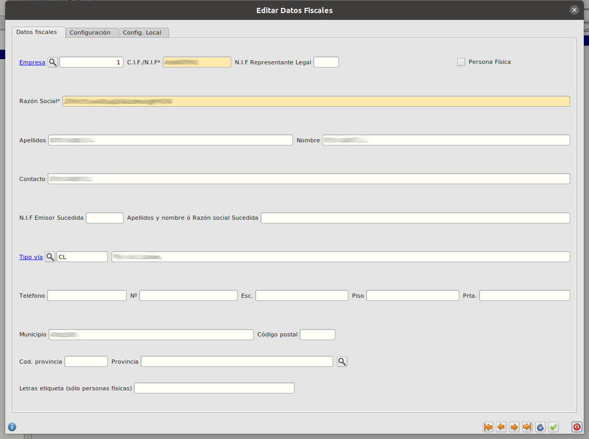

* **Configuración** En esta pestaña estableceremos configuraciones sobre el comportamiento del módulo: Tipo de entorno, tipo de periodo, intervalo de presentaciones, fecha de inicio en Batuz, urls de consulta y envio de datos a batuz...
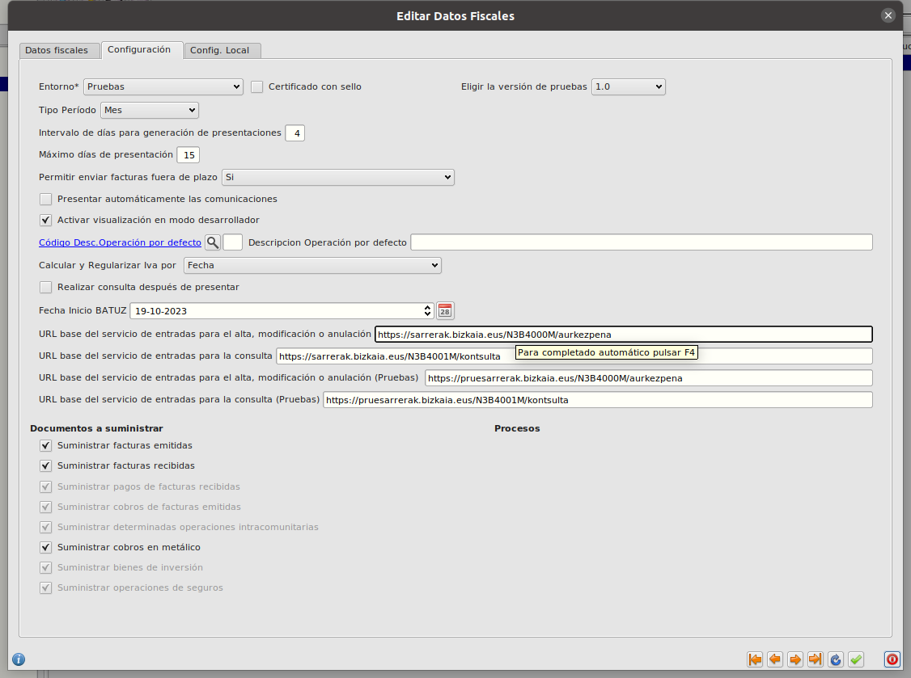

* **Configuración Local** En esta pestaña configuraremos urls a aplicaciones de nuestro equipo y al certificado de empresa

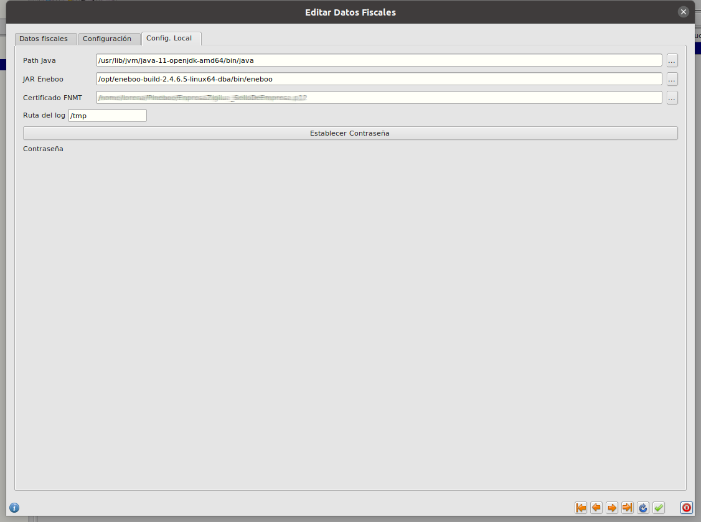

# Estructura del módulo

## Ejercicio y periodos

Antes de generar la primera presentación y de calcular datos del Batuz para las facturas emitidas y recibidas previamente generadas, es necesario acceder al registro del ejercicio para generar los periodos de presentación que requiere el módulo Batuz.

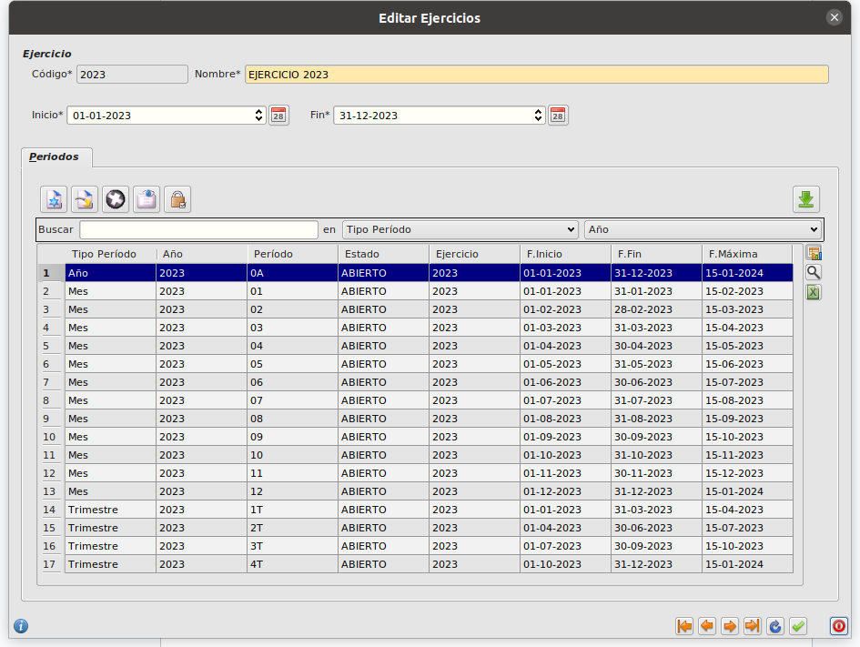

## Pestaña Batuz en facturas

En el formulario de facturas de cliente como de proveedor hay una pestaña Batuz en la que se establecen algunas configuraciones sobre esa factura en concreto

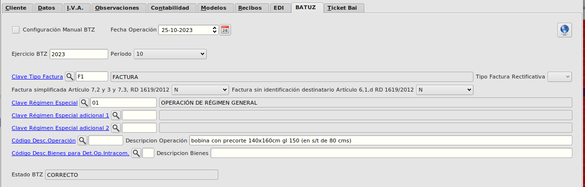

Estas configuraciones se calculan automáticamente en base a los datos de la factura. Ej. para facturas de clientes con **Régimen de Iva** **General**, se establece el valor de **Clave Régimen especial** como **OPERACIÓN DE RÉGIMEN GENERAL**. Si el cliente de la factura tuviése REgimen de IVA **U.E.** y su **Tipo de Id Fiscal** fuése **NIF/IVA** El valor de **Clave Régimen especial** se informaría automáticamente como  **EXPORTACIÓN**

Pero existe la posibilidad de informar los valores manualmente marcando el check **Configuración Manual BTZ**

El valor de **EStado BTZ** es un valor que se calcula después de hacer una presentación. En ese valor se indica si la presentación ha sido correcta o si ha habido algún error con esa factura.

## Presentaciones

Una presentación es un registro para el cálculo de comunicaciones y su posterior emisión. Una presentación tendrá los campos:
* **Ejercicio**: Código de ejercicio para el cálculo de registros.	
* **Tipo periodo**: Los tipos de periodo pueden ser: Mensual para libros de registro de Facturas Emitidas, Facturas Recibidas, Cobros de Facturas Emitidas, Pagos de Facturas Recibidas y Determinadas Operaciones Intracomunitarias. Anual para Libros de Registro de Cobros en Metálico, Bienes de Inversión y Operaciones de Seguros.	
* **Estado**: Una presentación se genera en estado Abierta, una vez sean presentados sus registros de comunicación pasarán a estado de Cerrada y no será editable.	
Fecha de Presentación y Hora de Presentación: Registro interno a nivel de usuario de la creación del registro de Presentación.
* **Fecha Inicio y Fecha Fin**: Fechas para el cálculo de comunicaciones de libro de registro.
Una vez configurados los datos, se calculan los datos, bien desde el botón de calcular datos dentro del registro o desde el maestro de presentaciones.

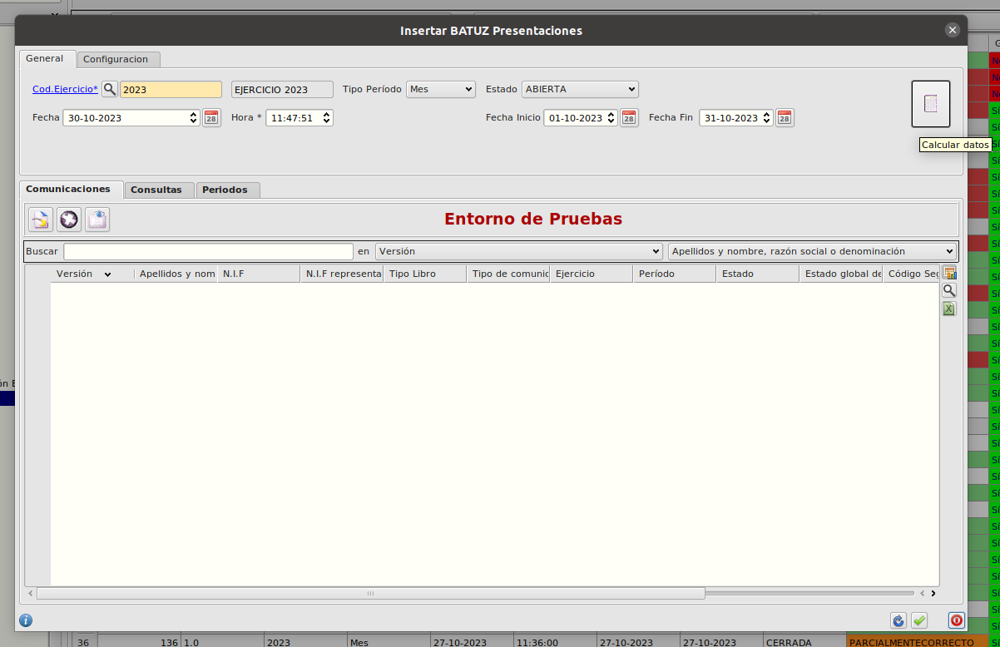
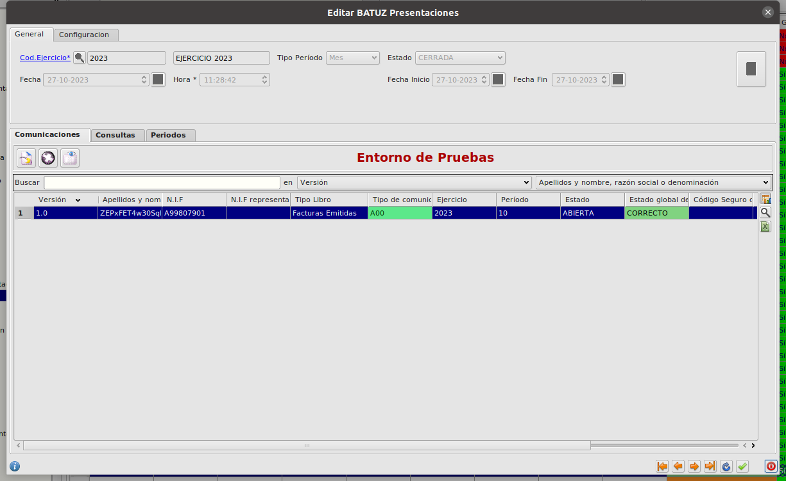

## Comunicaciones

Las comunicaciones son registros que contienen agrupadas las altas, modificaciones y bajas de los tipos de registro. Contienen los datos de versión, datos del presentador, ejercicio y periodo. Mientras el estado de la comunicación esté abierta se podrán recalcular los datos. Una vez sea enviada la comunicación, tanto el mismo registro como sus libros relacionados pasarán a ser no editables.
Los tipos de libro son::
- Libro de Registro de Facturas Emitidas.
- Libro de Registro de Facturas Recibidas.
- Libro de Registro de Determinadas operaciones Intracomunitarias.	
- Libro de Registro de Cobros de Facturas Emitidas.
- Libro de Registro de Pagos de Facturas Recibidas.
- Libro de Registro de Cobros en Metálico.
- Libro de Registro de Bienes de Inversión.
- Libro de Registro de Operaciones de Seguros.

Los tipos de comunicación son:
- A00: Alta de Registros.
- A01: Alta devolución en régimen de viajeros
- A5: Alta Fra. Régimen Viajeros (DER)
- A6: Modificación de las devoluciones del IVA de viajeros (DER)
- AN0: ANULACIÓN
- B0: Interna para comprobación de Errores en registros modificados
- C00: CONSULTA
- M00: Modificación
- M01: Modificación devolución en régimen de viajeros

## Libro de Registro de Facturas Emitidas, Alta y Modificación

Los datos del libro de Registro de Facturas Emitidas se calculan desde la combinación de los datos del documento de Factura y del asiento relacionado con las partidas de IVA. A continuación se mencionan los datos incluidos en el registro.	 	
- **Titular de Libro de Registro**: Son los datos de NIF del declarante español y Apellidos y Nombres y Razón social. Se toman por defecto de los datos fiscales de la empresa relacionada al ejercicio.
- **Ejercicio y Período**: Ejercicio y periodo impositivo de la factura, se calcula a partir de la fecha de expedición.
- **Identificación de la factura**: La combinación de número de serie y factura, fecha de expedición y el CIF/NIF del emisor de la factura se convierten en una clave de identificación de la factura única.
- **Clave Tipo Factura**: Las claves de tipos de Factura son las siguientes:

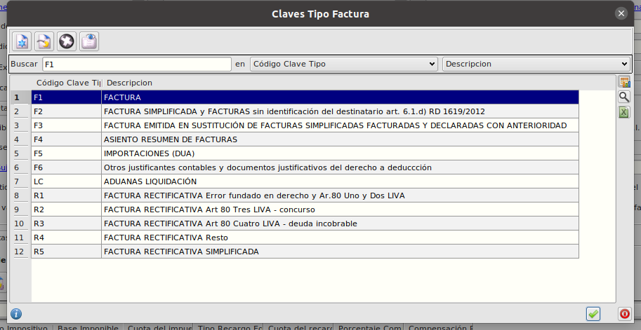

Las facturas serán marcadas por defecto con tipo F1 Factura, y se si están marcadas con el check de rectificativa cambiarán a tipo R1 Factura Rectificativa por error fundado en derecho. Si la factura debe ir marcada con los tipos R2, R3 o R4, debe ser el usuario quien marque la factura con datos manuales y asigne dicha clave.
En la tabla de series, se añade la marca Simplificada para marcar todas las facturas de esa serie como F2 Facturas simplificadas o R5 Factura rectificativa Simplificada en caso de la combinación de marcas de Serie Simplificada y Factura Rectificativa.
- **Datos contraparte**: Los datos del cliente se tomarán del registro de factura. Nombre y razón social, CIF/NIF y/o representante Legal en el caso de España y tipo de identificación fiscal y número de identificación para declarados de Unión Europea y Extranjeros.
- **Código país contraparte de la operación**: Sólo se indica el código ISO del país cuando el cliente sea extranjero y no pertenezca al régimen de Unión Europea.
- **Clave de identificación fiscal**: se calculará desde la ficha del cliente según el campo de tipo de identificación:
    - NIF/IVA = 02
    - Pasaporte = 03
    - Doc.Oficial País = 04
    - Cert.Residencia = 05
    - Otro = 06
- **Facturas Rectificadas**: Si la factura está marcada como rectificada e indica la factura a la cual rectifica, generará un registro con indicando el código de factura a la cual rectifica y la fecha de expedición de la factura a la cual rectifica.
- **Facturas Agrupadas**: Eneboo base no contempla la agrupación de facturas. En el caso de personalizaciones que sí que lo hagan, es opcional la emisión de un registro con el código de factura y fecha de expedición de cada una de las facturas agrupadas.
- **Tipo Rectificativa**: La factura rectificativa siempre se marcará automáticamente con la clave I por diferencias, si se requiere marcar la clave S por sustitución el usuario deberá indicarlo de manera manual y asimismo modificar el asiento relacionado al documento.
- **Base Rectificada, cuota rectificada y cuota de recargo rectificada**: Estos valores no son calculados y deberán ser informados por el usuario en el caso de que marque manualmente el tipo de factura rectificativa por sustitución, con tipo rectificativa S.
- **Fecha Operación**: la fecha de la operación se calcula desde la fecha del último albarán relacionado si existe. Si no existe asigna la fecha de expedición.
- **Importe Total**: Es el importe de total euros del documento de factura.
- **Clave de Régimen Especial**: Claves de Operación para libros de Registro de Facturas Emitidas:

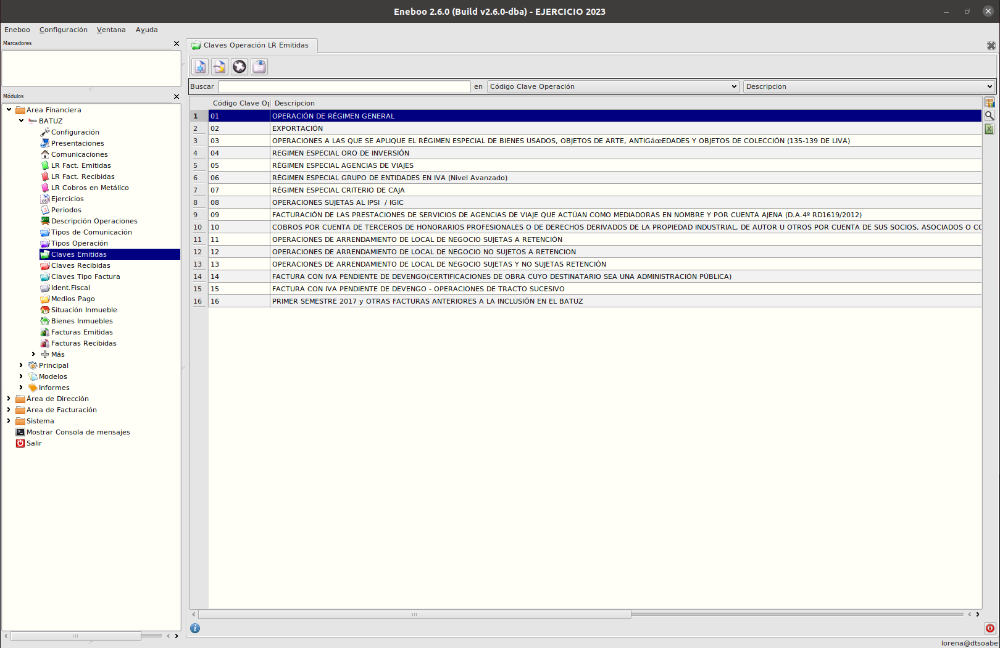

Las operaciones irán marcadas por defecto con tipo 01 Operación en régimen General.
Las operaciones de Unión Europea ya sean bienes o servicios irán marcadas con la clave 02.
Las operaciones de exportaciones de entrega de bienes (incluyendo Canarias, Ceuta y Melilla) irán marcadas con la clave 02. Si la operación es una entrega de servicios (Canarias, Ceuta y Melilla), la operación no está sujeta por reglas de localización pero se indicará la clave 08 y la base imponible no sujeta.

Si se emite una factura en la que alguna de sus líneas contiene un artículo marcado como alquileres, la clave sería la 12 para los alquileres de local no sujetos a retención y la clave 13 para los sujetos a retención.
El resto de claves de operación son casos específicos no contemplados en la contabilización automática del Eneboo por lo que, si se diese el caso, sería el usuario quien tendría que configurar dicha información de manera manual.
- **Descripción de la Operación**: La descripción de la operación es un campo de texto de 500 caracteres y no tiene una directriz exacta estipulada. Se puede definir una lista de registros de Descripción de operaciones que serán utilizadas para rellenar este campo. Se puede hacer de forma manual en la pestaña Batuz de la factura o de forma automática. El proceso automático toma la descripción asignada a alguno de los artículos (pestaña Contabilidad en formulario de artículos) de las líneas de la factura. Si en las líneas no hay ningún artículo con descripción de operación asignada la cogerá de la que esté definida en la pantalla de configuración de Batuz en el campo Cod.Desc.Operación por defecto o en Descripción operación por defecto.
- **Código de situación del inmueble y referencia catastral**: En el caso de que la clave de operación sea 12 o 13 el usuario, de manera obligatoria, deberá indicar la situación del inmueble y la referencia catastral del mismo.
- **Exenta Causa**: En caso de que la operación sea Sujeta o Exenta, hay que indicar la causa de la exención según la lista:

  - **E1**: exenta por el artículo 20
  - **E2**: exenta por el artículo 21
  - **E3**: exenta por el artículo 22
  - **E4**: exenta por los artículos 23 y 24
  - **E5**: exenta por el artículo 25
  - **E6**: exenta por otros

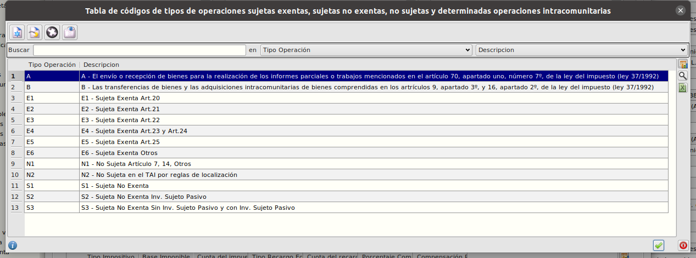

Si la operación no es exenta, el sistema asigna por defecto el valor E6, salvo para las exportaciones que marca la causa E2 y para las entregas intracomunitarias la causa E5.
- **Base Imponible Exenta**: Indica la base imponible exenta.
- **Tipo No Exenta**: Las operaciones sujetas no exentas irán marcadas con el tipo S1, salvo las operaciones con inversión de sujeto pasivo que estarán marcadas con tipo S2.
- **Importes en Euros**: Si la operación es sujeta no exenta, se emitirán tantos registros como agrupaciones por tipo tenga la factura, los datos a emitir son tipo Impositivo, Base Imponible, cuota del impuesto, recargo de equivalencia y cuota de recargo de equivalencia.
- **Importe no Sujeta por Articulo 7,14 y otros**: Este campo debe indicar la base imponible exenta contemplada bajo este supuesto. ** Pendiente de calculo del dato.
- **Importe no sujeta por reglas de Localización**: Si el CIF/NIF español empieza por N, o el cliente es extranjero y la operación está contemplada en este supuesto.
- **Importe percibido por transmisión de inmuebles sujetas a IVA (Importe T.I.)**: Valor no calculado por Eneboo. El usuario debe indicarlo en el registro de manera manual.
- Las marcas de **factura emitida por terceros**, **factura con varios destinatarios** y la **minoración de la base imponible por la concesión de cupones, bonificaciones o descuentos cuando sólo se expide el original de la factura**, se marcarán por defecto a no (N). En caso contrario (S) el usuario deberá indicarlo dentro de cada registro de manera manual.

## Libro de Registro de Facturas Recibidas, Alta y Modificación

- **Titular de Libro de Registro**: Son los datos de NIF del declarante Español y Apellidos y Nombres y Razón social. Se toman por defecto de los datos fiscales de la empresa relacionada con el ejercicio.	 	 	
- **Ejercicio y Período**: Ejercicio y periodo impositivo de la factura, se calcula a partir de la fecha de registro contable. El usuario siempre podrá modificar el ejercicio y período impositivo de manera manual en el caso de estar en el plazo para soportar el iva de un periodo anterior. En el caso de las importaciones se calcula desde la fecha del DUA.
- **Número de serie y factura**: La combinación de número de serie y factura, fecha de expedición y el CIF/NIF del emisor de la factura se convierten en una clave de identificación de la factura única. Por lo que el Número de documento de proveedor pasa a ser un campo obligatorio y debe ser correctamente informado con todos su dígitos. En el caso de importaciones, el número de serie y factura es el número de DUA calculado desde la factura del transitario o bien, desde el registro de importaciones diferidas y el CIF/NIF Emisor es el CIF/NIF del importador y titular del libro de registro. 
- **Clave Tipo Factura**: Las claves de tipos de Factura Recibida son las siguientes:

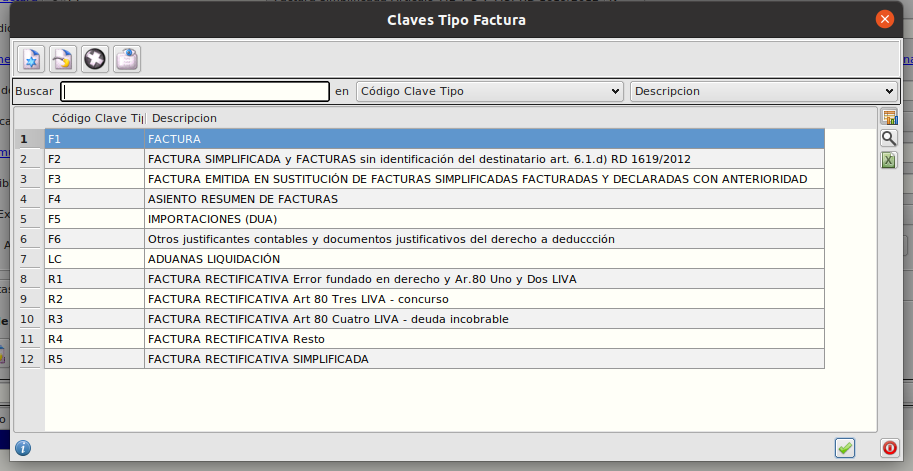

Las facturas serán marcadas por defecto con tipo F1 Factura, y se si están marcadas con el check de rectificativa cambiarán a tipo R1 Factura Rectificativa por error fundado en derecho. Si la factura debe ir marcada con los tipos R2, R3 o R4, debe ser el usuario quien marque la factura con datos manuales y asigne dicha clave.
El registro de Iva de Importación se marcará con tipo F5 y obtendrá los datos del DUA desde la configuración de la factura del transitario o bien, desde los registros de importaciones diferidas.
En la tabla de series, se añade la marca Simplificada para marcar todas las facturas de esa serie como F2 Facturas simplificadas o R5 Factura rectificativa Simplificada en caso de la combinación de marcas de Serie Simplificada y Factura Rectificativa.
- **Datos contraparte**: Los datos del proveedor/acreedor se tomarán del registro de factura. Nombre y razón social, CIF/NIF y/o representante Legal en el caso de España y tipo de identificación fiscal y número de identificación para declarados de Unión Europea y Extranjeros.
- **Código país contraparte de la operación**: Sólo se indica el código ISO del país cuando el proveedor sea extranjero y no pertenezca al régimen de Unión Europea.
- **Clave de identificación fiscal**: se calculará desde la ficha del proveedor según el campo de tipo de identificación:
  - NIF/IVA = 02
  - Pasaporte = 03
  - Doc.Oficial País = 04
  - Cert.Residencia = 05
  - Otro = 06
- **Tipo Rectificativa**: La factura rectificativa siempre se marcará automáticamente con la clave I por diferencias, si se requiere marcar la clave S por sustitución el usuario deberá indicarlo de manera manual y así mismo, modificar el asiento relacionado al documento.
- **Facturas Rectificadas**: Si la factura está marcada como rectificada e indica la factura a la cual rectifica, generará un registro con indicando el código de factura a la cual rectifica y la fecha de expedición de la factura a la cual rectifica.
- **Facturas Agrupadas**: El eneboo base no contempla la agrupación de facturas, en el caso de personalizaciones que sí que lo hagan, es opcional la emisión de un registro con el código de factura y fecha de expedición de cada una de las facturas agrupadas.
- **Base Rectificada, cuota rectificada y cuota de recargo rectificada**: Estos valores no son calculados y deberán ser informados por el usuario en el caso de que marque manualmente el tipo de factura rectificativa por sustitución, con tipo rectificativa S.
- **Fecha Operación**: la fecha de la operación será la misma que la fecha de expedición salvo que en la misma factura conste una fecha de operación diferente.
- **Clave de Régimen Especial**: Claves de Operación para libros de Registro de Facturas Recibidas:

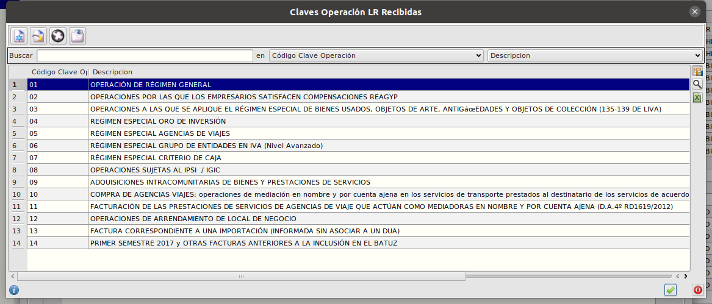

Las operaciones irán marcadas por defecto con tipo 01 Operación en régimen General.
Las facturas recibidas cuyo proveedor esté marcado con el régimen especial de criterio de caja, se marcarán con la clave de operación 07.
Las operaciones de recepción de bienes y/o servicios de Unión Europea, están marcadas con la clave 09.
Si se registra una factura recibida en la que alguna de sus líneas contiene un artículo marcado como alquileres, la clave sería la 12 independientemente de si éste está sujeto o no a retención.
El resto de claves de operación son casos específicos no contemplados en la contabilización automática del Eneboo, por lo que, si se diese el caso, sería el usuario quien tendría que configurar dicha información de manera manual.
- **Descripción de la Operación**: La descripción de la operación es un campo de texto de 500 caracteres y no tiene una directriz exacta estipulada desde AEAT, por lo que, se crea una lista de registros de descripciones de la operación para que puedan asignarse en la factura de manera manual o calculada de los artículos contenidos en la factura (pestaña de contabilidad en formulario de artículos).
- **Código de situación del inmueble y referencia catastral**: Campos opcionales a indicar cuando la clave de operación sea 12.
- **Fecha Registro Contable**: Es la fecha de registro de la factura recibida, coincidente con la fecha de asiento.
- **Cuota Deducible**: Importe de la cuota a deducir.
- **Importes en Euros con Inversión de Sujeto Pasivo**: Se emitirán tantos registros como agrupaciones por tipo tenga la factura, los datos a emitir son tipo Impositivo, Base Imponible, cuota del impuesto, tipo de recargo de equivalencia y cuota de recargo de equivalencia.
- **Importes en Euros**: Se emitirán tantos registros como agrupaciones por tipo tenga la factura, los datos a emitir son tipo Impositivo, Base Imponible, cuota del impuesto, tipo de recargo de equivalencia y cuota de recargo de equivalencia. El porcentaje de compensación REAGYP y la compensación REAGYP no son valores calculados por defecto y en el caso de ser necesarios deberían indicarse de manera manual, o bien, solicitar una personalización del sistema.

# Guía rápida de uso del módulo Batuz
En esta sección se describe brevemente y con un sentido práctico cómo usar el módulo Batuz de Eneboo para el suministro de facturas emitidas y recibidas. Vamos a suponer que el módulo está correctamente configurado.

## Alta de facturas
La información para Batuz de las facturas de cliente o de proveedor es generada de forma automática por Eneboo en el momento en que se crea la factura.
De forma periódica se procederá a generar y enviar las nuevas facturas generadas como se indica a continuación:
- Abrimos la opción de menú Area Financiera → BATUZ → Presentaciones.
- Pulsamos el botón Insertar registro.
- Indicar Fecha Inicio y Fecha Fin del intervalo de facturas que vamos a suministrar.
- Pulsamos el botón Calcular Datos .
- Si pide la clave para el certificado digital la introducimos y pulsamos Aceptar.
- Eneboo rellenará las pestañas Comunicaciones, Consultas y Periodos. La pestaña Comunicaciones es la que contiene los datos que va a suministrar a Batuz.
- Cerramos el formulario aceptando los cambios.
- Pulsamos el botón Generar Fichero .
- Abrimos la presentación y consultamos el Estado global de cada una de las comunicaciones. Si hay algún error podemos consultar el Estado de registro de cada factura abriendo la comunicación.

## Modificación de facturas
Batuz permite enviar modificaciones solamente de facturas recibidas que no se han registrado correctamente en el libro correspondiente. Estas modificaciones no pueden afectar a los datos de identificación del emisor, número de factura y fecha de expedición (en cuyo caso se deberá realizar una baja de las facturas como se explica en el apartado siguiente).
Es importante no confundir este tipo de comunicación con la de facturas rectificativas, que se suministrarán como altas según lo explicado en el apartado anterior.
Para hacerlo seguiremos estos pasos:
- Abrimos la opción de menú Área Financiera → BATUZ → Presentaciones.
- Pulsamos el botón Insertar registro.
- Indicar Fecha Inicio y Fecha Fin del intervalo en el que se encuentran las facturas a modificar.
- Pulsamos el botón Calcular Datos .
- Si pide la clave para el certificado digital la introducimos y pulsamos Aceptar.
- Eneboo rellenará las pestañas Comunicaciones, Consultas y Periodos. La pestaña Comunicaciones es la que contiene los datos que va a suministrar a Batuz.
- Las facaturas recibidas modificaras aparecerán con el tipo M00
- Cerramos el formulario aceptando los cambios.
- Pulsamos el botón Generar Fichero .
- Abrimos la presentación y consultamos el Estado global de cada una de las comunicaciones. Si hay algún error podemos consultar el Estado de registro de cada factura abriendo la comunicación.

## Baja de facturas
Se pueden dar de baja facturas recibidas enviadas por error. Es importante no confundir esto con las facturas rectificativas que, como ya se ha dicho, se deben enviar como facturas nuevas y por tanto enviarlas como altas.
Para hacerlo seguiremos estos pasos:
- Eliminamos las facturas que queramos dar de baja en la lista de facturas de proveedores y que ya han sido enviadas previamente.
- Abrimos la opción de menú Área Financiera → BATUZ → Presentaciones.
- Pulsamos el botón Insertar registro.
- Indicar Fecha Inicio y Fecha Fin del intervalo en el que se encuentran las facturas a modificar.
- Pulsamos el botón Calcular Datos .
- Si pide la clave para el certificado digital la introducimos y pulsamos Aceptar.
- Eneboo rellenará las pestañas Comunicaciones, Consultas y Periodos. La pestaña Comunicaciones es la que contiene los datos que va a suministrar a Batuz.
- Revisamos que las comunicaciones tienen el tipo de comunicación vacío (con el fondo rojo).
- Editamos las comunicaciones que queden y revisamos que las facturas que contienen sean aquellas para las que queremos enviar la baja. Eliminaremos aquellas para las que no queremos enviar la baja.
- Cerramos el formulario aceptando los cambios.
- Pulsamos el botón Generar Fichero .
- Abrimos la presentación y consultamos el Estado global de cada una de las comunicaciones. Si hay algún error podemos consultar el Estado de registro de cada factura abriendo la comunicación.