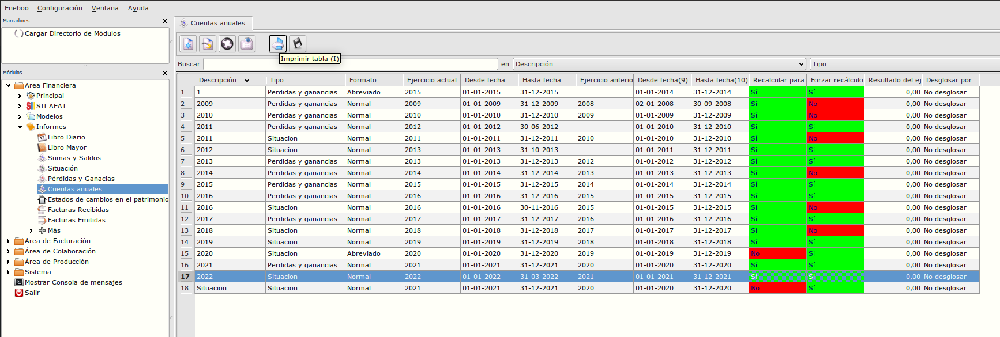
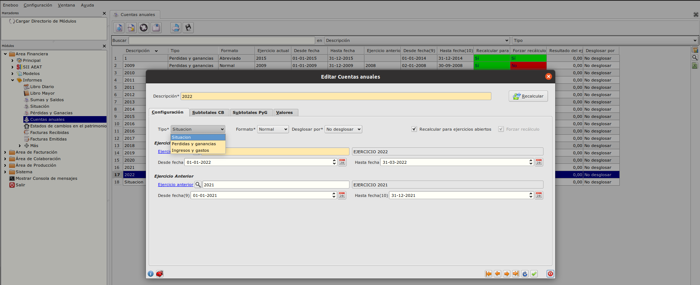

# Informes
----------------------

# Informes Cuentas Anuales

### Objetivo

* Imprimir diferentes tipos de informe de contabilidad. Por ejemplo Situación, PyG, etc .. 

### Funcionamiento
Al formulario de Cuentas Anuales podemos acceder desde **Área Financiera -> Informes -> Cuentas anuales** 

Al crear un informe podemos seleccionar tipo deseado: 
**Situación** , **Perdidas y ganancias** y **Ingresos y gastos**.

Despues de guardar el registro se puede imprimir con el botón **Imprimir tabla**.
