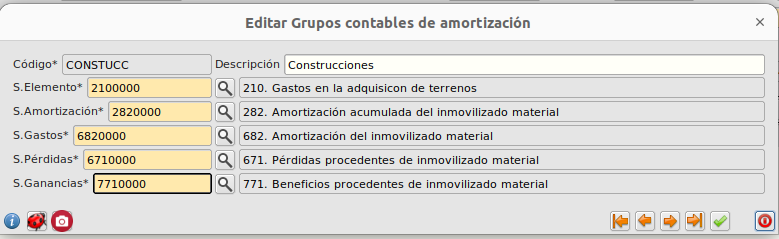
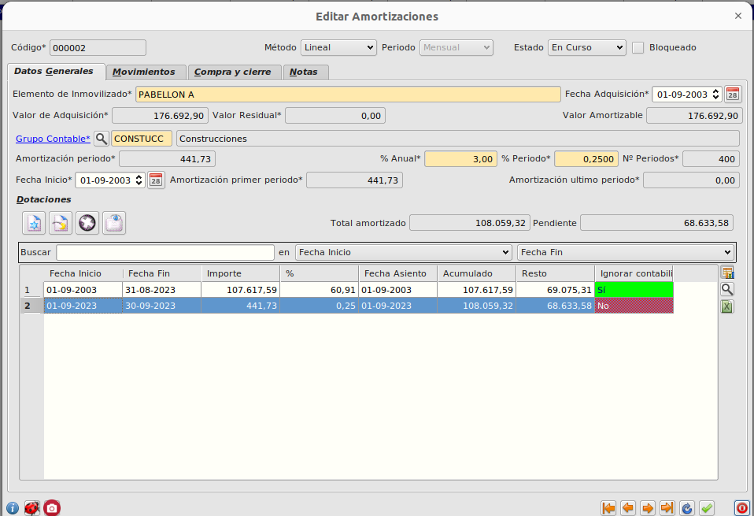
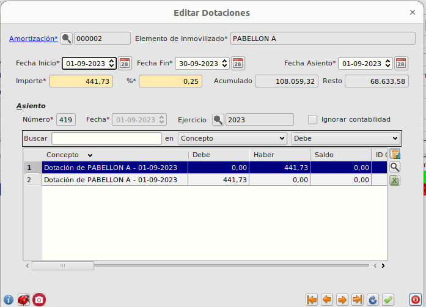

# Amortizaciones

## Crear un nuevo elemento de amortización
Para crear una nueva amortización, seguiremos los siguientes pasos:
* Vamos a _Financiera - Principal - Amortizaciones_ y pulsamos el botón _Crear_.
* En el formulario de alta, indicamos
    * _Descripción del elemento_
    * _Período de amortización_
    * _Fecha de adquisición_
    * _Valor de adquisición_ y _Valor residual_ (parte no amortizable)
    * _Grupo contable_ (ver siguiente punto)
    * _Amortización por período_, _Porcentaje anual_, etc. Estos campos actúan unos sobre otros calculando los valores correspondientes. Generalmente solo es necesario indicar Fecha Inicio y % Anual.

## Crear un grupo contable de amortización
Los elementos a amortizar de una misma naturaleza comparten un Grupo contable de amortización.

Para definir el grupo indicamos:
* _Subcuenta del elemento_: Subcuenta que usa el asiento de la factura de compra del elemento.
* _Subcuenta de amortización_: Subcuenta a usar en los asientos de las dotaciones como subcuenta de amortización.
* _Subcuenta de gastos_: Subcuenta a usar en los asientos de las dotaciones como subcuenta de gastos.
* _Subcuenta de pérdidas_: Subcuenta a usar en el caso de que el elemento se venda por un valor inferior a su valor no amortizado.
* _Subcuenta de ganancias_: Subcuenta a usar en el caso de que el elemento se venda por un valor superior a su valor no amortizado.

## Crear la dotación inicial (elementos con amortización en curso)
En el caso de que incorporemos al programa un elemento cuya amortización esté en curso, crearemos una partida con los siguientes datos:
* _Fecha de inicio_: Fecha de inicio de la amortización (generalmente es la Fecha adquisición)
* _Fecha fin_: Fecha hasta la que no vamos a contabilizar dotaciones. A partir de esta fecha crearemos dotaciones por cada período.
* _Importe_: Importe acumulado amortizado en todo el período Fecha Inicio - Fecha Fin.
* _Fecha asiento_: Igual a fecha inicio (no generaremos asiento)
* _Ignorar contabilidad_: __Importante__ este valor debe estar activado si  no queremos generar la contabilidad correspondiente al período de la dotación inicial.

## Crear una dotación periódica manual
Para crear una nueva dotación, basta con:
* Pulsar el botón de _Crear dotación_ en el formulario del elemento.
    * El formulario se abrirá con los valores informados, calculados automáticamente a partir de los datos de la ficha del elemento con los datos relativos al siguiente período.
* Informamos la _Fecha asiento_. Este será el único dato a incluir, para la fecha en la que queramos que se cree el asiento contable.
* Guardamos el formulario.
    * Se genera automáticamente el asiento de la dotación.

