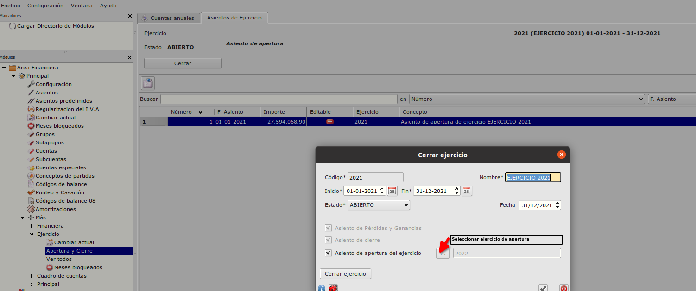
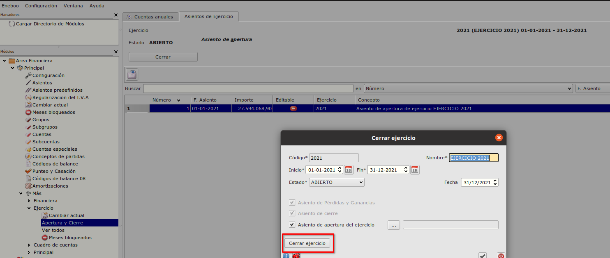
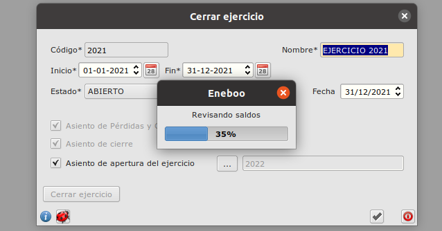
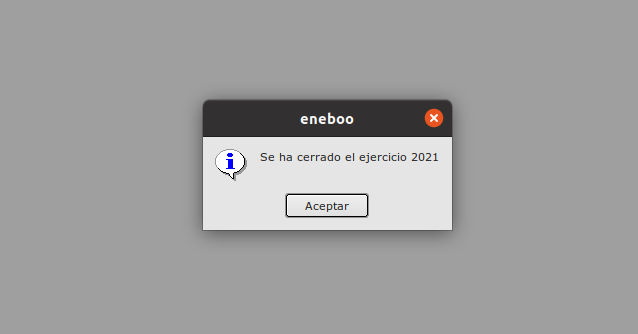
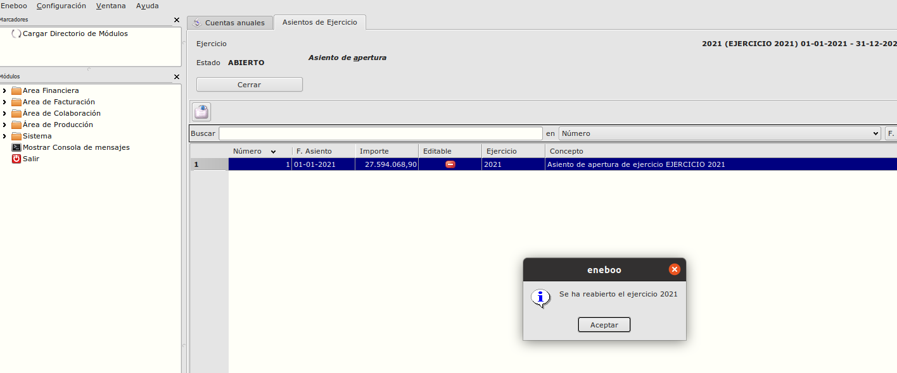

# Apertura y cierre ejercicio fiscal

### Objetivo

* Abrir o cerrar el ejercicio fiscal actual. 

### Funcionamiento
Al formulario de Apertura y cierre podemos acceder desde **Área Financiera -> Principal -> Mas -> Ejercicio** 

## Cerrar ejercicio
* Con el botón **Cerrar** desde el formulario  **Apertura y cierre** se abre un formulario de *Cerrar Ejercicio*

En el formulario que se abre hay que seleccionar el Ejercicio de apertura previamente creado en Eneboo.

Despues de seleccionar el ejercicio de apertura con el bóton 'Cerrar' se lanza el proceso de cierre.

Empieza el proceso de cierre. Se revisan los saldos de los asientos. Tambien se crean los asientos de cierre y regularización para el ejercicio que estamos cerrando y tambien el asiento de apertura para el ejercico selecionado.

## Reabrir ejercicio
* Con el botón **Reabrir** desde el formulario  **Apertura y cierre** se abre el ejercicio cerrado.

## Funcionamiento de proceso de cierre de ejercicio

#### Crear el asiento de regularización. 
Es el primer asiento que se crea.
El programa esta buscando todas las subcuentas del ejercicio que se cierra que tienen cuenta informada en la tabla Códigos de balance 2008 con código que empieza por 'PG' y con saldo diferente de 0. Para estas subcuentas se crean partidas en el asiento de regularización.
Después el programa busca la subcuenta que tiene cuenta informada en la tabla Códigos de balance 2008 con código 'P-A-1-VII-' y crea partida para esta subcuenta en el asiento.

#### Crear el asiento de cierre. 
El programa esta buscando todas las subcuentas del ejercicio que se cierra que tienen cuenta informada en la tabla Códigos de balance 2008 con código que empieza por 'A-' o que empieza por 'P-' y con saldo diferente de 0. Para estas subcuentas se crean partidas en el asiento de cierre.

#### Crear el asiento de apertura.
Es un asiento que se crea para el siguiente ejercicio con todas las partidas del asiento de cierre creado anteriormente. 

 