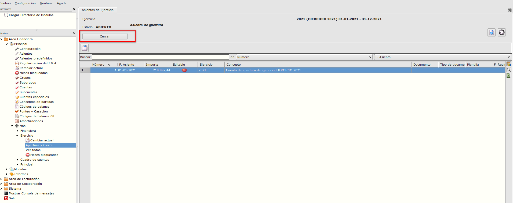
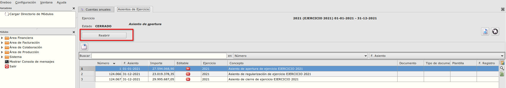

# Apertura y cierre ejercicio fiscal

### Objetivo

* Abrir o cerrar el ejercicio fiscal actual. 

### Funcionamiento
Al formulario de Apertura y cierre podemos acceder desde **Área Financiera -> Principal -> Mas -> Ejercicio** 

## Cerrar ejercicio
* Con el botón **Cerrar** desde el formulario  **Apertura y cierre** se abre un formulario de *Cerrar Ejercicio*

En el formulario que se abre hay que seleccionar el Ejercicio de apertura previamente creado en Eneboo.

Despues de seleccionar el ejercicio de apertura con el bóton 'Cerrar' se lanza el proceso de cierre.

Empieza el proceso de cierre. Se revisan los saldos de los asientos. Tambien se crean los asientos de cierre y regularización para el ejercicio que estamos cerrando y tambien el asiento de apertura para el ejercico selecionado.

## Reabrir ejercicio
* Con el botón **Reabrir** desde el formulario  **Apertura y cierre** se abre el ejercicio cerrado.

 