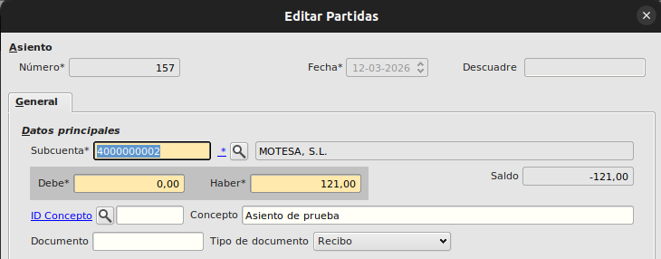
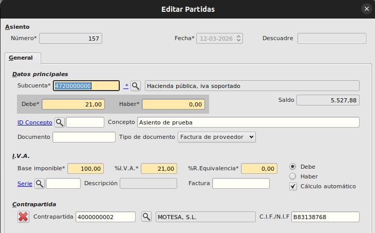
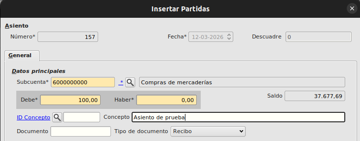
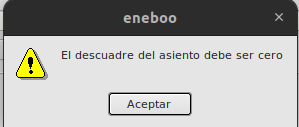

# Creación de asientos de compra

## Crear un nuevo asiento

Para crear una nuevo asiento manualmente, seguiremos los siguientes pasos:

- Vamos a _Financiera - Principal - Asientos_ y pulsamos el botón _Crear_.
- En el formulario de alta, indicamos
  - _Numero_ (Se informa automaticamente, pero se puede cambiar por otro que no exista)
  - _Fecha de asiento_

## Insertar partidas de asiento

Insertaremos tantas partidas como necesitemos, normalmente para un asientos básico, serian 3:

- _Subcuenta del proveedor_: Informamos la subcuenta del proveedor al que le vamos a comprar y el importe en el _HABER_ que seria el total de la compra incluido el IVA.

- _Subcuenta de IVA_: Informamos tantas subcuentas de IVA como distintos IVAs tengamos en la compra (10, 21, etc...). Para este caso solo vamos a insertar una partida al 21 %. En estas partidas hay que informar tambien la contrapartida del proveedor.

Se activará el bloque de IVA al introducir la subcuenta 4720000000. En este bloque introducimos tambien la base imponible y el % en este caso 21.

- _Partida de compra_: Informamos la subcuenta y el importe en el _DEBE_ que seria la suma del total de las compras sin el IVA.

## Comprobaciones

El asiento siempre tiene que cuadrar en importes. El **(DEBE - HABER)** tiene que ser siempre 0, en cualquier otro caso nos saldría el mensaje de error.

