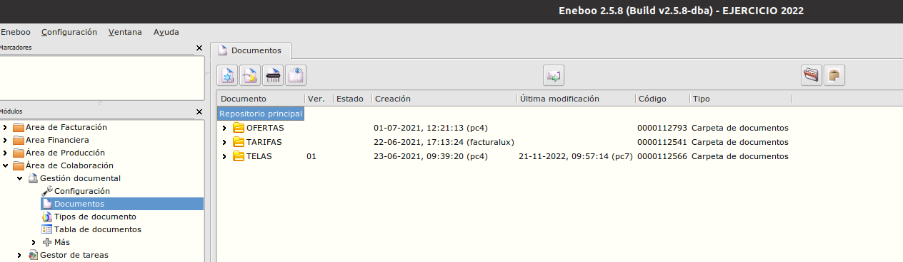
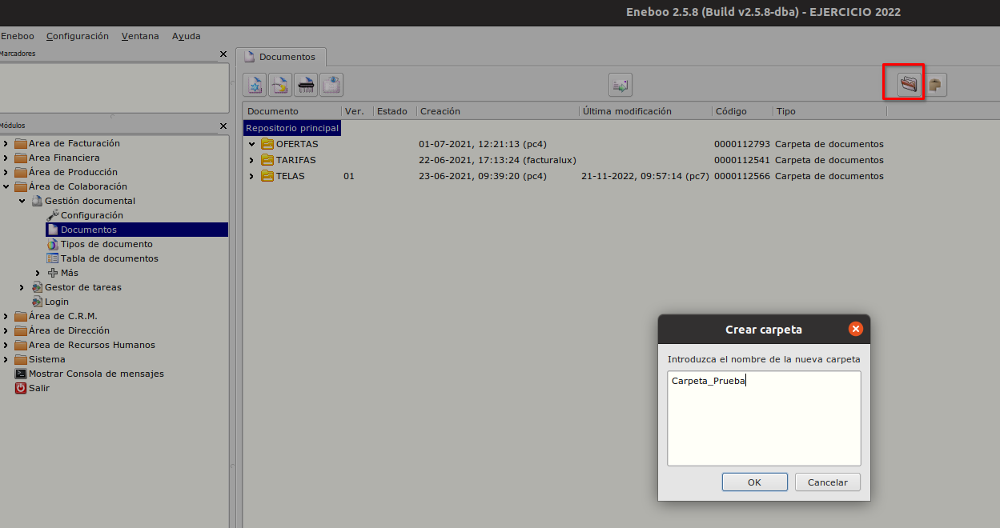
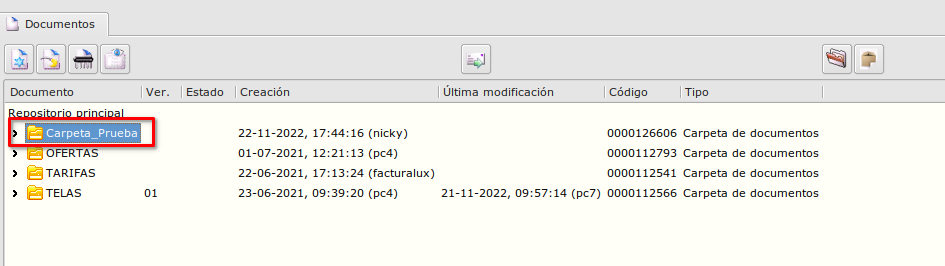
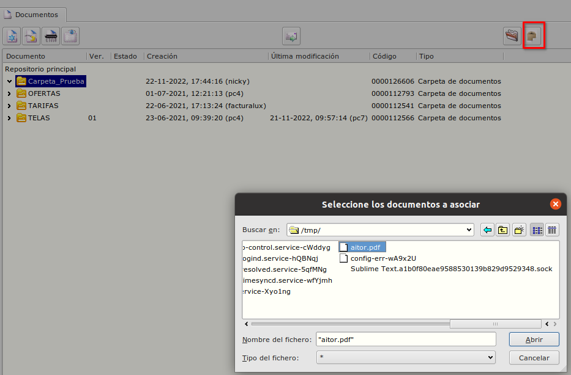
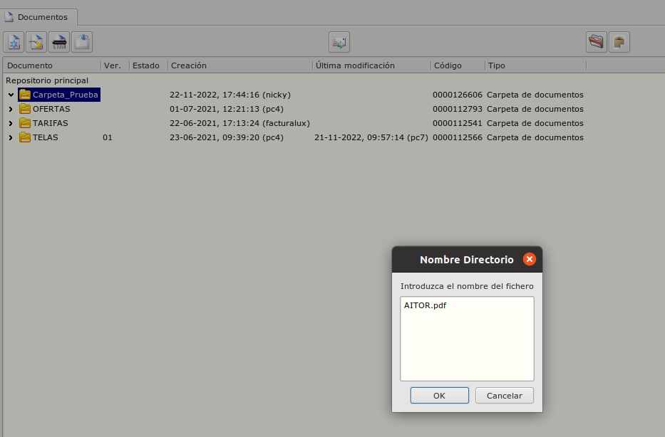
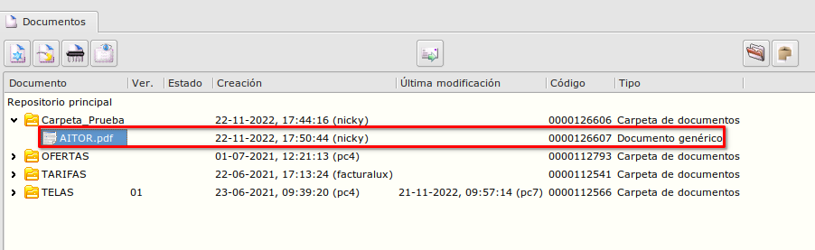

# Gestión documental - Documentos
----------------------

## ¿Como crear documento tipo Carpeta?
El formulario documentos los podemos encontrar en **Área de Colaboración -> Gestión documental -> Documentos**

Selecionamos la carpeta raiz donde se va a crear nuestra carpeta.

Con el botón *Crear Documento tipo Carpeta* se abre el dialogo donde introducimos el nombre de la nueva carpeta.

## ¿Como asociar un fichero dentro de una carpeta existente?
Selecionamos la carpeta.

Con el botón *Cargar directamente uno o más documentos* se abre el dialogo donde elegimos el fichero deseado. Al aceptar se abre un nuevo dialogo donde ponemos el nombre del fichero, tal y como lo queremos.

Al aceptar se va a guardar el fichero selecionado en la base de datos de gestión documental y aparecera en la carpeta selecionada.

