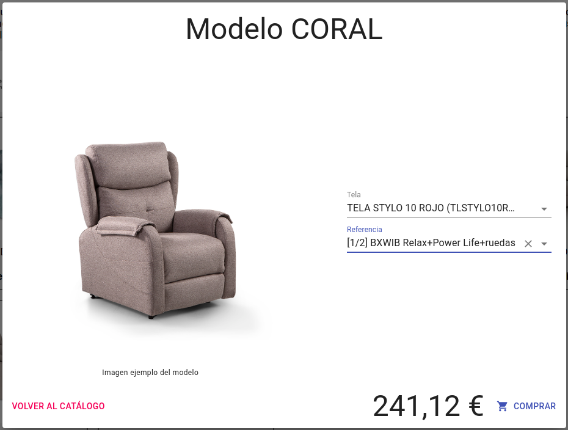

# Añadir un producto al carrito

Para añadir un producto al carrito, clicamos en el modelo elegido y se desplegará una ventana en la que podremos elegir las características deseadas.

Primero debemos elegir el tipo de tela, ya que no se puede elegir ningún tipo de módulo hasta elegir tela, ya que estos están limitados al tipo de tela.

Una vez elegida la tela podemos elegir el módulo deseado dentro de las opciones posibles.

Podemos filtrar las opciones, para ambas selecciones escribiendo la *referencia* o la *descripción*.

En la parte inferior podemos ver el precio del producto seleccionado y clicar *comprar* para añadir el producto al carrito.

[Volver al Índice](./index.md)