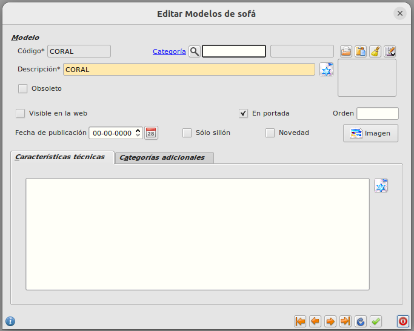

# Incluir un modelo en el catálogo

Para incluir un modelo en el catálogo debemos hacerlo desde el ERP. Debemos ir al formulario principal de **Area de Facturación/Almacén/Modelos**. Seleccionar el modelo que queremos incluir y maracar el campo *'En portada'*.

[Volver al Índice](./index.md)