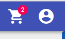
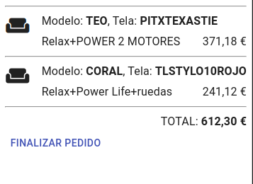

# Ver carrito y finalizar pedido

Para ver el contenido del carrito de compra clicaremos en el botón del *carrito* en la barra superior.

Se desplegará una barra lateral en la que veremos las líneas de productos incluidas en el carrito de compra. Y el precio total de las mismas.

Para [finalizar el pedido](../checkout/index.md) clicamos en el botón del mismo nombre en la parte inferior izquierda.

[Volver al Índice](./index.md)