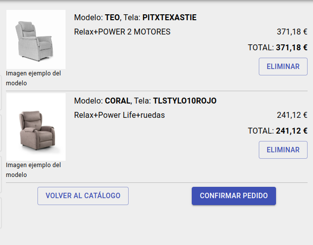

# Finalizar pedido

En esta pantalla hay dos secciones:

## Datos del pedido

Aquí podemos ver los datos de la tienda y el precio final de la compra también desglosado en precio *neto* y el *iva* calculado para el mismo. 

También veremos y podremos modificar la *dirección de entrega*, la *forma de pago*, la *forma de envío* y añadir *observaciones* al pedido.

## Contenido del carrito de compra

Aquí podremos ver el contenio del carrito de compra y eliminar la línea de producto del mismo. Si deseamos finalizar la compra, clicaremos el botón *confirmar pedido* en la parte inferior derecha. 

Si el pedido se ha realizado con exito, se cierra el carrito de compra y veremos el mensaje: **¡Gracias! Pedido recibido**.

[Volver al Índice](../../index.md)