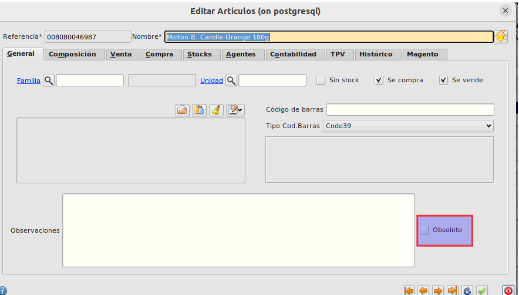
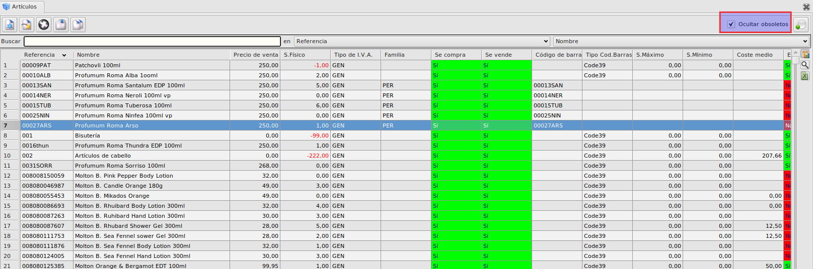
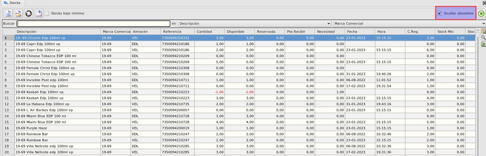

# #NAD #H3750 Poder marcar referencias como obsoletos

## Objetivo
Poder marcar artículos como obsoletos y dichos artículos no se muestren en la tabla de artículos, en la de stocks ni en las búsquedas a la hora de realizar una venta.

## Estructura
**Formulario de artículos**

En el formulario de artículos se ha añadido un nuevo check "Obsoleto". Al marcarse el check el artículo se marca como obsoleto y no mostrará en las búsquedas.

En el formulario maestro de artículos no se verán los artículos marcados como obsoletos a menos que desmarquemos el check de "Ocultar obsoletos".

En el formulario maestro de stocks no se verán los stocks de los artículos marcados como obsoletos a menos que desmarquemos el check de "Ocultar obsoletos".

