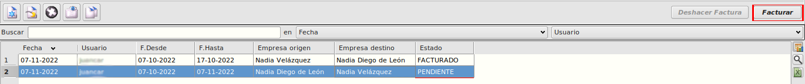

# Liquidación de transferencia de stock

## Precondiciones
Debemos tener creadas transferencias de stock entre dos empresas distintas.

## Crear una liquidación de transferencia de stock

* Accedemos a *Facturación > Almacén > + Más > Almacén > Liquidación de transferencias* e insertamos un nuevo registro.

* Seleccionamos las empresas de origen y destino.

* Seleccionamos el filtro de fechas a buscar.

* Establecidos los filtros, pulsamos en la lupa para empezar la busqueda. Si los resultados encontrados no pertenecen ya a alguna liquidación y están dentro de los parámetros de fecha y empresas buscados, se mostrará en la tabla inferior.

    

* Confirmamos y guardamos el nuevo registro

    * Se nos creará una nueva liquidación de transferencias con estado *PENDIENTE*.

 

## Generar Facturas de transferencias de stock

* Accedemos a *Facturación > Almacén > + Más > Almacén > Liquidación de transferencias* y nos posicionamos con el cursor sobre un registro.

    * Si el estado es *PENDIENTE*, el botón **Facturar**  estará habilidado.

* Pulsaremos el botón **Facturar**, para generar las facturas de cliente y proveedor. Si el proceso ha ido bien, se nos mostrará el siguiente mensaje:

    

    * El estado pasara a *FACTURADO*.

 

## Borrar Facturas de transferencias de stock
   
* Accedemos a *Facturación > Almacén > + Más > Almacén > Liquidación de transferencias* y nos posicionamos con el cursor sobre un registro.

    * Si el estado es *FACTURADO*, el botón **Deshacer Factura**  estará habilidado.

* Pulsaremos el botón **Deshacer Factura**, para eliminar las facturas de cliente y proveedor. Si han sido eliminadas correctamente, se nos mostrará el siguiente mensaje:

    

    * El estado pasara a *PENDIENTE*.

 

## Comprobar detalles en Facturas de transferencias de stock

* Accedemos a *Facturación > Almacén > + Más > Almacén > Liquidación de transferencias* y entramos en cualquier registro que tenga estado *FACTURADO*.

* Vamos a la pestaña **Facturas** y podemos ver los detalles de las facturas de cliente y proveedor, del registro seleccionado.

    

* Si queremos ver mas en detalle cualquiera de las dos facturas, tenemos que hacer doble click sobre el registro deseado.