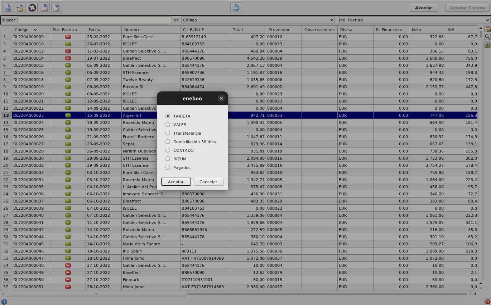

# Generar factura de compra desde albarán

## Precondiciones
Debemos tener creada una forma de pago con el campo *Generar recibos como* igual al valor *Pagados*.

## Facturar albarán de compra

* Vamos a *Facturación > Facturación > Albaranes* de compra y seleccionamos el albarán a facturar.

* Pulsamos el botón Generar factura.
    * Se abre el formulario de selección de forma de pago.
    

* Seleccionamos la forma de pago de la factura. Si queremos que quede pagada, debemos elegir aquella forma de pago que tenga el *Generar recibos como* igual al valor *Pagados*.

    * El albarán cambia su forma de pago al valor establecido y continua el proceso de facturación.

